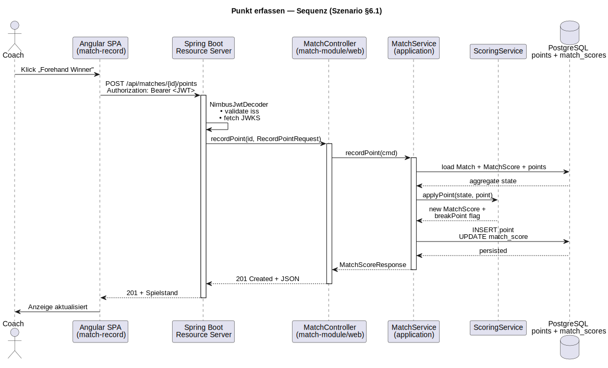
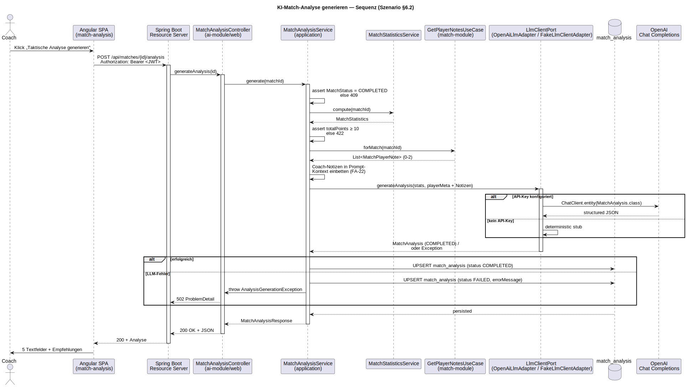
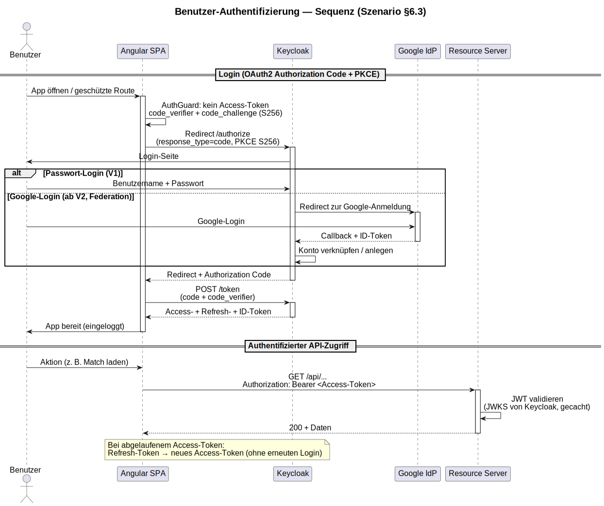

# Software Architecture Document – Tennis Score and Statistic (TSaS)

*nach arc42 Template*

| Feld               | Wert                            |
|--------------------|---------------------------------|
| **Version**        | 2.0                             |
| **Datum**          | 4\. Juli 2026                   |
| **Status**         | FINAL                           |
| **Autor**          | Christian Bonnhoff              |
| **Klassifikation** | Intern                          |
| **GitHub**         | https://github.com/cbo1970/tsas |

# Inhaltsverzeichnis

## Inhaltsverzeichnis

1. Einführung und Ziele
2. Randbedingungen
3. Kontextabgrenzung
4. Lösungsstrategie
5. Bausteinsicht
6. Laufzeitsicht
7. Verteilungssicht
8. Querschnittliche Konzepte
9. Architekturentscheidungen
10. Qualitätsanforderungen
11. Datenmodell
12. Risiken und technische Schulden
13. KI-Werkzeuge im Projekt
14. Reflexion und Fazit
15. Glossar

## 1. Einführung und Ziele

Für die Vorbereitung auf ein Tennismatch fehlt eine Anwendung, mit der Eltern und Trainer Spielweise und Eigenheiten des eigenen Spielers und des Gegners erfassen und auswerten können. Diese Lücke schliesst **Tennis Score and Statistic (TSaS)**: eine Web-App (später zusätzlich iOS), mit der ein Match Punkt für Punkt mit fixen Attributen dokumentiert und statistisch ausgewertet wird. Zusätzlich kann mittels KI eine Matchanalyse durchgeführt werden, um eine Strategie für zukünftige Matches gegen den gleichen Gegner zu entwickeln.

### 1.1 Aufgabenstellung

TSaS hält den Spielstand eines Tennismatches fest, dokumentiert jeden Punkt mit fixen Attributen und ermöglicht statistische Auswertungen. Ein Freitextfeld ermöglicht es dem Coach, zusätzliche Angaben zu machen, welche dann der KI für die Matchanalyse mitgegeben werden.

### 1.2 Qualitätsziele

| ID | Qualitätsziel | Szenario (SMART) | Priorität |
|----|----|----|----|
| QZ-01 | Wartbarkeit / Erweiterbarkeit | Ein neues fachliches Modul (z. B. Statistik-Erweiterung) ist in ≤ 5 Personentagen integrierbar, ohne bestehende Module zu ändern. | Hoch |
| QZ-02 | Verfügbarkeit | ≥ 95 % pro Kalendermonat (HTTP-Health-Check des API-Endpunkts). | Hoch |
| QZ-03 | Performance – Datenerfassung | Erfassen eines Punktes (`POST .../points`) ≤ 250 ms (95. Perzentil, serverseitig) bei bis zu 100 gleichzeitigen Nutzern. | Hoch |
| QZ-04 | Performance – Statistik | Head-to-Head-Berechnung ≤ 60 s, auch bei \> 500 Matches. | Mittel |
| QZ-05 | Sicherheit | Alle API-Endpunkte (ausser `/health`) durch gültiges OAuth2-Bearer-Token geschützt; unautorisiert → HTTP 401. | Hoch |
| QZ-06 | Performance – KI-Analyse | KI-Postmortem synchron ≤ 60 s (LLM-Timeout); erneutes Lesen aus DB \< 250 ms. | Mittel |

### 1.3 Stakeholder

| Rolle | Erwartungshaltung |
|----|----|
| **Tennistrainer** | Matches dokumentieren, Statistiken zur Gegner-Vorbereitung, Spielweise eigener Spieler analysieren. |
| **Eltern** | Einfache Bedienung während des Matches, übersichtliche Darstellung von Verlauf und Ergebnis. |
| **Entwickler / Betreiber** | Wartbare, dokumentierte Codebasis, einfaches Docker-Deployment. |

### 1.4 KI-Nutzen pro Kernfunktion

Scoring und Statistik sind rein deterministisch; KI wird gezielt nur dort eingesetzt, wo natürlichsprachliche Synthese einen aus Roh-Statistiken nicht mechanisch ableitbaren Mehrwert liefert.

| FA | Funktion | KI-Anteil |
|----|----|----|
| FA-01, FA-02 | Registrierung / Authentifizierung | – (Keycloak, OAuth2/OIDC) |
| FA-03, FA-04, FA-12, FA-13 | Spieler-CRUD und -Suche | – (klassisches CRUD) |
| FA-05, FA-14–FA-16 | Match-Lebenszyklus | – (deterministisch) |
| FA-06, FA-07 | Punkt erfassen / Spielstand | – (ITF-Regelwerk in `ScoringService`) |
| FA-08, FA-17 | Head-to-Head- / Match-Statistik | – (Aggregation aus `points`) |
| FA-22 | Coach-Freitext-Notizen | – (CRUD; Notizen fliessen aber als Kontext in FA-11/FA-20) |
| FA-11 | KI-Match-Analyse (Postmortem) | Spring AI → OpenAI (Default `gpt-4o-mini`), strukturierter JSON-Output via `BeanOutputConverter`, deterministischer Fallback (`FakeLlmClientAdapter`). Liefert taktische Synthese (Schlüsselmomente, Stärken/Schwächen je Spieler, 3–5 priorisierte Empfehlungen). |
| FA-20 | KI-Vorbereitung gegen einen Gegner | Gleiche Adapter-Chain. Liefert vorausschauende Vorbereitung (`opponentProfile`, `tacticalObservations`, `serveStrategy`, `returnStrategy` + 3–5 Empfehlungen) auf Basis der kumulierten Head-to-Head-Statistik (FA-08). Nicht persistiert; gleicher Rate-Limiter wie FA-11. |
| FA-09 (V2) | Google-Login | – (IdP-Federation) |
| FA-21 (V2) | KI-Live-Coaching während des Matches | Gleiche Adapter-Chain. Liefert konkrete Vorschläge bis zum nächsten Seitenwechsel. Nicht persistiert; gleicher Rate-Limiter wie FA-11. |
| FA-10 (V3) | Aufsprungpunkte erfassen | – (Touch-Erfassung) |

Mit FA-20 wurde die zweite KI-Rolle (Gegner-Vorbereitung) implementiert.

## 2. Randbedingungen

### 2.1 Technische Randbedingungen

| ID | Randbedingung |
|----|----|
| RB-T01 | Backend: Java 25 mit Spring Boot 4 |
| RB-T02 | Frontend: Angular mit Node.js (Build/Dev-Server) nginx für Betrieb (ADR-15) |
| RB-T03 | Datenbank: PostgreSQL |
| RB-T04 | Auth: Keycloak als Identity Provider (OAuth2/OIDC) |
| RB-T05 | Deployment: Docker Container (docker-compose), Frontend + Backend + DB |
| RB-T06 | Architekturstil: **modularer Monolith** als Gradle-Multi-Module-Projekt nach **Clean Architecture** (Domain → Application → Infrastructure/Adapter, Abhängigkeiten nur einwärts; framework-freie Domäne). Modulübergreifendes **Verhalten** nur über Application-Layer-Interfaces (Ports & Adapters), keine Events. Stabile **Domänen-Wertobjekte** (`Point`, `Player`, `MatchStatistics`) dürfen modulübergreifend als lesendes Modell genutzt werden (ADR-13). Durchsetzung via `ArchitectureTest`. |
| RB-T07 | Mailserver: Für die Entwicklung wurde MailHog verwendet, um E-Mail-Verifizierung und Passwort-Recovery zu testen. Für die Produktion muss dies durch einen transaktionalen Maildienst wie Mailgun oder SendGrid ersetzt werden. |

### 2.2 Organisatorische Randbedingungen

- Selbsterklärend für Tennisspieler; Tennis-Fachbegriffe erlaubt.
- MVP als reine Web-App; native iOS-App in V2.
- Keine externen API-Integrationen in V1 (Swisstennis erst ab V4).

## 3. Kontextabgrenzung

### 3.1 Fachlicher Kontext

TSaS unterstützt Trainer und Eltern bei der Vor- und Nachbereitung von Tennismatches. Sie sind die einzigen menschlichen Akteure des Systems: 
Über den Browser verwalten sie Spielerprofile, erfassen ein Match Punkt für Punkt mit fixen Attributen und rufen daraus berechnete 
Statistiken (z. B. Head-to-Head) sowie KI-gestützte Matchanalysen ab.

Fachlich innerhalb der Systemgrenze liegen Spielstandführung nach ITF-Regelwerk, Punkteerfassung, Statistikberechnung und die 
Aufbereitung der Analyse-Ergebnisse. Ausserhalb der Systemgrenze liegen die Identitätsverwaltung (Keycloak als IDP, 
inkl. E-Mail-Verifizierung über einen Mailserver) und die eigentliche Sprachmodell-Inferenz für die Matchanalyse (OpenAI). 
In späteren Versionen kommen weitere externe Systeme hinzu: Google als federated IDP (V2), die Swisstennis API für offizielle 
Spieler- und Turnierdaten (V4) sowie ein Kamera-System zur automatischen Erfassung von Aufsprungpunkten (V5).

*Quelle: [`diagrams/TSaS_Fachlicher_Kontext.drawio`](diagrams/TSaS_Fachlicher_Kontext.drawio)*

| Akteur / System | Beschreibung |
|----|----|
| Trainer / Eltern | Erfassen Spielstände, rufen Statistiken ab, verwalten Spielerprofile. |
| Keycloak (IDP) | Authentifizierung/Autorisierung via OAuth2/OIDC; ab V2 zusätzlich Google als federated IDP. |
| Mailserver (SMTP) | Versand von E-Mail-Verifizierung und Passwort-Recovery durch Keycloak (Dev: MailHog, Prod: transaktionaler Maildienst, RB-T07). |
| OpenAI LLM API | Sprachmodell-Inferenz für die KI-Matchanalyse (FA-11) und Gegner-Vorbereitung (FA-20) via Spring AI; deterministischer Fallback bei Nichtverfügbarkeit. |
| Swisstennis API (V4+) | Zukünftiger Abruf offizieller Spieler-/Turnierdaten. |
| Kamera-System (V5+) | Automatische Erfassung von Aufsprungpunkten („Hawk Eye very light”). |

### 3.2 Technischer Kontext

| Schnittstelle              | Protokoll / Technologie         |
|----------------------------|---------------------------------|
| Browser ↔ Angular-Frontend | HTTPS, Port 443 (4200 in Dev)   |
| Frontend ↔ Spring Boot API | REST/JSON über HTTPS, Port 8080 |
| API ↔ PostgreSQL           | JDBC/TCP, Port 5432             |
| API ↔ Keycloak             | OAuth2/OIDC, HTTPS, Port 8443   |
| Mailhog ↔ Keycloak         | SMTP Port 1025 (Web-UI :8025)   |

**OpenAPI-Vertrag:**

- Maschinenlesbar unter `GET /v3/api-docs` (OpenAPI 3.x)

- Menschenlesbar unter `GET /swagger-ui.html`.

- Die Doc-Pfade sind `permitAll()`, die Operationen per Bearer-JWT geschützt (Scheme `bearer-jwt`).

## 4. Lösungsstrategie

### 4.1 Architekturansatz: Modularer Monolith

Das Backend der Applikation wird für V1 als modularer Monolith implementiert, da der Umfang noch zu gering ist, um die zusätzliche Komplexität einer Microservice-Architektur zu rechtfertigen. Ein modularer Monolith vereinfacht das Deployment, die Fehlerbehandlung und Recovery, wenn ein Service nicht verfügbar ist. Die interne Modularität erlaubt ein späteres Aufteilen in Services. Das Port-und-Adapter-Pattern erlaubt es, ein anderes Kommunikationsprotokoll zu implementieren, ohne die Businesslogik zu ändern. Fürs Live Coaching in V2 wäre ein asynchroner Ablauf denkbar.

### 4.2 Technologieentscheidungen

| Bereich | Technologie | Begründung |
|----|----|----|
| Backend | Java 25, Spring Boot 4, Gradle Multi-Module | Etabliertes Ökosystem; klare Modulgrenzen mit Compile-Zeit-Abhängigkeiten; synchrone Modul-Kommunikation über Interfaces. |
| Frontend | Angular, Angular Material, ngx-charts | Typsicher, komponentenbasiert; touch-optimierte UI für Punkterfassung; ngx-charts für Statistik-Visualisierung. |
| Datenbank | PostgreSQL | Verbreitet, Open Source, gute relationale Unterstützung. |
| Security | Keycloak | Standard für OIDC/OAuth2; federated IDPs (Google) einbettbar. |
| Deployment | Docker / Compose | Konsistente Umgebung über Dev, Test, Prod. |
| KI / LLM | Spring AI 2.0.x mit OpenAI (`gpt-4o-mini` Default) | Boot-4-kompatibel; `ChatClient` mit strukturiertem JSON-Output (BeanOutputConverter). Der `LlmClientPort` erlaubt späteren Wechsel auf Anthropic/Ollama ohne Use-Case-Refactoring. Coach-Notizen (`match_player_notes`, FA-22) werden im `PromptBuilder` injiziert — ins Postmortem die Match-Notizen, in die Gegner-Vorbereitung die Notizen über den Gegner aus abgeschlossenen Matches. |

### 4.3 Release-Planung

| Version | Umfang |
|----|----|
| V1 (MVP) | Web-App: Punkterfassung, Spielerverwaltung, Basis-Statistiken (Head-to-Head, Winner%, Serve%), Registrierung/Login via Keycloak. KI-Postmortem: strukturierte taktische Auswertung nach Match-Ende (Schlüsselmomente, Stärken/Schwächen, 3–5 Empfehlungen). |
| V2 | Google als federated IDP, erweiterte Statistiken, natives iOS-Frontend (Swift), KI-Live-Coaching, KI-Gegner-Vorbereitung (Head-to-Head). |
| V3 | Aufsprungpunkte via Touch auf skizziertem Feld. |
| V4 | Swisstennis-API-Integration (falls möglich). |
| V5 | Kameraanbindung für automatische Aufsprungpunkt-Erfassung. |

## 5. Bausteinsicht

### 5.1 Whitebox Gesamtsystem

Auf Ebene 1 zerfällt das Gesamtsystem in vier eigenständige Bausteine, die als separate Container über Docker Compose 
betrieben werden (siehe Kap. 7): das **Angular-Frontend** (SPA, via nginx ausgeliefert), das **Spring-Boot-Backend** 
(REST-API als modularer Monolith), **PostgreSQL** als Persistenz sowie **Keycloak** als Identity Provider. 
Diese Aufteilung trennt Präsentation, Fachlogik, Datenhaltung und Identitätsverwaltung; jeder Baustein ist unabhängig deploy- und skalierbar.

Der Browser lädt die SPA über HTTPS und authentifiziert sich direkt bei Keycloak (OAuth2/OIDC mit PKCE). 
Alle fachlichen Aufrufe gehen als REST/JSON mit Bearer-Token an das Backend, das die JWTs gegen den JWKS-Endpunkt von 
Keycloak validiert. PostgreSQL hält sowohl die Applikationsdaten als auch den Keycloak-Realm (in getrennten Datenbanken). 
Als externe Dienste kommen die OpenAI LLM API (via Spring AI, für die KI-Matchanalyse) und ein Mailserver (
SMTP, für E-Mail-Verifizierung und Passwort-Recovery durch Keycloak) hinzu.

Die interne Zerlegung des Backends in fachliche Module folgt in 5.2, die Schichtung innerhalb der Module in 5.3.

*Quelle: [`diagrams/TSaS_Whitebox_Gesamtsystem.drawio`](diagrams/TSaS_Whitebox_Gesamtsystem.drawio)*

### 5.2 Backend-Module (Modularer Monolith)

Jedes Modul kapselt Domänenlogik, Repositories und REST-Endpunkte.

| Modul | Verantwortlichkeit |
|----|----|
| `player-module` | Spielerprofile (Name, Geschlecht, Ranking, Spielhand, Backhand-Typ); CRUD + Suche. |
| `match-module` | Matches mit Format (Gewinnsätze, Match-Tiebreak, Short Set), Sets/Spiele. **Umfasst Scoring** (`ScoringService`) sowie **Coach-Freitext-Notizen je Spieler** (FA-22). Das früher separate `scoring-module` ist hier konsolidiert (ADR-12). |
| `statistics-module` | Statistiken (Head-to-Head, Winner%, UE%, First/Second Serve%, DF, Aces), on-the-fly aus `points` berechnet. (FA-8 und FA-17). |
| `auth-module` | Keycloak-Integration: Token-Validierung, Rollenprüfung, Benutzerverwaltung. |
| `ai-module` | KI-Analyse. Konsumiert `statistics-module`, `player-module` und `match-module`, ruft via `LlmClientPort` ein LLM und persistiert `MatchAnalysis` (1:1 zum Match). |
| `common-module` | Shared Kernel: gemeinsame DTOs, Exceptions, Konfiguration, Utilities. |

*Quelle: [`diagrams/TSaS_Backend_Module.drawio`](diagrams/TSaS_Backend_Module.drawio)*

### 5.3 Backend – Clean Architecture (Schichten & Ports)

Jedes Modul ist intern nach Clean Architecture / Ports & Adapters aufgebaut; Abhängigkeiten zeigen einwärts (**Infrastructure → Application → Domain**), die Domain bleibt framework-frei.

- **Domain** – Modelle und Geschäftsregeln (`Player`, `Match`, `Point`, `MatchScore`, `MatchStatistics`, `MatchAnalysis`), ohne Spring/JPA.
- **Application** – Use-Case-Interfaces (`port/in`) mit `@Service`-Implementierungen (`PlayerService`, `ScoringService`, `MatchStatisticsService`, `MatchAnalysisService`, …) sowie Output-Ports (`port/out`, z. B. `LoadPlayerPort`, `LoadPointsByMatchPort`, `LlmClientPort`).
- **Infrastructure** – Adapter: REST-Controller (`web`), JPA-Persistenz, LLM-Adapter (`OpenAiLlmAdapter`/`FakeLlmClientAdapter`), Security/Config.

Die Austauschbarkeit der Adapter zeigt sich am `LlmClientPort`. Der produktive `OpenAiLlmAdapter` und der deterministische `FakeLlmClientAdapter` implementieren denselben Port — der Use Case bleibt unverändert. So kann der Use Case getestet werden.

*Quelle: [`diagrams/TSaS_Backend_CleanArchitecture.drawio`](diagrams/TSaS_Backend_CleanArchitecture.drawio)*

## 6. Laufzeitsicht

### 6.1 Szenario: Punkt erfassen

*Quelle: [`diagrams/TSaS_Seq_RecordPoint.puml`](diagrams/TSaS_Seq_RecordPoint.puml).*

1.  Trainer klickt im Frontend auf den Punkttyp (z. B. „Forehand Winner”).
2.  Frontend sendet `POST /api/matches/{id}/points` mit Bearer-Token.
3.  Das API validiert das Token (Keycloak).
4.  Das `match-module` verarbeitet den Punkt: Spielstand (Punkte/Games/Sätze) aktualisieren, Persistenz in `points`.
5.  `match_scores` wird aktualisiert; aggregierte Statistiken berechnet das `statistics-module` on-the-fly aus `points`.
6.  Antwort: aktualisierter Spielstand als JSON (HTTP 200).
7.  Frontend aktualisiert die Anzeige.

### 6.2 Szenario: KI-gestützte Match-Analyse (Postmortem)

*Quelle: [`diagrams/TSaS_Seq_GenerateAnalysis.puml`](diagrams/TSaS_Seq_GenerateAnalysis.puml).*

1.  Coach öffnet ein beendetes Match (`COMPLETED`) und klickt „Taktische Analyse generieren”.
2.  Frontend sendet `POST /api/matches/{id}/analysis` mit Bearer-Token.
3.  Der `MatchAnalysisController` (`ai-module`) ruft den `GenerateMatchAnalysisUseCase`.
4.  Vorbedingungen: Status = COMPLETED (sonst 409), Punktzahl ≥ 10 (sonst 422, Kostenschutz).
5.  Der Service lädt aggregierte Kennzahlen (`statistics-module`), Spielermetadaten (`player-module`) und die Coach-Notizen des Matches (`match-module`, `GetPlayerNotesUseCase`) als Prompt-Kontext (FA-22).
6.  `LlmClientPort.generateAnalysis(...)`: im Default-Profil `OpenAiLlmAdapter` (Spring AI → OpenAI, strukturierter JSON-Output); ohne `OPENAI_API_KEY` übernimmt der deterministische `FakeLlmClientAdapter`.
7.  Die strukturierte Antwort (Schlüsselmomente, Stärken/Schwächen, 3–5 Empfehlungen) wird als `MatchAnalysis` (Status COMPLETED) in `match_analysis` persistiert (1:1 zum Match, überschreibbar).
8.  API antwortet HTTP 200 mit der Analyse.
9.  Bei LLM-Fehlern wird ein `FAILED`-Datensatz (mit `errorMessage`) persistiert, API → HTTP 502; „Erneut versuchen” überschreibt ihn beim nächsten Erfolg.
10. `GET /api/matches/{id}/analysis` liefert die gespeicherte Analyse ohne erneuten LLM-Aufruf (200) bzw. 404, falls noch keine existiert.

### 6.3 Szenario: Benutzer-Authentifizierung

Das folgende Diagramm zeigt den Ablauf einer OAuth2-Autorisierung / Authentifizierung mit PKCE.

*Quelle: [`diagrams/TSaS_Seq_Authentication.puml`](diagrams/TSaS_Seq_Authentication.puml).*

## 7. Verteilungssicht

### 7.1 Infrastruktur

Deployment via Docker Compose.

*Quelle: [`diagrams/TSaS_Deployment.drawio`](diagrams/TSaS_Deployment.drawio). Der externe OpenAI-LLM-Dienst (Spring AI, ab V1.x) wird vom Backend über HTTPS angesprochen.*

| Container | Inhalt | Ports | Bemerkung |
|----|----|----|----|
| `frontend` | nginx-unprivileged + Angular SPA | Host 80 → Container 8080 | Läuft als UID 101, liefert die SPA, proxied `/api/` ans Backend. |
| `backend` | Spring Boot API (Java 25) | 8080 | UID 10001; im Prod-Setup nur intern erreichbar. |
| `db` | PostgreSQL 16 | 5432 (intern) | Persistentes Volume, kein Port-Mapping nach aussen. |
| `keycloak` | Keycloak 26 | 8443 (HTTPS), 18080 (HTTP, JWKS) | Realm `tsas` wird beim Start importiert. |

### 7.1.1 Container-Hardening (STRIDE E5)

Alle Services in `docker/compose.yml` laufen mit Sicherheits-Defaults (adressiert STRIDE T4/D5):

| Massnahme | Wirkung |
|----|----|
| Non-root User | `backend` UID 10001, `frontend` via `nginx-unprivileged` UID 101. |
| `read_only: true` + Targeted `tmpfs` | Root-FS nicht beschreibbar; nur deklarierte Pfade (`/tmp`, nginx-Caches, postgres) schreibbar. Keycloak ausgenommen (Dev `start-dev`) und persistiert — wie in Prod — in einer dedizierten `keycloak`-Postgres-DB auf derselben Instanz (`--db=postgres`; angelegt via `docker/db/init/01-create-keycloak-db.sh`). |
| `cap_drop: [ALL]` | Alle Capabilities entfernt; nur `postgres` behält die für `initdb`/`chown` nötigen. |
| `security_opt: [no-new-privileges:true]` | Keine Rechte-Eskalation über `setuid`. |
| `mem_limit` + `cpus` | Ressourcen-Limits je Service (gegen Container-übergreifende DoS). |
| `HEALTHCHECK` | `backend` prüft `/actuator/health`, `frontend` den Root-Path. |

Die Frontend-Portumlegung (Host 80 → Container 8080) folgt aus dem Wechsel auf `nginx-unprivileged` (kein Privileged Bind \< 1024).

### 7.1.2 Security-Header im nginx (STRIDE T1)

Der nginx setzt auf jeder Antwort (Server-Scope, `always`) folgende Header:

| Header | Wert (Kurz) | Wirkung |
|----|----|----|
| `Strict-Transport-Security` | `max-age=31536000; includeSubDomains; preload` | Erzwingt HTTPS (greift hinter TLS-Terminator). |
| `Content-Security-Policy` | `default-src 'self'`, `script-src 'self'`, Keycloak-Realm in `connect-src`/`form-action`, `frame-ancestors 'none'`, `object-src 'none'` | XSS-/Clickjacking-Mitigation. `'unsafe-inline'` bei `style-src` nötig für Angular Materials Runtime-Styles. |
| `X-Content-Type-Options` | `nosniff` | Kein MIME-Sniffing. |
| `Referrer-Policy` | `strict-origin-when-cross-origin` | Kein Referrer-Leak. |
| `Permissions-Policy` | `camera=(), microphone=(), geolocation=(), …` | Sperrt ungenutzte Browser-APIs. |

### 7.1.3 Rate-Limits und E-Mail-Verifizierung (STRIDE D1+D2+S2)

Der kostenpflichtige KI-Endpoint kombiniert mit offener Self-Registration ergibt ein finanzielles DoS-Risiko. Drei Schutzschichten:

1.  **Per-User-Token-Bucket** (`AnalysisRateLimiter`, Bucket4j): 5 Aufrufe/Tag **und** 1/Minute pro Nutzer. Bei Ablehnung HTTP **429** mit `Retry-After` (RFC-7807). Micrometer-Counter `tsas.ai.calls.total{outcome,user}`.
2.  **Per-IP-Limit im nginx** (`limit_req_zone`, `5r/m, burst=5, nodelay`) auf der Analysis-Location; überzählige Requests → HTTP **429** ohne Backend-Treffer.
3.  **E-Mail-Verifizierung** beim Keycloak-Self-Registration (`verifyEmail: true` + SMTP gegen Mailhog im Dev). Verhindert endlose Neu-Registrierung zum Umgehen der Limits. SMTP über `${KC_SMTP_*}` parametrisiert (Dev = Mailhog, Prod via Env-Vars).

Verifiziert via `MatchAnalysisRateLimitIT` (3. POST → 429 mit korrektem `Retry-After`).

### 7.1.4 TLS & Secret-Hygiene im Prod-Overlay (STRIDE T1+S3+S4+I3+D6)

Der Basis-`compose.yml` ist auf Dev getrimmt (Default-Credentials, Mailhog, Keycloak `start-dev`, nginx HTTP). Der Overlay `docker/compose.prod.yml` mitigiert die STRIDE-Befunde:

| Komponente | Massnahme |
|----|----|
| **nginx** (`nginx.prod.conf`) | TLS auf 8443 (Host 443); Port 8080 nur HTTP-301-Redirect. Cert-Mount via `${TLS_CERT_DIR}/tls.{crt,key}`. Security-Header bleiben aktiv. |
| **Keycloak** | `start --hostname … --proxy-headers=xforwarded --db=postgres …` (Prod-Modus, eigene Postgres-DB); Bootstrap-Admin via Env, keine Defaults. |
| **Postgres** | `${DB_PASSWORD:?…}` bricht ohne Passwort ab; Init-Script legt Keycloak-DB + -User an; kein Host-Port. |
| **Backend** | `OPENAI_API_KEY`, `DB_*`, `KEYCLOAK_ISSUER_URI` required; kein Host-Port (nur über nginx). |
| **Mailhog** | Entfernt — Prod nutzt echtes SMTP via `KC_SMTP_*`. |

**Aktivierung:**

`podman compose -f docker/compose.yml -f docker/compose.prod.yml up -d --build`

(echte Werte via `.env`; Vorlage `docker/.env.prod.example`). Cert-Provisionierung (Let’s Encrypt o. ä.) liegt ausserhalb des Overlays.

## 8. Querschnittliche Konzepte

### 8.1 Sicherheitskonzept

Alle API-Endpunkte (ausser Health-Check) sind durch OAuth2-Bearer-Tokens geschützt.\
Das Frontend nutzt Authorization Code Flow mit PKCE.\
Keycloak verwaltet Nutzer, Rollen und Sessions (V1 direkte Registrierung, ab V2 zusätzlich Google als federated IDP).

- **Test-Profil-Guard (STRIDE E2).** Der `permitAll`-`SecurityFilterChain` für Integrationstests lebt ausschliesslich in `auth-module/src/testFixtures/` (nicht im Boot-Jar). Zusätzlich bricht `TestProfileGuard` (`EnvironmentPostProcessor`) den Boot ab, sobald das `test`-Profil mit `prod`/`docker` kombiniert wird oder die Datasource nicht auf In-Memory-H2 zeigt. Acht Unit-Tests decken die Kombinationen ab.
- **JWT-Validierung (STRIDE S1).** Der `JwtDecoder` kombiniert drei Validatoren:
  1.  `createDefaultWithIssuer` (iss + Default-Claims),
  2.  JWK-Set-Signaturprüfung,
  3.  `JwtClaimValidator("aud", … contains "tsas-frontend")`.

> Ohne (c) würde jedes Realm-Token akzeptiert. Erwartete Audience via `tsas.security.expected-audience` (Default `tsas-frontend`), geliefert per Keycloak-`oidc-audience-mapper`.

- **RBAC im Frontend.** Backend setzt die Realm-Rollen `COACH`/`ADMIN` durch und reicht den JWT-`sub` als `owner_id` in die Persistenz. Der `AuthService` exponiert `roles`/`isAdmin`/`userId` als Signals. Daraus: ADMIN-Chip in der Toolbar, Scope-Toggle „Meine/Alle Owner” für Admins (client-seitig auf `ownerId`), `ownerId` in `PlayerResponse`/`MatchResponse`. Rollen-Verwaltung bleibt in der Keycloak-Admin-Konsole (UI out-of-scope V1).

### 8.2 Persistenz

Der Zugriff auf die Datenbank erfolgt mit Spring Data JPA / Hibernate. Als Datenbank wird PostgreSQL verwendet. Jedes Modul hat seine eigenen Repositories. Das Schema wird via Flyway erstellt und erweitert.

- Flyway-Dependency im `app`-Modul; Skripte unter `db/migration/`, Schema `V{n}__{beschreibung}.sql`; `V1__baseline.sql` = initiales Schema.
- Hibernate `ddl-auto` = `validate` (PostgreSQL — Default und `local`-Profil) bzw. `none` im `test`-Profil (H2) — Flyway ist einzige Schema-Quelle.
- H2 wird nur noch im `test`-Profil (`application-test.yml`, in-memory) verwendet — für Unit-/Slice-Tests und einzelne Context-/Contract-Tests. Die Integrationstests laufen über Testcontainers gegen eine echte PostgreSQL-Instanz (per `@DynamicPropertySource` verdrahtet; erfordert eine Container-Runtime). Das `local`-Profil nutzt ebenfalls PostgreSQL.
- Migrationen nutzen weitgehend ANSI-SQL (PostgreSQL- und H2-kompatibel), sodass dieselben Flyway-Skripte im `test`-Profil (H2) und auf PostgreSQL greifen.

### 8.3 Fehlerbehandlung

Die Fehlerbehandlung ist deklarativ über `@RestControllerAdvice` gelöst. Das Antwortformat ist durchgängig RFC 7807 über Springs `ProblemDetail` (ersetzt das frühere Ad-hoc-Format); die Schemas der Fehlerantworten (400/404/409/422/502) sind via springdoc unter `/v3/api-docs` dokumentiert.\
Der `GlobalExceptionHandler` behandelt die modulübergreifende “nicht gefunden”-Domain-Exceptions der fachlichen Module (Player/Match), die zu einem 404 führen.\
Querschnittliche Fälle (Konflikte, Validierung, ungültige Argumente) übernimmt der `CommonExceptionHandler` im `common-module` und AI-spezifische Fälle der `AiExceptionHandler`.

**Catch-all und Sanitization (STRIDE I5+I6).**

Vier allgemeine Exception-Typen werden als Auffangnetz verwendet. So werden keine internen Details (Klassenpfade, SQL, Stack-Traces) nach aussen gegeben.

| Exception | Status | Detail |
|----|----|----|
| `ResponseStatusException` | aus Exception | Reason oder Standard-Phrase |
| `DataIntegrityViolationException` | 409 | Generisch; Original via WARN geloggt |
| `AccessDeniedException` | 403 | „Zugriff verweigert.” |
| `Exception` (Catch-all) | 500 | „Interner Fehler …“; Original via ERROR geloggt |

Damit auch Springs eingebauter Whitelabel-Fallback nichts preisgibt, sind `server.error.include-message` und `include-stacktrace` auf `never` gesetzt, er zeigt dann weder Fehlermeldung noch Stack-Trace.\
Abgesichert wird das durch `CommonExceptionHandlerTest` (7 Testfälle), der prüft, dass in `detail` weder SQL noch UUIDs noch Klassennamen auftauchen.

### 8.4 Logging und Monitoring

Ein strukturiertes JSON-Logging erfolgt über SLF4J/Logback. Der Spring Boot Actuator liefert Health-/Metrics-/Info-Endpunkte (Prometheus/Grafana-fähig).

### 8.5 Testkonzept

Testpyramide: viele schnelle Unit-Tests (Domäne/Service), eine schmalere Integrations-/API-Schicht gegen den realen Stack, plus Frontend-Komponententests.

- **Unit (Backend):** JUnit 5 + Mockito für Domänenlogik/Services (Scoring, Punkt-Attribution, Use-Case-Vorbedingungen) — ohne Spring-Context.
- **Integration/API (Backend):** Spring Boot Test mit Testcontainers (PostgreSQL) + MockMvc (`AbstractIntegrationTest`). JWT via Spring Security Test gemockt (kein laufendes Keycloak nötig).
- **Coverage-Gate:** JaCoCo, modulübergreifend aggregiert (die Integrationstests im `app`-Modul decken alle Module ab; `jacocoRootReport`/`…CoverageVerification`). In `check` eingehängt, bricht unter **85 % Line / 70 % Branch** (Ist ~95 %/~80 %).
- **Frontend:** Vitest (`*.spec.ts`) + Cypress Component Testing (`*.cy.ts`, gemockte HTTP via `cy.intercept`).

#### 8.5.1 Begründung der Werkzeuge

1)  *Echtes PostgreSQL via Testcontainers statt H2:* Persistenz-/Schema-Verhalten ist PostgreSQL-spezifisch und wird gegen dieselbe Engine wie in Prod verifiziert (Flyway V1–V10 real, nativer `UUID`-Typ, `CHECK`/`ON DELETE CASCADE`); H2 im PG-Modus weicht ab.
2)  *WireMock für den LLM-Adapter:* `OpenAiLlmAdapterTest` stubbt den OpenAI-HTTP-Endpoint und prüft den realen Serialisierungspfad deterministisch, offline, ohne Kosten.
3)  *Coverage-Gate 85/70:* knapp unter Ist-Stand → fängt Regressionen ohne Brechen bei Schwankungen (ADR-11).

#### 8.5.2 Tests der KI-Anteile (Nichtdeterminismus, Guardrails, Fehlerpfade)

Die KI-Anteile sind wegen Nichtdeterminismus, externer Abhängigkeit und Kosten gesondert abgesichert:

- **Nichtdeterminismus eliminieren.** Auf Adapter-Ebene fixiert der WireMock-Stub die LLM-Antwort (`OpenAiLlmAdapterTest`). Auf Service-/IT-Ebene ersetzt der deterministische `FakeLlmClientAdapter` (aktiv via `@ConditionalOnMissingBean`, ohne API-Key) den Provider vollständig — die IT belegen das über `modelUsed = fake-llm`. So sind KI-Pfade reproduzierbar testbar, ohne dass eine generative Antwort das Ergebnis verwackelt.
- **Guardrails verifizieren.** `MatchAnalysisServiceTest` prüft die fachlichen Vorbedingungen explizit: `generate_throwsWhenMatchNotCompleted` (Match muss `COMPLETED` sein) und `generate_throwsWhenTooFewPoints` (Mindestpunktzahl). Die Kosten-Guardrail (Rate-Limit) ist separat in `MatchAnalysisRateLimitIT` abgedeckt (vgl. §7.1.3 / TEN-64).
- **Fehlerpfade abdecken.** `generate_persistsFailedAnalysisAndRethrowsOnLlmError` belegt: ein LLM-Ausfall persistiert einen `FAILED`-Datensatz **und** propagiert den Fehler (→ HTTP 502). `MatchAnalysisControllerIT` prüft die HTTP-Abbildung end-to-end gegen echtes PostgreSQL (409 nicht beendet, 422 zu wenige Punkte, 404 unbekannt/cross-tenant).

### 8.6 Continuous Integration / Build-Gate

Zwei GitHub-Actions-Workflows bei jedem Push/PR auf `develop`/`main`:

| Workflow | Inhalt |
|----|----|
| Backend CI (`backend-ci.yml`) | `./gradlew check` (Tests + JaCoCo-Gate) auf JDK 25; lädt den aggregierten Coverage-Report als Artifact. Testcontainers nutzt das native Docker des Runners. |
| Frontend CI (`frontend-ci.yml`) | `ng build` + Vitest + Cypress auf Node 22 (mit Cache). |

Beide sind **required status checks** (Branch Protection) ohne Pfadfilter (ein nicht ausgelöster required Check würde den Merge blockieren).\
`enforce_admins=false` (Admin-Override im Notfall).

### 8.7 Testergebnisse

Snapshot vom **2026-06-13** (`develop`, nach PR \#6). Reproduzierbar via `./gradlew clean test jacocoRootReport` (JDK 25, Testcontainers). Der aggregierte Report ist eingecheckt unter `backend/doc/reports/jacoco/jacocoRootReport/` und wird in der CI als Artifact hochgeladen.

**Testanzahl (alle grün, 0 Failures/Errors/Skipped):**

| Modul | Tests | Schwerpunkt |
|----|---:|----|
| `app` | 78 | Integrations-/API-Tests (Testcontainers + MockMvc); `ArchitectureTest` |
| `match-module` | 60 | Scoring-Regeln, Match-Lebenszyklus, Break-Points |
| `statistics-module` | 31 | Punkt-Attribution + Kennzahlen (inkl. Head-to-Head) |
| `player-module` | 16 | Spieler-Use-Cases inkl. Lösch-/Deaktivierungsregeln |
| `ai-module` | 7 | `MatchAnalysisService` + `OpenAiLlmAdapter` (WireMock) |
| **Gesamt** | **192** | Laufzeit ~15 s (ohne Container-Start) |

**Coverage (JaCoCo, aggregiert):** Gesamt **94,8 %** Line (1336/1410) / **79,7 %** Branch (278/349); je Modul `match` 92,0/74,2, `statistics` 98,2/89,8, `player` 100/70,0, `ai` 94,8/72,2, `common` 100/75,0. Das Gate (85/70) ist erfüllt.

**Interpretation.**\
Abgedeckt ist die fachliche Kernlogik wie Tennis-Zählregeln, Punkt-Attribution/Statistik, Spieler-Regeln und KI-Analyse inkl. Fehlerpfade 502/422/409.\
Die Integrationstests fahren gegen eine echte PostgreSQL-Instanz inkl. Flyway und JWT, der `ArchitectureTest` sichert die Einhaltung der Schichten-/Modulgrenzen.\
Die Branch-Coverage (80 %) liegt erwartungsgemäss unter der Line-Coverage — die offenen Zweige sind überwiegend defensive Pfade (Guards, Mapper-Null-Prüfungen, seltene Scoring-Verzweigungen). Das 70-%-Gate sichert eine Untergrenze, ohne für jeden trivialen Zweig einen Test zu erzwingen. Bewusste Lücken: OpenAI-Happy-Path gegen die echte API (über Fake/WireMock abgebildet; manuelle Verifikation), `main` und reine Config-Klassen.

## 9. Architekturentscheidungen

Architecture Decision Records (ADR), jede Entscheidung mit Begründung. Alle Status sind **akzeptiert**. Inhaltlich manuell entschieden (siehe §14.2), die KI half nur beim Ausformulieren.

**ADR-01 · Modularer Monolith statt Microservices.** V1 ist klein und wird von einem kleinen Team gebaut. Die Microservice-Komplexität (Komplexeres Deployment, Netzwerk-Overhead, Fehlerbehandlung und Recovery bei Ausfall …) ist hier nicht gerechtfertigt. Die Modularisierung als Gradle-Multi-Module erzwingt Modulgrenzen auf Compile-Ebene und erleichtert eine spätere Service-Extraktion.

**ADR-02 · Frontend und Backend in separaten Containern.** Angular (via Nginx) und Spring Boot laufen eigenständig; Nginx liefert die statischen Artefakte und proxied `/api/` ans Backend. Ermöglicht unabhängige Skalierung und saubere Separation of Concerns (übliches SPA-+-REST-Muster).

**ADR-03 · Keycloak als Identity Provider.** De-facto-Standard für OIDC/OAuth2 mit Out-of-the-box User-Management, Rollen, federated IDPs und Self-Service-Registrierung.

**ADR-04 · PostgreSQL als Datenbank.** Bewährte relationale DB mit guter Spring-Integration; das Datenmodell ist klar relational (Player, Match, Set, Point, Stats) — kein NoSQL-Bedarf.

**ADR-05 · REST API als Schnittstellenformat.** JSON/REST ist Web-Standard, gut tooling-unterstützt und via OpenAPI/Swagger dokumentierbar. GraphQL würde die Komplexität unnötig erhöhen.

**ADR-06 · Flyway statt Liquibase.** Eine PostgreSQL-Instanz, stabiles Schema (6 Kernentitäten): Flyway versioniert plain-SQL ohne XML/YAML-Overhead und ist in Spring Boot auto-konfiguriert. Liquibase-Flexibilität (DB-agnostisch, Rollback-Skripte, Diff) ist nicht nötig (kein DB-Wechsel geplant; Rollbacks via Backup). Skripte unter `db/migration/`, Baseline `V1__baseline.sql`.

**ADR-07 · Gradle Multi-Module statt Spring Modulith.** Spring Modulith verworfen, weil es modulübergreifend standardmässig auf Application-Events (asynchron) setzt — unnötige Komplexität für synchrone Antworten. Explizite Application-Layer-Interfaces (Ports & Adapters) bilden die Kommunikation sauberer ab. Gradle-Module erzwingen Grenzen zur Compile-Zeit (unerwünschte Abhängigkeiten = Build-Fehler) und erleichtern spätere Service-Extraktion.

**ADR-08 · Angular Material + ngx-charts als UI-Framework.** Nutzer bedienen die App während des Matches auf Tablet/Smartphone. Material liefert out-of-the-box touch-optimierte, responsive Komponenten für schnelle Punkterfassung, ist eng mit Angular verzahnt und kostenfrei. ngx-charts ergänzt die Statistik-Visualisierung (FA-08). Die Alternative PrimeNG wäre für V1 Over-Engineering.

**ADR-09 · angular-oauth2-oidc statt keycloak-angular.** Generische, standard-konforme OIDC-Library ohne Keycloak-Coupling im Frontend-Code — ein IDP-Wechsel ändert nur Konfiguration, nicht Code. Schlanker (keine `keycloak-js`-Abhängigkeit), native PKCE-Unterstützung, aktiv gepflegt. Umsetzung: `OAuthModuleConfig`, Bearer-Token-Interceptor, `CanActivateFn`-Guard auf allen Routes.

**ADR-10 · Spring AI mit OpenAI. Provider-Abstraktion via** `LlmClientPort`**.** Spring AI 2.0.x (Boot-4-kompatibel) liefert mit `ChatClient.entity(Class)` strukturierten JSON-Output statt fragiler Parser. OpenAI als initialer Provider (Default `gpt-4o-mini`, via Property tauschbar); ein zweiter Adapter (Anthropic, Ollama) ist über den Out-Port `LlmClientPort` ohne Use-Case-Eingriff ergänzbar. Aktivierung des `OpenAiLlmAdapter` per `@ConditionalOnExpression` auf nicht-leeren API-Key, sonst deterministischer `FakeLlmClientAdapter`. Analyse wird einmal pro Match generiert und persistiert (Kostenkontrolle, Reproduzierbarkeit). **Bewusst kein RAG / keine Vektor-DB:** der Analyse-Input ist strukturierte Numerik (wenige Dutzend Felder pro Match), passt in einen Prompt-Context; eine Embedding-Schicht wäre Over-Engineering. Für V2 (Head-to-Head über N Matches) wird das neu bewertet.

**ADR-11 · GitHub Actions und aggregiertes JaCoCo-Coverage-Gate.** Qualität wird erzwungen, nicht nur empfohlen: Zwei GitHub-Actions-Workflows (Backend und Frontend) laufen bei jedem Push und Pull Request auf `develop` und `main` und sind als *required status checks* gesetzt — ohne beide grün kein Merge. Die Backend-Coverage misst JaCoCo modulübergreifend als Summe: Die Integrationstests liegen im `app`-Modul, decken aber alle Module ab, weshalb ein Gate pro Modul zu niedrig zählen würde. Das Gate hängt in `check` und verlangt **85 % Line / 70 % Branch** — bewusst knapp unter dem Ist-Stand (~95 % / ~80 %), damit normale Schwankungen den Build nicht brechen. Die Workflows laufen absichtlich **ohne Pfadfilter**, da ein `required Check`, der wegen eines Pfadfilters gar nicht erst startet, den Merge sonst dauerhaft blockieren würde. Damit ein Administrator zur Not auch ohne die `required Checks` einen Merge durchführen kann, bleibt `enforce_admins` auf `false` gesetzt.

**ADR-12 · Scoring im** `match-module` **statt eigenem** `scoring-module`**.** Bei der Umsetzung konsolidiert: Punkte erfassen/zählen ist das **Kernverhalten** eines Matches und operiert untrennbar auf dessen Zustand. Eine Modulgrenze hätte feingranularen Port-Verkehr ohne fachlichen Mehrwert erzwungen. Scoring bleibt intern als `ScoringService` gekapselt (spätere Extraktion möglich).

**ADR-13 · Gemeinsames lesendes Domänenmodell statt DTO-Mapping an jeder Grenze.** Module rufen fremdes Verhalten nur über Ports auf (RB-T06), verwenden aber stabile Domänen-Wertobjekte direkt als Read-Model (z. B. liest `statistics-module` `Point`s, `ai-module` `Match`/`Player`/`MatchStatistics`). Diese Typen sind framework-frei und stabil. Spiegel-DTOs an jeder Grenze wären für einen Monolithen Over-Engineering und Duplikation. Abhängigkeiten bleiben einwärts gerichtet und zyklenfrei (`ArchitectureTest`). Bei späterer Service-Extraktion werden sie zu Vertragstypen/DTOs.

**ADR-14 · Versionierung nach SemVer 2.0.0, Changelog nach „Keep a Changelog” 1.1.0.** Beide sind der De-facto-Standard im Java- und JS-Ökosystem. Solange die Version bei `0.x` steht, gilt bereits eine MINOR-Erhöhung als potenziell breaking — das passt zum MVP, dessen Datenmodell und API noch in Bewegung sind. Ab `1.0.0` greifen die strengen SemVer-Regeln (breaking changes nur bei einer MAJOR-Erhöhung). Die Änderungen werden in `CHANGELOG.md` gepflegt. Ein Sammelabschnitt `[Unreleased]` nimmt laufend neue Einträge auf, geordnet nach den Kategorien Added/Changed/Deprecated/Removed/Fixed/Security. Der Changelog wird vorerst bewusst von Hand statt automatisiert geführt — Werkzeuge wie release-please wären für ein Ein-Personen-MVP Over-Engineering. Jede Version wird als Git-Tag `vX.Y.Z` markiert.

**ADR-15 · Nginx als Laufzeit-Server der SPA (kein Node).** `ng build` erzeugt rein statische Artefakte — Node.js ist nur Build-/Testwerkzeug (CI, Dockerfile-Build-Stage, `ng serve`), nicht Laufzeit. Ein Multi-Stage-Build liefert das finale Image auf `nginx-unprivileged:alpine` (kein Node im Image → kleine Angriffsfläche, `mem_limit: 128m`, non-root UID 101, `read_only`). Nginx übernimmt zugleich TLS-Terminierung und HTTP→HTTPS-Redirect (`nginx.prod.conf`), Reverse-Proxy `/api/` ans Backend (eine Origin → kein CORS, Backend ohne öffentlichen Port), Security-Header (CSP/HSTS/…) und Per-IP-Rate-Limit auf den KI-Endpoint sowie SPA-Fallback (`try_files … /index.html`) für Deep-Links. Ein Node-Runtime-Server wäre nur bei SSR/Angular Universal nötig — für die reine Client-SPA Over-Engineering. Ergänzt die Container-Trennung aus ADR-02.

**ADR-16 · MailHog als SMTP-Sink im Dev, echter Provider erst in Prod.** Keycloak versendet Verifizierungs-/Passwort-Mails (verifyEmail, §7.1.3). Im Dev fängt der Container `mailhog` allen SMTP-Verkehr ab (`:1025` SMTP, `:8025` Web-UI) statt real zuzustellen, so ist kein Provider-Account/API-Key/Domain-Setup für die Entwicklung nötig, keine Zustellkosten, keine versehentlichen Mails an echte Adressen, jede Test-Mail ist sofort in der Web-UI einsehbar. Ein transaktionaler Dienst (Mailgun/SendGrid) wäre im Dev Over-Engineering. In Produktion wird MailHog durch einen echten SMTP-Server ersetzt. Die Keycloak-Konfiguration bleibt dabei unverändert, nur die `${KC_SMTP_*}`-Umgebungsvariablen werden mit echten Werten belegt. Das Compose-Overlay `compose.prod.yml` entfernt zusätzlich den MailHog-Dienst (`mailhog: !reset null`). Damit ist die Randbedingung RB-T07 umgesetzt.

## 10. Qualitätsanforderungen

### 10.1 Funktionale Anforderungen (SMART)

Antwortzeit-Ziele sind übergreifend in §1.2 (QZ-03/04/06) und §10.2 (NFA-01) festgelegt (Write ≤ 250 ms, Read ≤ 500 ms, KI ≤ 60 s) und werden unten nicht je FA wiederholt.

| ID | Anforderung | SMART-Beschreibung (Kurz) | Version |
|----|----|----|----|
| FA-01 | **User-Registrierung** | Keycloak-Self-Service mit E-Mail (RFC 5322), Benutzername (3–50) und Passwort (≥ 8, ≥ 1 Grossbuchstabe + 1 Ziffer). Danach automatisch authentifiziert und auf die Startseite weitergeleitet. Doppelte E-Mail/Username → Fehlermeldung (intern 409). | V1 |
| FA-02 | **Authentifizierung** | OAuth2 Authorization Code mit PKCE über Keycloak. Access-Token (15 min), Refresh-Token (30 Tage). Mit gültigem Token alle geschützten Endpunkte → 200; ohne → 401 (ausser dem öffentlichen Health-Check). | V1 |
| FA-03 | **Spieler erfassen** | Erfasst einen neuen Spieler. Pflichtfelder Vor-/Nachname (≤ 50), Geschlecht, Spielhand, Backhand-Typ. Optional: Ranking (\> 0), Nationalität (ISO 3166-1 α-2), Geburtsdatum (ISO 8601). Erfolg → 201 mit UUID; Formatfehler → 400 (Feld + Grund). | V1 |
| FA-04 | **Spieler suchen** | Sucht einen Spieler. Mindestens ein Suchparameter ist erforderlich (sonst 400). Paginierte Liste (max. 50/Seite, Nachname aufsteigend); keine Treffer → leere Liste (200). | V1 |
| FA-05 | **Match erstellen** | Erstellt einen neuen Match. Pflichtfelder `player1Id`/`player2Id` (müssen existieren, sonst 404), `setsToWin` (2/3), `matchTiebreak`, `shortSet`. Erfolg → 201 mit UUID, Status `IN_PROGRESS`. | V1 |
| FA-06 | **Punkte erfassen** | Erfasst einen Punkt in einem laufenden Match (`IN_PROGRESS`). Pflicht ist nur `winner` (1/2). Optional: die typisierten Attribute `pointType`, `strokeType`, `direction` (ohne Attribut = „Quick-Point“), `remark` (≤ 500) und `serveAttempt` (1/2). Erfolg → 201 mit aktualisiertem Spielstand; fehlendes `winner` oder ungültige Enum-Werte → 400. | V1 |
| FA-07 | **Spielstand anzeigen** | Jede Punkt-Antwort enthält den vollständig berechneten Stand: Game-Punkte (0/15/30/40/Vorteil/Tiebreak), Games je Satz, Sätze. Einstand/Vorteile/Tiebreak gemäss **ITF-Regelwerk**. | V1 |
| FA-08 | **Head-to-Head-Statistik** | Head-to-Head-Statistik zweier Spieler. Je Spieler: Aufschlag (First/Second Serve Won%, Aces, DF), Return (Return Points Won% 1./2., Break Points Won%, Return Games Won%), Rallye (Winners%, UE%), Match-Bilanz (Siege/Niederlagen, Satzbilanz). Bilanz nur aus abgeschlossenen Matches; unbekannte ID → 404. | V1 |
| FA-09 | **Google-Login** | Keycloak-Federation „Mit Google anmelden“; erster Login legt automatisch ein TSaS-Konto mit verifizierter Google-E-Mail an. Gleiche Rechte wie lokal registriert. | V2 |
| FA-10 | **Aufsprungpunkte erfassen** | Touch/Klick auf massstabsgetreue Feld-Darstellung (23,77 × 10,97 m); normalisierte X/Y als Optionalfeld im Punkt. Marker-Feedback ≤ 100 ms. | V3 |
| FA-11 | **KI-Match-Analyse (Postmortem)** | KI-Postmortem für ein abgeschlossenes Match (`COMPLETED`, ≥ 10 Punkte). Prompt aus Statistiken + Spielermetadaten + Coach-Notizen (FA-22), LLM via Spring AI. Antwort: 5 Textfelder (Schlüsselmomente, eigene/gegnerische Stärken/Schwächen) + 3–5 priorisierte Empfehlungen; persistiert (1:1, überschreibbar). Codes: 200/404/409 (nicht `COMPLETED`)/422 (\< 10)/502 (LLM-Fehler → `FAILED` persistiert). Erneutes Lesen liefert die gespeicherte Analyse ohne LLM-Aufruf. Sprache Deutsch. **HITL:** je Empfehlung Status `OPEN/ACCEPTED/REJECTED` setzbar (+ Begründung ≤ 500); Codes 200/400/404/409. Neu-Generieren setzt den Review zurück. | V1 |
| FA-12 | **Spieler aktualisieren** | Aktualisiert einen Spieler (Felder wie FA-03). Erfolg → 200 mit Ressource (inkl. `deletable`, ggf. `activeMatchId`); unbekannt → 404, Formatfehler → 400. | V1 |
| FA-13 | **Spieler löschen / deaktivieren** | Löscht einen Spieler → 204; ist er an einem Match beteiligt → 409 (Historieschutz), stattdessen Deaktivieren (Soft-Delete `active=false` → 204). Unbekannt → 404. | V1 |
| FA-14 | **Match beenden / Walkover** | Beenden finalisiert den offenen Stand und leitet den Sieger aus den Sätzen ab (200). Walkover (Body `winner`) weist den Sieg unabhängig vom Stand zu. Walkover auf abgeschlossenem Match → 409, unbekannt → 404, ungültiger `winner` → 400. | V1 |
| FA-15 | **Spielstand manuell korrigieren** | Manuelle Spielstand-Korrektur. Pflicht: Punkte/Games/Sätze (≥ 0), `currentSet` (≥ 1), `isDeuce`, `isDone`. Optional: `isAdvantagePlayer1`, `winner`. Status folgt `isDone` (entschieden → `COMPLETED`, sonst zurück auf `IN_PROGRESS`). Unbekannt → 404, Wertebereich → 400. | V1 |
| FA-16 | **Aufschläger setzen** | Setzt den Aufschläger (Spieler 1 oder 2, kein Body). `servingPlayer` ist Grundlage der Break-Point-Erkennung (FA-06). Auf abgeschlossenem Match → 409, unbekannt → 404. | V1 |
| FA-17 | **Match-Statistik (einzelnes Match)** | Statistik eines einzelnen Matches. Antwort: `matchId`, `totalPoints` + je Spieler gewonnene Punkte, Winners, Unforced/Forced Errors, Aces, DF, First/Second-Serve-%, gewonnene/gespielte Break Points, Vorhand-Anteil. Unbekannt → 404. | V1 |
| FA-18 | **DSGVO Art. 20 — Datenexport** | Liefert einen JSON-Snapshot der eigenen Daten (`players`, `matches`, `points`, `scores`, `analyses`), gefiltert auf `owner_id = sub`. Frontend lädt `tsas-export-YYYY-MM-DD.json`. | V1 |
| FA-19 | **DSGVO Art. 17 — Löschung** | Löscht alle eigenen Aggregate in einer Transaktion (FK-Reihenfolge `points → match_scores → match_analysis → matches → players`). Antwort: Counts; idempotent. Keycloak-Konto bleibt. | V1 |
| FA-20 | **KI-Gegner-Vorbereitung (Head-to-Head)** | Head-to-Head-Vorbereitung gegen einen Gegner. Lädt beide Profile, aggregiert die Head-to-Head-Statistik (FA-08), LLM via Spring AI. Antwort: 4 Textfelder (`opponentProfile`, `tacticalObservations`, `serveStrategy`, `returnStrategy`) + 3–5 Empfehlungen. **Nicht persistiert** (Stand ändert sich pro Match); gleicher Rate-Limiter wie FA-11. Codes: 200/400 (gleiche IDs)/404 (Spieler unbekannt/fremder Owner — IDOR-Schutz: 404 statt 403)/422 (kein gemeinsames Match)/429/502. Verankert auf der Head-to-Head-Seite; Sprache aus User-Preferences (FA-21). | V2 |
| FA-21 | **Mehrsprachigkeit (DE/EN/IT/FR)** | UI in vier Sprachen (DE Default), Picker in der Toolbar. ngx-translate (JSON-Locales `public/i18n/`), persistiert in `user_preferences` (PK = Keycloak-`sub`, `CHECK` auf vier Codes). `LanguageService` lädt die Präferenz beim Boot, schreibt sie zurück, Fallback `localStorage`. KI-Antworten (FA-11/FA-20) folgen der Sprache: `PromptBuilder` hängt eine sprachspezifische Direktive an, gelesen über `UserLanguagePort`. | V1 |
| FA-22 | **Coach-Freitext-Notizen je Spieler** | Genau **eine** Notiz pro Spieler/Match, entkoppelt vom Spielstand. Lesen liefert 0–2 Notizen (owner-geprüft); Schreiben ist ein Upsert (leere Notiz löscht → 204). `playerId` muss teilnehmen (sonst 400), `note` ≤ 2000 (sonst 400), fremdes Match → 404. Persistenz `match_player_notes`. Notizen fliessen als Kontext in FA-11 (Match-Notizen) und FA-20 (Gegner-Notizen aus abgeschlossenen Matches). Wiederverwendbares Panel auf Score- und Analyse-Seite. | V1 |

### 10.2 Nicht-funktionale Anforderungen (SMART)

Ergänzend zu den Qualitätszielen (QZ-01–QZ-06, §1.2):

| ID | Merkmal | SMART-Beschreibung (Kurz) |
|----|----|----|
| NFA-01 | **Skalierbarkeit** | Bei 100 gleichzeitigen Nutzern (Lasttest k6/JMeter, 95. Perzentil): Write ≤ 250 ms, Read ≤ 500 ms; Durchsatz-Degradation gegenüber 10 Nutzern ≤ 20 %. Nachweis via dokumentiertem Lasttest. |
| NFA-02 | **Datensicherheit** | Passwörter nur als bcrypt-Hash (Cost ≥ 12) in Keycloak. Alle externen Verbindungen TLS ≥ 1.2 (TLS 1.0/1.1 deaktiviert, prüfbar via `openssl s_client`). Interne Container-Kommunikation (API ↔ DB) im isolierten Docker-Netz von der TLS-Pflicht ausgenommen. |
| NFA-03 | **Portabilität** | Lauffähig auf Docker Engine 24.0+ / Compose v2.0+ (Linux x86_64, macOS Apple Silicon, Windows WSL2). `docker compose up` ohne manuelle Schritte, betriebsbereit ≤ 5 min (inkl. Image-Download); auf ≥ 2 Plattformen verifiziert. |
| NFA-04 | **Wiederherstellbarkeit** | Tägliches automatisches `pg_dump` (komprimiert, ausserhalb des DB-Containers). RPO = 24 h, RTO = 30 min. Wiederherstellung dokumentiert und vor Produktivbetrieb ≥ 1× erfolgreich getestet. |

### 10.3 Abnahmekriterien je Kernfunktion

Je Kernfunktion ein abnahmefähiges *Gegeben/Wenn/Dann*-Kriterium, verlinkt auf FA (§10.1) und QZ/NFA. **Erfüllt**, wenn der zugehörige automatisierte Test grün ist (Modul-Tests plus Integrationstests gegen eine PostgreSQL-Instanz, §8.5–8.7).

| Kernfunktion | Abnahmekriterium (Kurz) | FA | QZ/NFA |
|----|----|----|----|
| **Auth & Registrierung** | Geschützter Endpunkt ohne Token → **401**, mit Token → **200**; Self-Registrierung mit gültigen Feldern → Konto, doppelte E-Mail/Username → **409**. | FA-01, FA-02 | QZ-05 |
| **Spieler (CRUD/Suche)** | `POST /api/players` mit Pflichtfeldern → **201** mit UUID; fehlend → **400**; Suche ohne Parameter → **400**; Löschen eines beteiligten Spielers → **409** (Soft-Delete via `deactivate`). | FA-03, FA-04, FA-12, FA-13 | QZ-03, NFA-01 |
| **Match anlegen & verwalten** | `POST /api/matches` gültig → **201** (`IN_PROGRESS`), unbekannte Spieler-ID → **404**; End/Walkover/Korrektur/Aufschläger regelkonform → **200**, ungültig/abgeschlossen → **409/400**. | FA-05, FA-14–16 | QZ-03 |
| **Punkterfassung & Scoring** | Punkt auf `IN_PROGRESS`-Match → **201** mit **ITF-korrektem** Stand (0/15/30/40/Vorteil, Games, Sätze, Tie-Break, Short Set); ungültiger Enum/fehlend → **400**. | FA-06, FA-07 | QZ-03 |
| **Statistik (H2H & Match)** | `GET …/head-to-head` bzw. `…/statistics` → **200** mit den definierten Kennzahlen je Spieler; unbekannte ID → **404**. | FA-08, FA-17 | QZ-04 |
| **KI-Analyse & Vorbereitung** | `COMPLETED` + ≥ 10 Punkte (bzw. ≥ 1 gemeinsames Match) → **200** mit Textfeldern + 3–5 Empfehlungen; Fehler korrekt: **409/422/429/502** (`FAILED` persistiert). HITL `PATCH …/recommendations/{index}` → 200/400/404/409. | FA-11, FA-20 | QZ-06 |

Die funktionalen Kriterien sind durchgängig automatisiert abgedeckt (§8.7). Die Antwortzeit-Kriterien (QZ-03/04/06, NFA-01) sind als Design-Ziele spezifiziert. Ihr formaler Nachweis erfolgt über den NFA-01-Lasttest (noch durchzuführen, vgl. §12).

## 11. Datenmodell

Durch die verwendete Datenbank (PostgreSQL) ist das Datenmodell relational. Es wird keine Vector-DB verwendet, auch nicht für den KI-Input. Dieser ist strukturierte Numerik (Statistiken und Metadaten), passt in einen Prompt-Context und braucht keine Embedding-Schicht (Begründung ADR-10; für V2 neu bewertet).

*Quelle: [`diagrams/TSaS_Datenmodell.drawio`](diagrams/TSaS_Datenmodell.drawio). Autoritatives Schema: Flyway **V1–V10**. Das Diagramm zeigt die Kernentitäten inkl. `match_player_notes`. Querschnittliche Spalten und `user_preferences` sind unten beschrieben.*

### 11.1 Entitätenübersicht

| Tabelle | Beschreibung |
|----|----|
| `players` | Spielerprofile (Name, Geschlecht, Spielhand, Backhand-Typ, Ranking, Nationalität, Geburtsdatum). `active`-Flag erlaubt Soft-Delete beteiligter Spieler (FA-13). |
| `matches` | Begegnungen (`player1_id`/`player2_id` → `players`) mit Format (`sets_to_win`, `match_tiebreak`, `short_set`) und `status` (`IN_PROGRESS`/`COMPLETED`). |
| `match_scores` | Aktueller Stand (1:1 zu `matches`, UNIQUE `match_id`): Punkte/Games/Sätze, Einstand-/Vorteil-Flags, `current_set`, `serving_player` (FA-16), Ace-Zähler, `is_done` + `winner`. |
| `points` | Einzelpunkte (1:n zu `matches`): Satz-/Spiel-/Punktnummer, Gewinner, Punkt-/Schlag-/Richtungstyp, Aufschläger, Break-Point-Flag, Aufschlagversuch, Bemerkung, Zeitstempel. |
| `match_analysis` | KI-Analyse (1:1, UNIQUE `match_id`, `ON DELETE CASCADE`): Status (PENDING/COMPLETED/FAILED), 5 Textfelder, JSON-Empfehlungsliste, verwendetes Modell, Generierungszeit, Fehlermeldung. |
| `user_preferences` | Pro-Nutzer-Sprache (FA-21). PK = Keycloak-`sub` (`user_id`); `language` (`VARCHAR(2)`, Default `de`, `CHECK` auf `de/en/it/fr`), `updated_at`. Keine FK — Verknüpfung über JWT-Identität. |
| `match_player_notes` | Coach-Notizen je Spieler/Match (FA-22): eine Notiz pro `UNIQUE(match_id, player_id)`. `note` (`VARCHAR(2000)`), FK `match_id` → `matches` (`ON DELETE CASCADE`), `player_id` → `players`, Index auf `player_id`, Audit-Spalten. Notizen fliessen als Kontext in FA-11/FA-20. |

**Querschnittliche Spalten** ergänzen die Kernentitäten: `owner_id` auf `players` und `matches` (Owner-Bindung für RBAC, je mit Index) sowie die Audit-Spalten `created_at`/`created_by`/`updated_at`/`updated_by` auf `players`, `matches`, `points` und `match_player_notes` (bewusst nullable, damit Schreiber ohne Auth-Kontext wie Migrationen oder Hintergrund-Jobs sie leer lassen dürfen). Die `owner_id` dient der Mandanten-Trennung, die Audit-Spalten der Nachvollziehbarkeit; beide sind im ER-Diagramm nicht einzeln dargestellt.

Sätze und Statistiken werden **nicht eigenständig persistiert**. Der Satzstand ist Teil von `match_scores`, aggregierte Statistiken werden zur Laufzeit aus `points` berechnet (keine `match_set`-/`match_stats`-Tabelle).

## 12. Risiken und technische Schulden

| ID | Risiko | Thema | Beschreibung / Mitigation |
|----|----|----|----|
| R-01 | Niedrig | **Container-Skalierung** | Frontend/Backend bereits getrennt; Backend horizontal skalierbar, Nginx dann als Load Balancer. |
| R-02 | Mittel | **Keycloak-Komplexität** | Hoher Konfigurationsaufwand; Fehlkonfiguration kann Sicherheitslücken öffnen. |
| R-03 | Mittel | **Swisstennis-API** | V4-Integration hängt von Verfügbarkeit/Genehmigung ab. Fallback: manuelle Eingabe. |
| R-04 | Niedrig | **Performance bei grosser Datenmenge** | Statistik-Berechnungen könnten langsam werden. Mitigation: Indizes, Caching, ggf. materialized Views. |
| R-05 | Mittel | **iOS-Doppelentwicklung** | Native iOS-App (V2) = doppeltes Frontend. Alternative: PWA evaluieren. |
| R-06 | Mittel | **OpenAI-Kosten** | Manueller Trigger + Persistenz (eine Analyse/Match) + Mindest-Punktzahl (≥ 10) begrenzen das Volumen; `gpt-4o-mini` Default; Wechsel auf lokales LLM via `LlmClientPort` möglich. |
| R-07 | Niedrig | **Spring AI Milestone** | Spring AI 2.0.x im Milestone-Status (`2.0.0-M6`) — Breaking-Change-Risiko vor GA. Mitigation: dünner Adapter, GA-Umstellung voraussichtlich trivial. |
| R-08 | Niedrig | **Lasttest ausstehend** | Antwortzeit-/Skalierbarkeitsziele (QZ-03/04/06, NFA-01) sind spezifiziert, aber noch nicht formal per Lasttest nachgewiesen. Nachweis via k6/JMeter (100 Nutzer, p95: Write ≤ 250 ms, Read ≤ 500 ms, Degradation ≤ 20 %). Offen als Ticket **TEN-69**. |

## 13. KI-Werkzeuge im Projekt

### 13.1 Eingesetzte Werkzeuge

| Werkzeug | Version / Modell | Einsatzbereich |
|----|----|----|
| Claude Code | Opus 4.7 / 4.8 (1M-Context) als Hauptmodell; Sonnet 4.6 für Subagents (Superpowers) | Spezifikation, Planung, Implementierung, Review |
| Superpowers Skill-Suite | brainstorming, writing-plans, subagent-driven-development, … | Strukturierter Spec → Plan → Implementierungs-Workflow |
| `pr-review-toolkit` / `/code-review ultra` | Multi-Agent-Review | Codeüberprüfung vor Merge |
| Context7 MCP | – | Doc-Recherche (Spring AI, springdoc, Testcontainers) |
| GitHub MCP | – | PR-/Issue-Verwaltung, Branch-Operationen |

### 13.2 Einsatz pro Phase

- **Generierung.** Jede grössere Änderung folgt der Reihenfolge `Brainstorming → Spec → Plan → Implementierung mit TDD`. Spec-/Plan-Dokumente unter `docs/superpowers/specs/` bzw. `…/plans/` (je mit dem TEN-Ticket im Namen), z. B. AI-Postmortem (FA-11), Bean-Validation (TEN-60), Owner-Binding/RBAC (TEN-55).
- **Review.** Vor jedem Merge auf `develop` läuft `/code-review` bzw. `pr-review-toolkit:review-pr` (Multi-Agent-Fan-out) gegen das Diff. Der KI-Selbst-Audit `Code-Pruefung_Kriterien_7_und_8.md` identifizierte Lücken, die in ADR-12, ADR-13 und `ArchitectureTest` adressiert wurden.
- **Refactoring.** Spec-getriebene Cleanups mit TDD (z. B. TEN-60 typed enums + `@Size` auf DTOs).
- **Recherche.** Punktuelle Aufgaben (Spring AI 2.x Boot-4, JaCoCo-Aggregation, JWT-Mock, Testcontainers + Podman) via Web-Recherche-Subagenten und Context7; Ergebnisse flossen in ADR-10 (R-07) und ADR-11 (Coverage-Schwellen).

### 13.3 Eigenständigkeit

Eine separate Eigenständigkeitserklärung (`doc/sad/TSaS_Eigenstaendigkeitserklaerung.md`) bestätigt, dass alle KI-Vorschläge vor Übernahme geprüft, angenommen oder zurückgewiesen wurden. Die drei wichtigsten bewusst **nicht** an die KI delegierten Entscheidungen sind in §14 belegt.

## 14. Reflexion und Fazit

Die Anwendung entstand auf Basis eines rund zu 70 % vorab erstellten SAD und wurde danach schrittweise mit dem Claude CLI entwickelt — anfangs rein über Prompts, später über Linear-Tickets. Aus dieser Arbeitsweise ergeben sich die folgenden Reflexionen.

Drei Bereiche wurden bewusst nicht an die KI delegiert. „Nicht delegiert” heisst dabei nicht, dass der Code von Hand statt KI-gestützt entstand — die *Generierung* war wie beim übrigen Code KI-unterstützt. Delegiert wurde nicht die **Entscheidung und Verifikation**: hier blieb die inhaltliche Verantwortung durchgängig menschlich, KI-Vorschläge wurden geprüft und wo nötig verworfen (konsistent mit §13.3).

### 14.1 Veto 1 — Security-Konfiguration

`SecurityConfig.java`, Keycloak-Realm-Export, JWT-Validator, CORS und Pfad-Permits wurden, wie der übrige Code, KI-gestützt erstellt, aber bewusst nicht als KI-Default übernommen. Jede sicherheitsrelevante Zeile wurde manuell gegen die OAuth2-/OIDC-Spec geprüft und KI-Vorschläge, wo nötig, verworfen.\
**Begründung:** Fehlerhafte Token-Validation (`aud`/`iss`, JWK-URL, Permit-Patterns) erzeugt direkt Auth-Bypass-Lücken. Generative Tools schlagen oft `permitAll()` als „lauffähigen” Default vor oder lassen die `aud`-Prüfung weg. Genau solche Vorschläge wurden hier zurückgewiesen.\
**Beleg:** Die `aud`-Lücke (STRIDE-Befund S1, Hoch) wurde im manuellen Audit gefunden. Ein KI-Review hätte sie kaum als Lücke erkannt, da `createDefaultWithIssuer` formal „korrekt” ist.

### 14.2 Veto 2 — Architekturentscheidungen (ADRs)

Die ADRs in §9 wurden inhaltlich manuell entschieden, die KI half nur beim Ausformulieren der Trade-offs.\
**Begründung:** KI-Vorschläge tendieren zu konservativen „Best-Practice”-Empfehlungen und übersehen Kontext (Team-Grösse, Roadmap).\
**Drei Gegen-Entscheidungen:**

- **ADR-07** verwirft Spring Modulith zugunsten von Compile-Zeit-Grenzen;

- **ADR-12** konsolidiert das `scoring-module` zurück ins `match-module`;

- **ADR-13** erlaubt geteilte Domänen-Wertobjekte statt Anti-Corruption-Schicht.

**Beleg:** Die Begründungen enthalten konkrete, nicht aus dem Code ableitbare Kontextfaktoren; ADR-12/13 sind explizite Korrekturen früherer Bausteinskizzen.

### 14.3 Veto 3 — Tennis-Domänenregeln im Scoring

`ScoringService.java` (Punkte, Spiele, Sätze, Tiebreak, Match-Tiebreak, Short Set, Einstand/Vorteil, Break-Point) wurde gegen das **ITF-Regelwerk manuell verifiziert**, statt der KI-generierten Version blind zu vertrauen. **Begründung:** LLMs haben unzuverlässige Domänenkenntnis bei Sport-Regelwerken (Edge Cases: Match-Tiebreak, Short Set, Tiebreak-Wechsel); falsche Regeln würde der Coach am Platz sofort bemerken. **Beleg:** 60 `match-module`-Tests, grösstenteils Edge-Case-Tests; die hohe Branch-Coverage (74,2 %) ist direktes Resultat dieser manuellen Verifikation.

### 14.4 Human-in-the-Loop

Die KI trifft keine endgültigen Entscheidungen: generierte Empfehlungen sind Vorschläge (`OPEN`); der Coach nimmt sie an oder verwirft sie (mit Begründung). HITL ist im Domänenmodell (`Recommendation.status`) und im UI verankert.

### 14.5 Übertrag auf die künftige Arbeitsweise

- **KI als Drafting-/Review-Werkzeug, nicht als Entscheider** — Entscheidungen (Stil, Trade-offs, Domänenregeln, Security) bleiben beim Menschen.
- **Adversariales Review als Standard** — ein zweiter, unabhängiger KI-Agent prüft jeden grösseren Diff.
- **Belegpflicht** — übernommene Vorschläge müssen in Spec, ADR oder Commit nachvollziehbar sein.
- **Domänenregeln immer testen** — dedizierte Test-Suites; das 70-%-Branch-Gate hält die Disziplin durch.

### 14.6 Beobachtungen aus der Praxis

Über das Projekt hinweg haben sich mehrere Muster wiederholt:

- **Präzision zahlt sich aus.** Je genauer der Prompt, desto besser das Ergebnis. Teils muss man hartnäckig bleiben, bis die KI umsetzt, was man will — und was man glaubte, ihr klar gesagt zu haben.
- **KI als Sparring-Partner.** Für mich als Backend-Entwickler mit geringem Angular-Wissen war die KI ein wertvoller Gesprächspartner, um Frontend-Vorstellungen zu klären und Stil-Alternativen abzuwägen.
- **Solide Vorarbeit ist entscheidend.** Nachträgliche Architektur-Refactorings dauern lange und kosten viele Tokens. Die tragenden Entscheidungen (Backend-, Frontend-, Systemarchitektur) müssen früh in einem Dokument festgehalten sein. Das `CLAUDE.md` wird damit zum zentralen Steuerungsinstrument des Architekten — inklusive einer Definition of Done —, damit ein ganzes Team gleichwertigen Code erzeugt.
- **Tickets brauchen mehr Sorgfalt.** Tasks/Tickets sollten aus einem Template entstehen und deutlich sorgfältiger formuliert sein als bei rein menschlicher Bearbeitung; die KI kann beim Erstellen helfen.
- **Neue Architektenaufgaben.** Neben den klassischen FA/NFA gehört künftig das Setzen von „Pflöcken” (Rahmenbedingungen/Guardrails für die KI) dazu — sowie die laufende Überwachung, dass diese Richtlinien eingehalten werden. Dafür kann ein zweites LLM unterstützen (vgl. adversariales Review, §14.5).
- **Review-Disziplin unter Druck.** Bei sehr grossen Diffs (vor allem im Frontend) stiess das manuelle Review an seine Grenzen — die Tragweite war allein im Review kaum noch erfassbar. Konsequenz: Issues müssen kleiner werden und automatisierte Tests gewinnen weiter an Bedeutung, sonst geht der Überblick verloren.

### 14.7 Konkrete Beispiele — akzeptiert und korrigiert

Ergänzend zu den Vetos (§14.1–14.3) zeigen zwei belegte Situationen den Umgang mit KI-Vorschlägen:

- **Akzeptiert — strukturierter LLM-Output statt selbstgebautem Parser.** Für die KI-Match-Analyse schlug die KI vor, die LLM-Antwort nicht als Text zu parsen, sondern über Spring AI direkt in ein typisiertes Java-Objekt zu mappen (`ChatClient….entity(MatchAnalysisResult.class)`). Der Vorschlag wurde unverändert übernommen: Er macht den fragilen String-Parser überflüssig und erzwingt die Antwortstruktur (begründet in ADR-10). → Commit `e02ee0b` (`OpenAiLlmAdapter.java`).
- **Korrigiert — NullPointer in der Statistik.** Der generierte `MatchStatisticsService` griff beim Iterieren über alle Punkte auf `pointType` zu. Die später eingeführten „Quick-Points” (schnelle Punkterfassung ohne Attribut, vgl. FA-06) haben aber keinen `pointType` → NullPointerException. Korrektur: Guard-Klausel (solche Punkte zählen nur zum Stand und überspringen die Attribution) plus Regressionstest. → Commit `9e35106` (+6 Zeilen Service, +17 Zeilen Test).

### 14.8 Geeignete und kritische Projekte für den KI-Einsatz

KI ist ein mächtiges Werkzeug für Implementierung und Architekturfindung, hat aber klare Grenzen. Besonders wirksam ist sie bei Projekten mit etabliertem, gut dokumentiertem Tech-Stack und klar umrissenen, in kleine Tickets zerlegten Aufgaben. Zurückhaltender wäre ich in zwei Fällen:

- **Reguliertes Umfeld.** In der höchsten Kritikalitätsstufe („Fehlverhalten gefährdet Menschenleben” — Medizintechnik, Maschinensteuerungen) würde ich KI nur mit sehr strikten Guards und lückenloser menschlicher Verifikation einsetzen.
- **Exotischer Tech-Stack oder brandneue Versionen.** Direkt nach dem Release von Spring Boot 4 kam die KI mit der neuen Version noch nicht zurecht und wich auf die ältere aus. Erst Wochen später gelang die Migration. Bei wenig verbreiteten Frameworks fehlt der KI schlicht die Datenbasis. Hier ist mehr manuelle Führung nötig.

### 14.9 Gefahren und offene Fragen

- **Kompetenzaufbau.** Unerfahrene Entwickler setzen Tickets mit KI schneller um, aber nicht zwangsläufig besser, da sie noch nicht über das Wissen verfügen, was gut oder weniger gut ist. Die Frage für die Zukunft lautet: “Wie bilden wir Juniors zu Seniors aus, wenn weniger Code selbst geschrieben wird?” Müssen sie künftig nur noch Code lesen können, oder genügt das alleinige Verständnis, um über einen guten Aufbau, gute Tickets und Architektur-Trade-offs zu entscheiden?
- **Kontrollverlust.** Das Gefühl „das ist mein Code” schwindet. Bleibt die KI stecken, wird die manuelle Fehlersuche aufwendiger, weil man sich erst in den generierten Code einarbeiten muss. Evtl. kommt hier dann in Zukunft auch KI (anderes LLM) zum Einsatz, was das Gefühl dann noch weiter verstärkt.
- **Ethik und Regulatorik.** Wie weit darf KI in stark regulierten oder sicherheitskritischen Bereichen eingesetzt werden, und wie gehen wir mit den gesellschaftlichen Folgen um (Entscheidungshoheit, Überwachung, wegfallende Tätigkeiten)? Diese Fragen bleiben bewusst über den Projektrahmen hinaus offen.
- **Arbeitsplatzverlust, Wertschätzung.** „Wozu brauche ich noch einen teuren SW-Ingenieur/Architekten? Ich lasse die KI schreiben, die ist schneller und billiger. Die Architektur interessiert mich nicht, ich will Ergebnisse.“ Solchen Manager-Gedanken werden wir uns stellen müssen und unsere Antwort werden sie nicht verstehen, bis sie wieder eines Besseren belehrt werden. Siehe Ford.

### 14.10 Fazit

KI wird aus der Softwareentwicklung nicht mehr wegzudenken sein und bald so selbstverständlich genutzt werden, wie heute die Code-Completion in der IDE. Software-Ingenieure bleiben nötig, aber ihre Arbeit verschiebt sich. Ein Grossteil der Codierung wird die KI übernehmen; was bleibt, sind die Codeabschnitte mit einer verzwickten Business-Logik, einem speziellen Algorithmus, bei dem die KI vielleicht noch etwas unterstützt. Wir werden uns daran gewöhnen, präzisere Tickets zu formulieren, noch mehr mit dem Business zu sprechen, die Requirements im Vorfeld noch genauer zu verstehen und unsere Architekturentscheidungen mit Hilfe der KI zu untermauern oder zu revidieren.

Für dieses Projekt hat sich die Kombination aus solider Vorarbeit (SAD, `CLAUDE.md`), klar delegierbaren Aufgaben und konsequent menschlicher Verifikation der kritischen Teile bewährt.

## 15. Glossar

| Begriff | Definition |
|----|----|
| **TSaS** | Tennis Score and Statistic – Name der Applikation |
| **MVP** | Minimum Viable Product – erste lauffähige Version mit Kernfunktionalität |
| **Modularer Monolith** | Eine deploybare Einheit, intern in lose gekoppelte Module aufgeteilt |
| **Clean Architecture** | Abhängigkeiten zeigen von aussen (Infrastruktur/Adapter) nach innen (Domain); die Domäne ist framework-frei |
| **OIDC** | OpenID Connect – Authentifizierungsschicht auf OAuth2 |
| **OAuth2** | Autorisierungsframework für delegierte Zugriffsrechte |
| **PKCE** | Proof Key for Code Exchange – Sicherheitserweiterung für den OAuth2 Authorization Code Flow |
| **IDP** | Identity Provider – verwaltet und verifiziert Benutzeridentitäten |
| **Keycloak** | Open-Source Identity- und Access-Management von Red Hat |
| **Head-to-Head** | Direktvergleich der Statistiken zweier Spieler über alle Begegnungen |
| **Winner** | Schlag, der direkt zum Punktgewinn führt, ohne Gegnerberührung |
| **Unforced Error** | Fehler ohne Druckeinwirkung des Gegners |
| **Ace** | Aufschlag, den der Gegner nicht berühren kann |
| **Double Fault** | Zwei aufeinanderfolgende Aufschlagfehler → Punktverlust |
| **Tiebreak** | Entscheidungsspiel bei Satzgleichstand (meist 6:6) |
| **Match-Tiebreak** | Verkürzter Entscheidungssatz (Tiebreak bis 10 Punkte) |
| **Short Set** | Verkürzter Satz bis 4 statt 6 Games |
