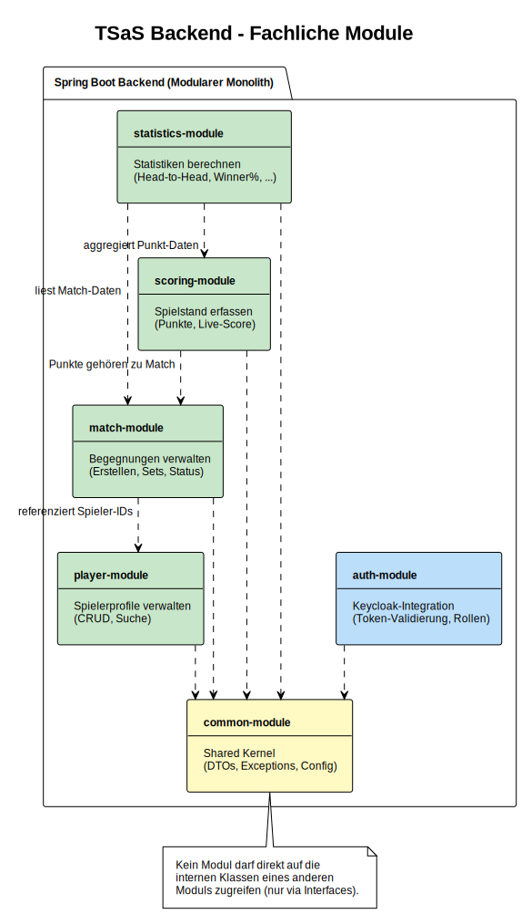
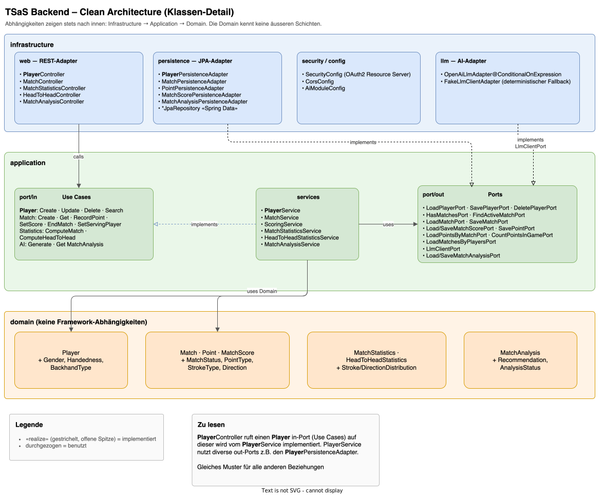
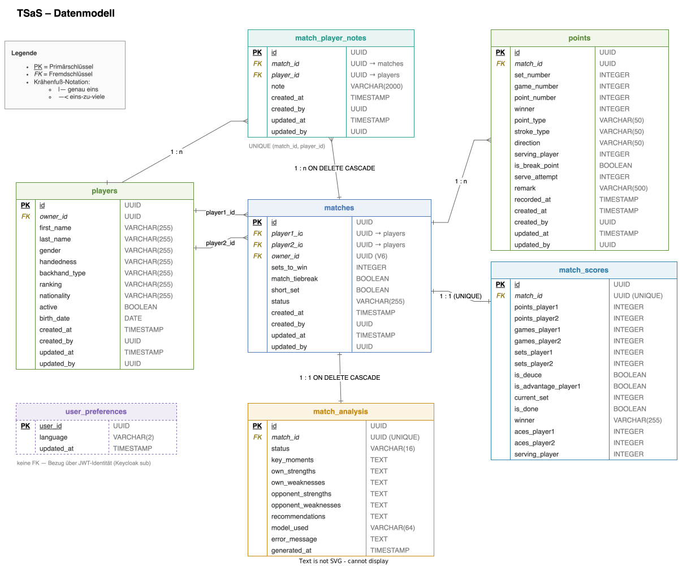

# Software Architecture Document – Tennis Score and Statistic (TSaS)

*nach arc42 Template*

| Feld | Wert |
|------|------|
| **Version** | 1.0 – Erster Entwurf |
| **Datum** | 06. März 2026 |
| **Status** | ENTWURF |
| **Autor** | Christian Bonnhoff |
| **Klassifikation** | Intern |

---

## Inhaltsverzeichnis

1. Einführung und Ziele
2. Randbedingungen
3. Kontextabgrenzung
4. Lösungsstrategie
5. Bausteinsicht
6. Laufzeitsicht
7. Verteilungssicht
8. Querschnittliche Konzepte
9. Architekturentscheidungen
10. Qualitätsanforderungen
11. Datenmodell
12. Risiken und technische Schulden
13. Glossar

---

## 1. Einführung und Ziele

Für die gezielte Vorbereitung auf ein Tennismatch fehlt derzeit eine geeignete Anwendung, welche es Eltern und Trainern ermöglicht, Statistiken und Informationen über die Spielweise und Eigenheiten des eigenen Spielers sowie des Gegners zu erfassen und auszuwerten.

Diese Lücke soll die Anwendung Tennis Score and Statistic (TSaS) schliessen. Ziel ist die Entwicklung einer Web-App (später zusätzlich einer iOS-App), mit der Trainer oder Eltern ein Tennismatch Punkt für Punkt mit vordefinierten und frei definierbaren Angaben dokumentieren können.

### 1.1 Aufgabenstellung

TSaS soll eine webbasierte Applikation bereitstellen, mit der der aktuelle Spielstand eines Tennismatches festgehalten und jeder Punkt mit fixen Attributen dokumentiert werden kann. Zusätzlich sollen einfache statistische Auswertungen ermöglicht werden.

### 1.2 Qualitätsziele

| ID | Qualitätsziel | Szenario (SMART) | Priorität |
|----|---------------|-------------------|-----------|
| QZ-01 | Wartbarkeit / Erweiterbarkeit | Der modulare Monolith muss so strukturiert sein, dass ein neues fachliches Modul (z.B. Statistik-Erweiterung) innerhalb von 5 Personentagen integriert werden kann, ohne bestehende Module zu verändern. | Hoch |
| QZ-02 | Verfügbarkeit | Das System muss eine Verfügbarkeit von mindestens 95% pro Kalendermonat aufweisen (gemessen über HTTP Health-Check des API-Endpunkts). | Hoch |
| QZ-03 | Performance – Datenerfassung | Das Erfassen eines einzelnen Punktes (POST /api/points) muss bei bis zu 100 gleichzeitigen Benutzern in maximal 250ms (95. Perzentil, serverseitig) abgeschlossen sein. | Hoch |
| QZ-04 | Performance – Statistik | Die Berechnung einer Head-to-Head-Statistik zwischen zwei Spielern muss in maximal 60 Sekunden abgeschlossen sein, auch wenn über 500 Matches in der Datenbank vorliegen. | Mittel |
| QZ-05 | Sicherheit | Alle API-Endpunkte (ausser /health) müssen durch ein gültiges OAuth2 Bearer Token geschützt sein. Unautorisierte Requests müssen mit HTTP 401 abgewiesen werden. | Hoch |
| QZ-06 | Performance – KI-Analyse | Die KI-gestützte Match-Analyse (Postmortem) muss synchron innerhalb von 60 Sekunden generiert sein (Timeout des LLM-Aufrufs). Wiederholtes Lesen einer bereits generierten Analyse erfolgt aus der DB in < 250 ms. | Mittel |

### 1.3 Stakeholder

| Rolle | Erwartungshaltung |
|-------|-------------------|
| **Tennistrainer** | Dokumentation von Matches, Zugriff auf Statistiken zur Vorbereitung auf Gegner, Analyse der Spielweise eigener Spieler. |
| **Eltern** | Einfache Bedienung während eines Matches, Übersichtliche Darstellung des Spielverlaufs und der Ergebnisse. |
| **Entwickler / Betreiber** | Wartbare, gut dokumentierte Codebasis. Einfaches Deployment mittels Docker. |

---

## 2. Randbedingungen

### 2.1 Technische Randbedingungen

| ID | Randbedingung |
|----|---------------|
| RB-T01 | Programmiersprache Backend: Java 25 mit Spring Boot 4 |
| RB-T02 | Frontend: Angular mit Node.js als Build-/Dev-Server |
| RB-T03 | Datenbank: PostgreSQL |
| RB-T04 | Authentifizierung/Autorisierung: Keycloak als Identity Provider (OAuth2/OIDC) |
| RB-T05 | Deployment: Docker Container (docker-compose) – Frontend + Backend in einem Container, DB in separatem Container |
| RB-T06 | Architekturstil: Modularer Monolith als Gradle Multi-Module-Projekt. Das Backend wird nach den Prinzipien der Clean Architecture aufgebaut (Schichten: Domain, Application, Infrastructure, Adapter). Abhängigkeiten zeigen stets von aussen nach innen – die Domänenschicht hat keine Abhängigkeiten zu Frameworks oder Infrastruktur. Modulübergreifendes **Verhalten** wird ausschliesslich über definierte Interfaces im Application-Layer aufgerufen (Ports & Adapters) – keine Event-basierte Kommunikation. Stabile **Domänen-Wertobjekte** (z. B. `Point`, `Player`, `MatchStatistics`) dürfen dagegen als gemeinsames, lesendes Domänenmodell modulübergreifend verwendet werden, statt sie an jeder Modulgrenze auf DTOs abzubilden (siehe ADR-13). Die Einhaltung dieser Regeln (framework-freie Domäne, einwärts gerichtete Schichten, zyklenfreier Modulgraph) wird durch `ArchitectureTest` automatisiert geprüft. |

### 2.2 Organisatorische Randbedingungen

- Die App soll für Tennisspieler selbsterklärend sein. Fachbegriffe aus der Tenniswelt dürfen verwendet werden.
- Erste Version (MVP) als reine Web-Applikation. Native iOS-App ist für Version 2 geplant.
- Keine Integration mit externen APIs in Version 1 (Swisstennis-API erst ab Version 4).

---

## 3. Kontextabgrenzung

### 3.1 Fachlicher Kontext

TSaS interagiert mit folgenden externen Akteuren und Systemen:


*Durchgezogene Linien = implementiert (V1 / V1.x), gestrichelte Linien = geplante Versionen. Quelle: [`diagrams/TSaS_Fachlicher_Kontext.drawio`](diagrams/TSaS_Fachlicher_Kontext.drawio)*

| Akteur / System | Beschreibung |
|------------------|-------------|
| **Trainer / Eltern** | Erfassen Spielstände Punkt für Punkt, rufen Statistiken ab, verwalten Spielerprofile. |
| **Keycloak (IDP)** | Authentifizierung und Autorisierung der Benutzer via OAuth2/OIDC. In V2 zusätzlich Google als federated IDP. |
| **Swisstennis API (V4+)** | Zukünftige Integration zum Abruf von offiziellen Spieler- und Turnierdaten. |
| **Kamera-System (V5+)** | Automatische Erfassung von Aufsprungpunkten des Balls („Hawk Eye very light"). |

### 3.2 Technischer Kontext

Die Kommunikation zwischen den Systemkomponenten erfolgt über folgende technische Schnittstellen:

| Schnittstelle | Protokoll / Technologie |
|---------------|------------------------|
| Browser ↔ Angular-Frontend | HTTPS, Port 443 (bzw. 4200 in Dev) |
| Angular-Frontend ↔ Spring Boot API | REST/JSON über HTTPS, Port 8080 |
| Spring Boot API ↔ PostgreSQL | JDBC/TCP, Port 5432 |
| Spring Boot API ↔ Keycloak | OAuth2/OIDC, HTTPS, Port 8443 |

---

## 4. Lösungsstrategie

### 4.1 Architekturansatz: Modularer Monolith

Die Anwendung wird als modularer Monolith realisiert. Diese Entscheidung basiert auf folgenden Überlegungen:

- Relativ kleine Applikation zu Beginn – ein Microservice-Ansatz wäre Over-Engineering.
- Vereinfachtes Deployment als einzelne deploybare Einheit.
- Modularität innerhalb des Monolithen ermöglicht ein nachträgliches Aufteilen in einzelne Services, falls dies notwendig wird.
- Geringere Komplexität bei der Kommunikation (keine Netzwerk-Latenzen zwischen Modulen).

### 4.2 Technologieentscheidungen

| Bereich | Technologie | Begründung |
|---------|-------------|------------|
| **Backend** | Java 25, Spring Boot 4, Gradle Multi-Module | Etabliertes Ökosystem, grosse Community, ausgereiftes Dependency-Management. Gradle Multi-Module-Projekt ermöglicht klare Modulgrenzen mit expliziten Compile-Zeit-Abhängigkeiten. Synchrone Modul-Kommunikation über Interfaces im Application-Layer – einfacher und direkter als Event-basierte Ansätze. |
| **Frontend** | Angular mit Node.js, Angular Material, ngx-charts | Typsicherheit durch TypeScript, komponentenbasiert, gut geeignet für komplexe Single-Page-Applikationen. Angular Material liefert touch-optimierte UI-Komponenten (grosse Buttons, Formulare, Dialoge) für die Punkterfassung auf dem Platz. ngx-charts ergänzt Statistik-Visualisierungen. |
| **Datenbank** | PostgreSQL | Bekannt, verbreitet, Open Source, geringes Risiko. Gute Unterstützung für relationale Datenmodelle. |
| **Security** | Keycloak | Standard für OIDC/OAuth2. Ermöglicht Einbettung von federated IDPs wie Google, Facebook. |
| **Deployment** | Docker / Docker Compose | Konsistente Umgebung über Entwicklung, Test und Produktion hinweg. |
| **KI / LLM** | Spring AI 2.0.x mit OpenAI (gpt-4o-mini Default) | Spring AI 2.x ist Boot-4-kompatibel und liefert die `ChatClient`-Abstraktion mit strukturiertem JSON-Output (BeanOutputConverter) für taktische Match-Analysen. OpenAI gewählt für die initiale Implementierung; der `LlmClientPort` im `ai-module` erlaubt späteren Wechsel auf Anthropic oder ein lokales LLM (Ollama) ohne Refactoring der Use Cases. |

### 4.3 Release-Planung

| Version | Umfang |
|---------|--------|
| **Version 1 (MVP)** | Web-App: Punkteerfassung, Spielerverwaltung, Basis-Statistiken (Head-to-Head, Winner%, Serve%), Registrierung/Login via Keycloak |
| **Version 1.x** | KI-gestützte Match-Analyse (Postmortem): Coach generiert per Klick eine strukturierte taktische Auswertung nach Match-Ende (Schlüsselmomente, Stärken/Schwächen beider Spieler, 3–5 Empfehlungen) |
| **Version 2** | Google als federated IDP, erweiterte statistische Auswertungen, natives iOS-Frontend für iPad (Swift), KI-Live-Coaching während des Matches, KI-Vorbereitung auf einen Gegner (Head-to-Head-basiert) |
| **Version 3** | Aufsprungpunkte via Touch auf skizziertem Tennisfeld im UI |
| **Version 4** | Integration Swisstennis-API (falls möglich) |
| **Version 5** | Kameraanbindung für automatische Aufsprungpunkt-Erfassung („Hawk Eye very light") |

---

## 5. Bausteinsicht

### 5.1 Whitebox Gesamtsystem

Das Gesamtsystem besteht aus drei Hauptbereichen, die als Docker-Container deployed werden:

**Container 1 – TSaS Application:** Enthält sowohl das Angular-Frontend (ausgeliefert via Node.js) als auch das Spring Boot Backend als zwei eigenständige Services.

**Container 2 – PostgreSQL Database:** Persistenz aller Applikationsdaten.

**Container 3 – Keycloak:** Identity Provider für Authentifizierung und Autorisierung.

### 5.2 Backend-Module (Modularer Monolith)

Das Spring Boot Backend ist intern in fachliche Module aufgeteilt. Jedes Modul kapselt seine Domänenlogik, seine Repositories und seine REST-Endpunkte.

| Modul | Verantwortlichkeit |
|-------|-------------------|
| `player-module` | Verwaltung von Spielerprofilen (Name, Geschlecht, Ranking, Spielhand, Backhand-Typ). CRUD-Operationen und Suchfunktionalität. |
| `match-module` | Erstellen und Verwalten von Begegnungen (Matches) mit Attributen wie Anzahl Gewinnsätze, Match-Tiebreak, Short Set; Verwaltung der Sets und Spiele. **Umfasst auch das Scoring** (Tennis-Zählregeln in `ScoringService`, Punkterfassung Punkt-für-Punkt, fixe Attribute wie Forehand Winner, Ace, Double Fault, freie Bemerkungen). Das ursprünglich separat geplante `scoring-module` wurde hier konsolidiert, da Scoring das Kernverhalten eines Matches ist und eng an dessen Zustand koppelt (siehe ADR-12). |
| `statistics-module` | Berechnung und Bereitstellung von Statistiken: Head-to-Head, Winner%, Unforced Error%, First/Second Serve%, Double Faults, Aces. Aggregierte Match-Statistiken werden on-the-fly aus Points berechnet und sowohl an die REST-Schicht als auch an das `ai-module` als Input geliefert. Abhängig von `player-module` (Spieler-Existenzprüfung → HTTP 404). REST: `GET /api/statistics/head-to-head` (FA-08), `GET /api/matches/{id}/statistics` (Einzel-Match, FA-17). |
| `auth-module` | Integration mit Keycloak. Token-Validierung, Rollenprüfung, Benutzerverwaltung. |
| `ai-module` | KI-gestützte Match-Analyse. Konsumiert `statistics-module` (aggregierte Stats) und `player-module` (Spielerdaten als Kontext), ruft via `LlmClientPort` ein LLM (Default OpenAI) und persistiert das Ergebnis als `MatchAnalysis` (1:1 zum Match, überschreibbar). REST: `POST/GET /api/matches/{id}/analysis`. |
| `common-module` | Shared Kernel mit gemeinsamen DTOs, Exceptions, Konfigurationen und Utilities. |



*Quelle: [`diagrams/TSaS_Backend_Module.drawio`](diagrams/TSaS_Backend_Module.drawio)*

### 5.3 Backend – Clean Architecture (Schichten & Ports)

Jedes fachliche Modul ist intern nach Clean Architecture / Ports & Adapters aufgebaut. Die Abhängigkeiten zeigen stets von aussen nach innen: **Infrastructure → Application → Domain**. Die Domain bleibt frei von Framework-Abhängigkeiten.

- **Domain** – Modelle und Geschäftsregeln (z. B. `Player`, `Match`, `Point`, `MatchScore`, `MatchStatistics`, `MatchAnalysis`), ohne Spring-/JPA-Abhängigkeiten.
- **Application** – Use-Case-Interfaces (`port/in`, z. B. `CreatePlayerUseCase`, `RecordPointUseCase`, `ComputeHeadToHeadStatisticsUseCase`, `GenerateMatchAnalysisUseCase`), deren `@Service`-Implementierungen (`PlayerService`, `MatchService`, `ScoringService`, `MatchStatisticsService`, `HeadToHeadStatisticsService`, `MatchAnalysisService`) sowie die Output-Ports (`port/out`, z. B. `LoadPlayerPort`, `SaveMatchScorePort`, `LoadPointsByMatchPort`, `LlmClientPort`).
- **Infrastructure** – Adapter: REST-Controller (`web`), JPA-Persistenz-Adapter (`persistence`), LLM-Adapter (`OpenAiLlmAdapter` / `FakeLlmClientAdapter`) sowie Security/Config.

Die Austauschbarkeit über Ports zeigt sich exemplarisch am `LlmClientPort`: Der produktive `OpenAiLlmAdapter` (Spring AI) und der deterministische `FakeLlmClientAdapter` (für Tests und Entwicklung ohne API-Key) implementieren denselben Port — der Use Case bleibt unverändert.



*Quelle: [`diagrams/TSaS_Backend_CleanArchitecture.drawio`](diagrams/TSaS_Backend_CleanArchitecture.drawio)*

---

## 6. Laufzeitsicht

### 6.1 Szenario: Punkt erfassen

Dieses Szenario beschreibt den typischen Ablauf, wenn ein Trainer während eines Matches einen Punkt erfasst:

1. Der Trainer klickt im Angular-Frontend auf die Schaltfläche für den Punkttyp (z.B. „Forehand Winner").
2. Das Frontend sendet einen POST-Request an /api/matches/{id}/points mit dem Bearer Token im Authorization-Header.
3. Das Spring Boot API validiert das Token via Keycloak.
4. Das match-module (Scoring-Logik) verarbeitet den Punkt: Aktualisierung des Spielstands (Punkte, Games, Sets), Persistierung in der POINT-Tabelle.
5. Das match-module aktualisiert die CURRENT_SCORE-Tabelle; aggregierte Statistiken werden vom statistics-module on-the-fly aus den Points berechnet.
6. Das API gibt den aktualisierten Spielstand als JSON zurück (HTTP 200).
7. Das Frontend aktualisiert die Anzeige des Spielstands.

### 6.2 Szenario: KI-gestützte Match-Analyse (Postmortem)

Dieses Szenario beschreibt die Generierung einer taktischen Match-Analyse nach Match-Ende:

1. Der Coach öffnet ein beendetes Match (`MatchStatus = COMPLETED`) im Frontend und klickt auf „Taktische Analyse generieren".
2. Das Frontend sendet `POST /api/matches/{id}/analysis` mit Bearer Token.
3. Der `MatchAnalysisController` im `ai-module` ruft den `GenerateMatchAnalysisUseCase` (`MatchAnalysisService`) auf.
4. Der Service prüft: Match-Status = COMPLETED (sonst HTTP 409), Punktzahl ≥ 10 (sonst HTTP 422, Kostenschutz).
5. Der Service ruft das `statistics-module` für die aggregierten Kennzahlen und das `player-module` für Spielermetadaten (Name, Ranking, Handedness, Backhand-Typ).
6. Der Service ruft `LlmClientPort.generateAnalysis(stats, metadata)`. Im Default-Profil ist dies der `OpenAiLlmAdapter` (Spring AI ChatClient → OpenAI Chat Completions API mit strukturiertem JSON-Output via BeanOutputConverter). Bei fehlendem oder leerem `OPENAI_API_KEY` übernimmt der `FakeLlmClientAdapter` (deterministisches Stub-Result) — nützlich für Tests und Entwicklung ohne Provider.
7. Die strukturierte Antwort (Schlüsselmomente, eigene/gegnerische Stärken/Schwächen, 3–5 priorisierte Empfehlungen) wird als `MatchAnalysis` mit Status `COMPLETED` in der Tabelle `match_analysis` persistiert (1:1 zum Match, überschreibbar via UNIQUE-Constraint).
8. Das API antwortet mit HTTP 200 und der vollständigen Analyse.
9. Bei LLM-Fehlern (Netzwerk, 5xx, Parse-Fehler) wird ein `MatchAnalysis`-Datensatz mit Status `FAILED` und `errorMessage` persistiert, das API antwortet mit HTTP 502. Der Coach kann „Erneut versuchen" klicken; der nächste erfolgreiche Aufruf überschreibt den FAILED-Datensatz.
10. `GET /api/matches/{id}/analysis` liefert die gespeicherte Analyse ohne erneuten LLM-Aufruf (HTTP 200) oder HTTP 404, falls noch keine generiert wurde.

### 6.3 Szenario: Benutzer-Authentifizierung

Der Login-Flow folgt dem Standard OAuth2 Authorization Code Flow mit PKCE:

1. Benutzer öffnet TSaS im Browser und wird zum Keycloak-Login weitergeleitet.
2. Benutzer authentifiziert sich (Benutzername/Passwort oder Google IDP ab V2).
3. Keycloak stellt Authorization Code aus und leitet zurück an TSaS.
4. Das Frontend tauscht den Code gegen Access- und Refresh-Token.
5. Bei jedem API-Call wird das Access-Token im Authorization-Header mitgesendet.

---

## 7. Verteilungssicht

### 7.1 Infrastruktur

Die Applikation wird mittels Docker Compose deployed. Das folgende Deployment-Diagramm zeigt die Container-Struktur:


*Quelle: [`diagrams/TSaS_Deployment.drawio`](diagrams/TSaS_Deployment.drawio). Der externe OpenAI-LLM-Dienst (Spring AI, ab V1.x) wird vom Backend über HTTPS angesprochen.*

| Container | Inhalt | Ports | Bemerkung |
|-----------|--------|-------|-----------|
| `frontend` | Nginx + Angular SPA (statische Build-Artefakte) | 80 | Nginx liefert die SPA aus und proxied `/api/`-Requests an den Backend-Container. |
| `backend` | Spring Boot API (Java 25) | 8080 | Nur intern erreichbar (kein direkter Portmapping nach aussen im Produktiv-Setup). |
| `db` | PostgreSQL 16 | 5432 (intern) | Persistentes Volume. Kein Port-Mapping nach aussen. |
| `keycloak` | Keycloak 26 | 8443 (HTTPS), 18080 (HTTP intern für JWKS) | Realm `tsas` wird beim Start automatisch importiert. |

### 7.2 Docker Compose Struktur

Schematischer Aufbau der `docker/compose.yml`:

```yaml
services:
  db:
    image: postgres:16-alpine
    volumes:
      - ../volume/postgres:/var/lib/postgresql/data
    environment:
      - POSTGRES_DB=${DB_NAME:-tsas}
      - POSTGRES_USER=${DB_USERNAME:-tsas}
      - POSTGRES_PASSWORD=${DB_PASSWORD:-tsas}

  keycloak:
    image: quay.io/keycloak/keycloak:26.0.7
    command: start-dev --import-realm
    ports:
      - "8443:8443"   # HTTPS (Browser OAuth2)
      - "18080:8080"  # HTTP (interner JWKS-Abruf durch Backend)

  backend:
    build: ./backend
    ports:
      - "8080:8080"
    depends_on:
      db: { condition: service_healthy }
      keycloak: { condition: service_healthy }
    environment:
      - SPRING_DATASOURCE_URL=jdbc:postgresql://db:5432/tsas
      - KEYCLOAK_ISSUER_URI=https://keycloak:8443/realms/tsas
      - KEYCLOAK_JWK_SET_URI=http://keycloak:8080/realms/tsas/protocol/openid-connect/certs

  frontend:
    build: ./frontend
    ports:
      - "80:80"
    depends_on:
      - backend
```

---

## 8. Querschnittliche Konzepte

### 8.1 Sicherheitskonzept

Alle API-Endpunkte (ausser Health-Check) werden durch OAuth2 Bearer Tokens geschützt. Das Frontend nutzt den Authorization Code Flow mit PKCE. Keycloak verwaltet Benutzer, Rollen und Sessions. In Version 1 erfolgt die Registrierung direkt in Keycloak, ab Version 2 zusätzlich über Google als federated Identity Provider.

### 8.2 Persistenz

Die Datenpersistenz erfolgt über Spring Data JPA / Hibernate mit PostgreSQL. Jedes fachliche Modul besitzt eigene Repository-Interfaces. Das Datenbankschema wird via Flyway-Migrationen verwaltet.

**Flyway-Konfiguration:**

- Die Flyway-Dependency (`flyway-core`, `flyway-database-postgresql`) ist im `app`-Modul deklariert – dem natürlichen Aggregator aller fachlichen Module.
- Migrationsskripte liegen unter `backend/app/src/main/resources/db/migration/` und folgen dem Namensschema `V{n}__{beschreibung}.sql`.
- `V1__baseline.sql` enthält das initiale Schema aller Tabellen (`players`, `matches`, `match_scores`), abgeleitet aus den bestehenden JPA-Entitäten.
- Hibernate `ddl-auto` ist auf `validate` (PostgreSQL) bzw. `none` (H2/lokal) gesetzt – Flyway ist die einzige Quelle für Schema-Änderungen.
- Die Migrationsskripte verwenden ausschliesslich ANSI-SQL, das mit PostgreSQL und H2 kompatibel ist (kein datenbankspezifischer SQL-Dialekt), damit auch das lokale H2-Profil Flyway-gesteuert ist.

### 8.3 Fehlerbehandlung

Die Fehlerbehandlung erfolgt deklarativ über `@RestControllerAdvice`. Querschnittliche Fälle liegen zentral im `common-module` (`CommonExceptionHandler`): fachliche Zustandskonflikte (Basisklasse `ConflictException`) → HTTP 409, Bean-Validation-Fehler (`MethodArgumentNotValidException`) → HTTP 400 mit Feld-Details, ungültige Argumente (z. B. unbekannter Enum-Wert) → HTTP 400. Modulspezifische Domain-Exceptions werden in den jeweiligen Advices abgebildet: `GlobalExceptionHandler` (Player/Match „nicht gefunden" → 404) und `AiExceptionHandler` (`InsufficientMatchDataException` → 422, `AnalysisGenerationException` → 502). Technische Fehler ergeben HTTP 5xx.

Das Antwortformat folgt **RFC 7807** über Springs `ProblemDetail` (Felder `type`, `title`, `status`, `detail`, ggf. zusätzliche Properties wie `errors`) — der Spring-native Standard, der das früher geplante Ad-hoc-Format `{error-code, message, timestamp}` ablöst.

### 8.4 Logging und Monitoring

Strukturiertes Logging via SLF4J/Logback im JSON-Format. Spring Boot Actuator stellt Health-, Metrics- und Info-Endpunkte bereit. Metriken können über Prometheus/Grafana überwacht werden.

### 8.5 Testkonzept

- **Unit Tests (Backend):** JUnit 5 (Jupiter) für Domänenlogik und Services; Mockito für das Mocking von Ports und externen Abhängigkeiten.
- **Integrations-/API-Tests (Backend):** Spring Boot Test mit Testcontainers (PostgreSQL) und MockMvc (`AbstractIntegrationTest`); die JWT-Validierung wird via Spring Security Test gemockt — kein laufendes Keycloak nötig.
- **Coverage-Gate (Backend):** JaCoCo, modulübergreifend aggregiert. Die `*IT`-Integrationstests liegen im `app`-Modul, decken aber Klassen aller Module ab — per-Modul-Reports würden unterzählen. Die Root-Tasks `jacocoRootReport` (Report) und `jacocoRootCoverageVerification` (Gate) kombinieren die `test.exec`-Daten aller Module gegen alle `main`-Sources. Das Gate ist in `check` eingehängt und bricht den Build unter **85 % Line / 70 % Branch** (aktueller Stand ~95 % / ~80 %). Schwellen in `backend/build.gradle.kts` (`violationRules`).
- **Frontend-Tests:** Vitest (`@angular/build:unit-test`-Builder, `*.spec.ts`) für Unit-Tests sowie Cypress Component Testing (`*.cy.ts`) für Komponenten-/Integrationstests mit gemockten HTTP-Calls (`cy.intercept`).

### 8.6 Continuous Integration / Build-Gate

Zwei GitHub-Actions-Workflows laufen bei jedem Push und Pull Request auf `develop` und `main`:

| Workflow | Datei | Inhalt |
|----------|-------|--------|
| **Backend CI** | `.github/workflows/backend-ci.yml` | `./gradlew check` (alle Tests + JaCoCo-Coverage-Gate) auf `ubuntu-latest` mit JDK 25 (Temurin). Lädt den aggregierten Coverage-Report als Build-Artifact hoch. Testcontainers nutzt das auf `ubuntu-latest` nativ vorhandene Docker — keine Zusatzkonfiguration nötig. |
| **Frontend CI** | `.github/workflows/frontend-ci.yml` | `ng build` + Vitest-Unit-Tests + Cypress-Komponententests auf Node 22 (mit npm- und Cypress-Binary-Cache). |

Beide Checks sind auf `develop` und `main` als **required status checks** via Branch Protection gesetzt: Ein PR kann erst gemergt werden, wenn beide grün sind. Damit pfadgefilterte Workflows die required Checks nicht blockieren (ein nicht ausgelöster Check bliebe „pending" und würde den Merge verhindern), laufen beide Workflows ohne Pfadfilter bei jedem Push/PR auf die geschützten Branches. `enforce_admins` ist deaktiviert, sodass Repo-Admins im Notfall überstimmen können.

### 8.7 Testergebnisse

Snapshot vom **2026-06-13** (Branch `develop`, Stand nach PR #6). Reproduzierbar mit:

```bash
cd backend
JAVA_HOME=/opt/java/jdk-25.0.1 DOCKER_HOST=unix:///var/run/docker.sock \
  TESTCONTAINERS_RYUK_DISABLED=true ./gradlew clean test jacocoRootReport
```

Der aggregierte Coverage-Report dieses Snapshots ist **nachvollziehbar im Repository eingecheckt** unter `backend/doc/reports/jacoco/jacocoRootReport/` (HTML/XML/CSV — Einstieg `html/index.html`). Frisch generiert landet er zusätzlich unter `backend/build/reports/jacoco/jacocoRootReport/`, und die CI lädt ihn bei jedem Lauf auf `develop`/`main` als Build-Artifact des Workflows **Backend CI** hoch.

**Backend — Testanzahl (alle grün, 0 Failures / 0 Errors / 0 Skipped):**

| Modul | Tests | Schwerpunkt |
|-------|------:|-------------|
| `app` | 78 | Integrations-/API-Tests (Testcontainers + MockMvc) über alle Module; `ArchitectureTest` (Schichten/Modulgrenzen) |
| `match-module` | 60 | Scoring-Regeln (`ScoringService`), Match-Lebenszyklus, Break-Point-Logik |
| `statistics-module` | 31 | Punkt-Attribution und Kennzahlen-Berechnung (inkl. Head-to-Head) |
| `player-module` | 16 | Spieler-Use-Cases inkl. Lösch-/Deaktivierungsregeln |
| `ai-module` | 7 | `MatchAnalysisService` (inkl. Fehlerpfade) + `OpenAiLlmAdapter` (WireMock) |
| **Gesamt** | **192** | Laufzeit ~15 s (ohne Container-Start) |

**Backend — Coverage (JaCoCo, modulübergreifend aggregiert):**

| Bereich | Line | Branch |
|---------|-----:|-------:|
| **Gesamt** | **94,8 %** (1336/1410) | **79,7 %** (278/349) |
| `match` | 92,0 % | 74,2 % |
| `statistics` | 98,2 % | 89,8 % |
| `player` | 100 % | 70,0 % |
| `ai` | 94,8 % | 72,2 % |
| `common` | 100 % | 75,0 % |

Das Gate (`jacocoRootCoverageVerification`, in `check` eingehängt) verlangt **85 % Line / 70 % Branch** und ist erfüllt.

**Interpretation:**

- **Abgedeckt ist die fachliche Kernlogik**: die Tennis-Zählregeln (Punkte/Spiele/Sätze, Tie-Break, Short Set, Break-Points) im `match-module`, die Punkt-Attribution und Statistik-Berechnung im `statistics-module`, die Spieler-Geschäftsregeln sowie die KI-Analyse inklusive Fehlerpfaden (LLM-Ausfall → HTTP 502, zu wenige Punkte → 422, Match nicht beendet → 409). Die Integrationstests fahren gegen eine **echte PostgreSQL** (Testcontainers) inklusive Flyway-Migrationen und Spring-Security-JWT, decken also den realen Persistenz- und Web-Stack ab. Der `ArchitectureTest` sichert zusätzlich die Schichten-/Modulgrenzen ab.
- **Die Branch-Coverage (80 %) liegt erwartungsgemäß unter der Line-Coverage.** Die nicht abgedeckten Zweige sind überwiegend **defensive Pfade**: Guard-Klauseln (z. B. `Point`-Winner-Validierung, Null-Prüfungen in Mappern), Serialisierungs-Fehlerzweige im Persistenz-Adapter und selten erreichte Verzweigungen der Scoring-Logik. Diese werden bewusst nicht alle einzeln getestet — ein Gate von 70 % Branch verankert die Untergrenze, ohne Tests für triviale/defensive Zweige zu erzwingen.
- **Bewusste Lücken:** Der OpenAI-*Happy-Path* gegen die echte API ist nicht im automatisierten Lauf enthalten (über `FakeLlmClientAdapter`/WireMock abgebildet; manuelle Verifikation siehe TEN-25/TEN-26). `TsasBackendApplication.main` und reine Konfigurationsklassen tragen kaum testbare Logik und drücken die Bereichswerte von `app`/`auth` optisch, sind aber fachlich irrelevant.

---

## 9. Architekturentscheidungen

| ID | Entscheidung | Begründung | Status |
|----|-------------|------------|--------|
| ADR-01 | **Modularer Monolith statt Microservices** | Die Applikation ist in V1 klein und wird von einem kleinen Team entwickelt. Die Komplexität von Microservices (Service Discovery, verteilte Transaktionen, Netzwerk-Overhead) ist nicht gerechtfertigt. Die interne Modularisierung als Gradle Multi-Module-Projekt erzwingt klare Modulgrenzen auf Compile-Ebene und erleichtert die spätere Extraktion einzelner Module als eigenständige Microservices. | Akzeptiert |
| ADR-02 | **Frontend und Backend in separaten Docker Containern** | Frontend (Angular, via Nginx) und Backend (Spring Boot) laufen in eigenständigen Containern. Nginx übernimmt das Ausliefern der statischen Angular-Artefakte und proxied `/api/`-Requests an den Backend-Container. Diese Trennung vereinfacht unabhängige Skalierung, ermöglicht saubere Separation of Concerns und entspricht dem üblichen Deployment-Muster für SPA + REST-Backend. | Akzeptiert |
| ADR-03 | **Keycloak als Identity Provider** | Keycloak ist der De-facto-Standard für OIDC/OAuth2 und bietet out-of-the-box Support für User-Management, Rollen, federated IDPs und Self-Service-Registrierung. | Akzeptiert |
| ADR-04 | **PostgreSQL als Datenbank** | Bewährte relationale Datenbank mit guter Spring-Integration. Das Datenmodell ist klar relational (Player, Match, Set, Point, Stats). Kein Bedarf für NoSQL. | Akzeptiert |
| ADR-05 | **REST API als Schnittstellenformat** | JSON/REST ist Standard für Web-Applikationen, gut tooling-unterstützt und einfach zu dokumentieren (OpenAPI/Swagger). GraphQL wäre eine Alternative, erhöht aber die Komplexität unnötig. | Akzeptiert |
| ADR-06 | **Flyway statt Liquibase für DB-Migrationen** | TSaS betreibt eine einzelne PostgreSQL-Instanz mit einem überschaubaren, stabilen relationalen Datenmodell (6 Kernentitäten). Flyway deckt diesen Anwendungsfall vollständig ab: Migrationen werden als plain SQL-Dateien versioniert, sind direkt lesbar und ohne XML/YAML-Overhead. Die erweiterte Flexibilität von Liquibase (Datenbank-agnostische Changelogs, Rollback-Skripte, Diff-Tooling) ist für dieses Projekt nicht erforderlich, da ein Datenbankwechsel nicht geplant ist und Rollbacks über Datenbankbackups abgedeckt werden. Flyway ist zudem out-of-the-box in Spring Boot integriert (Auto-Configuration) und erfordert keine zusätzliche Konfiguration. **Implementierung:** Flyway-Dependency im `app`-Modul, Skripte unter `db/migration/`, Baseline `V1__baseline.sql` repräsentiert das bei Einführung von Flyway bestehende Schema. | Akzeptiert |
| ADR-08 | **Angular Material + ngx-charts als UI-Framework** | Die primären Nutzer (Coaches, Eltern) verwenden die App während eines Matches auf Tablet oder Smartphone. Angular Material erfüllt die daraus resultierenden Anforderungen out-of-the-box: touch-optimierte Komponenten, responsive Layouts und grosse interaktive Elemente für schnelle Punkterfassung. Als offizielle Google-Library ist Angular Material eng mit Angular verzahnt, gut dokumentiert und kostenlos. Für die Statistik-Darstellung (FA-08) wird ngx-charts ergänzt, das nahtlos mit Angular Material harmoniert und ebenfalls kostenfrei ist. Die evaluierte Alternative PrimeNG bietet mehr Komponenten, ist aber schwerer, erfordert mehr Konfiguration und wäre für V1 Over-Engineering. | Akzeptiert |
| ADR-09 | **`angular-oauth2-oidc` statt `keycloak-angular` als Frontend OIDC-Library** | Für den Authorization Code + PKCE Flow im Angular-Frontend wurde `angular-oauth2-oidc` gegenüber `keycloak-angular` (keycloak-js Wrapper) bevorzugt. Gründe: (1) `angular-oauth2-oidc` ist eine generische, standard-konforme OIDC-Library — kein Keycloak-spezifisches Coupling im Frontend-Code. Bei einem zukünftigen IDP-Wechsel (z.B. Auth0, Okta) muss nur die Konfiguration angepasst werden, nicht der Code. (2) Die Library ist schlanker und hat keine Abhängigkeit auf `keycloak-js`, das eigene Release-Zyklen und Breaking Changes mitbringt. (3) `angular-oauth2-oidc` unterstützt PKCE nativ und ist aktiv gepflegt. **Implementierung:** `OAuthModuleConfig` in `core/auth/auth.config.ts`, HTTP-Interceptor für Bearer-Token-Injection, `CanActivateFn` Guard für alle Routes. | Akzeptiert |
| ADR-07 | **Gradle Multi-Module statt Spring Modulith** | Spring Modulith wurde evaluiert, aber verworfen. Gründe: (1) Spring Modulith nutzt für die modul-übergreifende Kommunikation Application Events (Spring `@EventListener`/`ApplicationEventPublisher`), was standardmässig zu asynchroner Kommunikation führt – eine unnötige Komplexität für einen Use-Case, der synchrone Antworten erfordert. (2) Die Kommunikation zwischen Modulen lässt sich sauberer und direkter über explizite Interfaces im Application-Layer (Ports & Adapters / Clean Architecture) abbilden – ohne Framework-Magie und ohne Remote-Kommunikationssemantik für lokale Aufrufe. (3) Ein Gradle Multi-Module-Projekt erzwingt Modulgrenzen zur Compile-Zeit: unerwünschte Abhängigkeiten zwischen Modulen werden sofort als Build-Fehler sichtbar. (4) Die Gradle-Modul-Struktur erleichtert die spätere Extraktion einzelner Module als eigenständige Microservices, da jedes Modul bereits ein eigenständiges Build-Artefakt mit expliziten Abhängigkeiten darstellt. | Akzeptiert |
| ADR-11 | **CI/CD mit GitHub Actions + aggregiertes JaCoCo-Coverage-Gate** | Qualitätssicherung wird automatisiert und durchgesetzt statt nur lokal empfohlen. Zwei pfad-ungefilterte Workflows (Backend, Frontend) laufen auf `develop`/`main` und sind als required status checks gesetzt. Coverage wird modulübergreifend aggregiert (die IT-Tests im `app`-Modul decken Klassen aller Module ab, daher würde ein per-Modul-Gate fälschlich fehlschlagen) und per Gate in `check` erzwungen (85 % Line / 70 % Branch). Schwellen-Begründung: knapp unter dem Ist-Stand (~95 %/~80 %) → fängt Regressionen, ohne bei kleinen Schwankungen zu brechen. Pfadfilter wurden entfernt, weil ein required, aber nicht ausgelöster Check den Merge dauerhaft blockiert. `enforce_admins=false`, damit Admins im Notfall überstimmen können. **Implementierung:** `.github/workflows/backend-ci.yml`, `.github/workflows/frontend-ci.yml`; Root-Tasks `jacocoRootReport`/`jacocoRootCoverageVerification` in `backend/build.gradle.kts`. | Akzeptiert |
| ADR-10 | **Spring AI mit OpenAI als initialer LLM-Provider; Provider-Abstraktion via `LlmClientPort`** | Für die KI-gestützte Match-Analyse (V1.x Postmortem, V2 Live-Coaching + Vorbereitung) wurde Spring AI 2.0.x mit dem OpenAI-Starter gewählt. Gründe: (1) Spring AI 2.x ist Boot-4-kompatibel und liefert mit `ChatClient.entity(Class)` strukturierten JSON-Output via BeanOutputConverter — kein fragiler String-Parser. (2) OpenAI als initialer Provider (Default `gpt-4o-mini` aus Kostengründen, austauschbar via Property) wegen ausgereifter API, hoher Reasoning-Qualität und einfacher Integration. (3) Die Provider-Abstraktion erfolgt über den Out-Port `LlmClientPort` im `ai-module`; ein zweiter Adapter (Anthropic, Ollama für lokales LLM) lässt sich später ohne Eingriff in den Use Case ergänzen. (4) Aktivierung des `OpenAiLlmAdapter` per `@ConditionalOnExpression` auf einen nicht-leeren `spring.ai.openai.api-key`; ohne Key übernimmt der `FakeLlmClientAdapter` via `@ConditionalOnMissingBean` (deterministisch, kostenfrei, geeignet für Tests und API-Key-freie Entwicklung). (5) Analyse wird einmal pro Match generiert und persistiert (1:1 zur `matches`-Tabelle via UNIQUE-Constraint, überschreibbar) — Kostenkontrolle und Reproduzierbarkeit. **Implementierung:** `ai-module` mit Clean Architecture (Domain `MatchAnalysis`, Use Cases `GenerateMatchAnalysisUseCase`/`GetMatchAnalysisUseCase`, Out-Ports `LlmClientPort`/`SaveMatchAnalysisPort`/`LoadMatchAnalysisPort`, Adapter `OpenAiLlmAdapter`/`FakeLlmClientAdapter`/`MatchAnalysisPersistenceAdapter`). Spring-Milestone-Repo nötig (Spring AI 2.0.0-M6). | Akzeptiert |
| ADR-12 | **Scoring im `match-module` statt eigenständigem `scoring-module`** | Die frühe Bausteinskizze sah ein separates `scoring-module` vor. Bei der Umsetzung wurde Scoring stattdessen im `match-module` realisiert (`ScoringService`, `MatchScore`, `Point`). Gründe: (1) Das Erfassen und Zählen von Punkten ist das **Kernverhalten** eines Matches und operiert untrennbar auf dessen Zustand (Status, Sätze, Spiele) — eine Modulgrenze dazwischen hätte einen ständigen, fein granularen Hin-und-Her-Verkehr über Ports erzwungen, ohne fachlichen Mehrwert. (2) Ein eigenes Gradle-Modul rechtfertigt sich erst bei eigenständig wiederverwendbarer Verantwortung; Scoring ohne Match ist nicht sinnvoll. (3) Die Konsolidierung reduziert Kopplung und Boilerplate. Eine spätere Extraktion bleibt möglich, da Scoring intern als eigene Klasse (`ScoringService`) gekapselt ist. | Akzeptiert |
| ADR-13 | **Gemeinsames lesendes Domänenmodell statt DTO-Mapping an jeder Modulgrenze** | Module rufen fremdes **Verhalten** nur über Application-Layer-Ports auf (RB-T06), verwenden aber stabile **Domänen-Wertobjekte** anderer Module direkt als gemeinsames Read-Model (z. B. liest `statistics-module` `match`-`Point`s, `ai-module` `Match`/`Player`/`MatchStatistics`). Gründe: (1) Diese Typen sind framework-freie, stabile Werte ohne Verhalten; eine Anti-Corruption-Schicht mit Spiegel-DTOs an jeder Grenze wäre für einen modularen Monolithen reines Over-Engineering und würde Duplikation erzeugen. (2) Die Abhängigkeiten bleiben einwärts gerichtet und zyklenfrei (Domäne→Domäne). (3) `ArchitectureTest` stellt sicher, dass dabei keine Schicht- oder Framework-Grenze verletzt wird. Bei einer späteren Modul-Extraktion zu Services würden diese geteilten Typen zu veröffentlichten Vertragstypen bzw. DTOs. | Akzeptiert |

---

## 10. Qualitätsanforderungen

### 10.1 Funktionale Anforderungen (SMART)

| ID | Anforderung | SMART-Beschreibung | Version |
|----|-------------|-------------------|---------|
| FA-01 | **User-Registrierung** | Ein nicht authentifizierter Benutzer kann sich über das Keycloak Self-Service-Registrierungsformular mit den Pflichtfeldern E-Mail (gültiges RFC-5322-Format), Benutzername (3–50 Zeichen) und Passwort (mind. 8 Zeichen, mind. 1 Grossbuchstabe und 1 Ziffer) registrieren. Nach erfolgreicher Registrierung wird der Benutzer automatisch authentifiziert und innerhalb von 5 Sekunden auf die TSaS-Startseite weitergeleitet. Doppelte E-Mail-Adressen oder Benutzernamen werden mit einer spezifischen Fehlermeldung im Formular abgewiesen (HTTP 409 intern). | V1 |
| FA-02 | **Authentifizierung** | Ein registrierter Benutzer kann sich via OAuth2 Authorization Code Flow mit PKCE über Keycloak anmelden. Nach erfolgreicher Authentifizierung erhält der Browser ein Access Token (Gültigkeit: 15 Minuten) und ein Refresh Token (Gültigkeit: 30 Tage). Mit gültigem Access Token werden alle geschützten API-Endpunkte mit HTTP 200 beantwortet; ohne gültiges Token antworten alle Endpunkte (ausser `/health`) mit HTTP 401. Der gesamte Login-Flow muss unter normaler Last (≤ 100 Benutzer) innerhalb von 3 Sekunden abgeschlossen sein. | V1 |
| FA-03 | **Spieler erfassen** | Ein authentifizierter Benutzer kann über `POST /api/players` einen neuen Spieler anlegen. Pflichtfelder: Vorname (max. 50 Zeichen), Nachname (max. 50 Zeichen), Geschlecht (`MALE`/`FEMALE`/`OTHER`), Spielhand (`LEFT`/`RIGHT`), Backhand-Typ (`ONE_HANDED`/`TWO_HANDED`). Optionale Felder: Ranking (ganze Zahl > 0), Nationalität (ISO 3166-1 Alpha-2, 2 Zeichen), Geburtsdatum (ISO 8601). Bei gültiger Eingabe antwortet das API mit HTTP 201 und der angelegten Spieler-Ressource inklusive generierter UUID. Fehlende Pflichtfelder oder Formatverletzungen werden mit HTTP 400 und strukturierter Fehlermeldung (Feldname + Grund) abgewiesen. Die Antwort erfolgt innerhalb von 250 ms. | V1 |
| FA-04 | **Spieler suchen** | Ein authentifizierter Benutzer kann über `GET /api/players?firstName={}&lastName={}` nach Spielern suchen. Mindestens einer der beiden Parameter muss angegeben sein (sonst HTTP 400). Das API liefert eine paginierte Liste (max. 50 Einträge pro Seite, Standard-Sortierung: Nachname aufsteigend) aller Treffer innerhalb von 500 ms (95. Perzentil). Bei keinen Treffern wird eine leere Liste mit HTTP 200 zurückgegeben. | V1 |
| FA-05 | **Match erstellen** | Ein authentifizierter Benutzer kann über `POST /api/matches` ein neues Match anlegen. Pflichtfelder: `player1Id` und `player2Id` (müssen als Spieler existieren, sonst HTTP 404), `setsToWin` (2 oder 3), `matchTiebreak` (true/false), `shortSet` (true/false). Bei erfolgreicher Erstellung antwortet das API mit HTTP 201, der neuen Match-Ressource inklusive generierter UUID und Status `IN_PROGRESS`. Die Antwort erfolgt innerhalb von 250 ms. | V1 |
| FA-06 | **Punkte erfassen** | Während eines laufenden Matches (Status `IN_PROGRESS`) kann ein authentifizierter Benutzer über `POST /api/matches/{id}/points` einen Punkt erfassen. Pflichtfelder: `pointType` (`WINNER`/`UNFORCED_ERROR`/`FORCED_ERROR`/`ACE`/`DOUBLE_FAULT`/`NET`/`OUT_LONG`/`OUT_SIDE`), `strokeType` (`FOREHAND`/`BACKHAND`/`SERVE`/`VOLLEY`/`SMASH`) und `direction` (`CROSS_COURT`/`DOWN_THE_LINE`/`MIDDLE`). Optionalfeld: `remark` (Freitext, max. 500 Zeichen). Das API antwortet mit HTTP 201 und dem aktualisierten Spielstand. Ungültige Enum-Werte oder fehlende Pflichtfelder werden mit HTTP 400 abgewiesen. Die Verarbeitung erfolgt innerhalb von 250 ms (95. Perzentil bei 100 gleichzeitigen Benutzern). | V1 |
| FA-07 | **Spielstand anzeigen** | Nach jedem erfassten Punkt enthält die API-Antwort von `POST /api/matches/{id}/points` den vollständigen, korrekt berechneten Spielstand: laufende Punkte im Game (0/15/30/40/Vorteil/Tiebreak-Zählung), gewonnene Games pro Satz und gewonnene Sätze beider Spieler. Das Angular-Frontend aktualisiert die Anzeige auf Basis dieser Antwort innerhalb von 250 ms. Einstand und Vorteile sowie Tiebreak-Regeln müssen gemäss ITF-Regelwerk korrekt abgebildet sein. | V1 |
| FA-08 | **Head-to-Head-Statistik** | Ein authentifizierter Benutzer kann über `GET /api/statistics/head-to-head?player1={id}&player2={id}` eine Statistik abrufen. Die Antwort enthält für beide Spieler die folgenden Kennzahlen, jeweils als Absolutwert und Prozentwert (wo sinnvoll): **Aufschlag:** First Serve% (Anteil erster Aufschläge im Feld), First Serve Won%, Second Serve Won%, Aces (absolut), Double Faults (absolut). **Return:** Return Points Won% auf ersten Aufschlag, Return Points Won% auf zweiten Aufschlag, Break Points Won% (gewonnene von gespielten Break Points), Return Games Won%. **Rallye:** Winners% (Anteil direkter Gewinnschläge an allen Punkten), Unforced Error%. **Match-Bilanz:** Siege und Niederlagen gegeneinander (absolut), Satzbilanz (gewonnene:verlorene Sätze gesamt). Die Berechnung muss auch bei 500 oder mehr gespeicherten Matches innerhalb von 60 Sekunden abgeschlossen sein. Nicht existierende Spieler-IDs werden mit HTTP 404 abgewiesen. **Implementierung:** `GET /api/statistics/head-to-head` im `statistics-module`. Match-/Satzbilanz wird ausschliesslich aus abgeschlossenen Matches (entschiedenes `MatchScore.winner`) berechnet; Punkt-basierte Kennzahlen aggregieren über alle gemeinsamen Matches mit erfassten Punkten. Return-Games-Won% wird aus dem spielentscheidenden Punkt je (Satz, Spiel) abgeleitet. | V1 |
| FA-09 | **Google-Login** | Ein Benutzer kann sich auf dem Keycloak-Login-Bildschirm über die Schaltfläche «Mit Google anmelden» via OAuth2-Federation mit seinem Google-Konto authentifizieren. Beim ersten Google-Login wird automatisch ein TSaS-Benutzerkonto mit der verifizierten Google-E-Mail-Adresse angelegt (HTTP 201 intern). Nach dem Login hat der Benutzer identische Zugriffsrechte wie ein lokal registrierter Benutzer (HTTP 200 auf alle geschützten Endpunkte). Der gesamte Google-Login-Flow muss innerhalb von 5 Sekunden abgeschlossen sein. | V2 |
| FA-10 | **Aufsprungpunkte erfassen** | Während der Punkterfassung kann ein authentifizierter Benutzer per Touch oder Mausklick auf eine massstabsgetreue, schematische Tennisfeld-Darstellung (Draufsicht, Abmessungen 23,77 m × 10,97 m) den Aufsprungpunkt des Balls markieren. Die normalisierten X/Y-Koordinaten (Gleitkommazahl, relativ zur Feldgrösse) werden als optionales Feld im `POST /api/matches/{id}/points` gespeichert. Die Touch/Klick-Eingabe muss innerhalb von 100 ms durch einen sichtbaren Marker auf der Darstellung bestätigt werden. | V3 |
| FA-11 | **KI-gestützte Match-Analyse (Postmortem)** | Für ein beendetes Match (Status `COMPLETED`) mit mindestens 10 erfassten Punkten kann ein authentifizierter Benutzer über `POST /api/matches/{id}/analysis` eine strukturierte taktische Auswertung generieren. Das Backend aggregiert die Match-Statistiken, baut einen Prompt aus Statistiken und Spielermetadaten (Name, Ranking, Handedness, Backhand-Typ) und ruft via Spring AI ein LLM (Default OpenAI `gpt-4o-mini`). Die Antwort enthält fünf Textfelder (Schlüsselmomente, eigene Stärken, eigene Schwächen, gegnerische Stärken, gegnerische Schwächen) und 3–5 priorisierte Empfehlungen. Die Analyse wird in `match_analysis` persistiert (1:1 zum Match, überschreibbar). Antwort innerhalb von 60 s (Timeout). Das Angular-Frontend stellt die Analyse über eine dedizierte Route (`/matches/:id/analysis`, `MatchAnalysisComponent`) dar — Generieren/Neu-Generieren mit Spinner, Anzeige der fünf Textfelder + priorisierter Empfehlungen und statuscode-spezifische Fehlerbehandlung (409/422/502). HTTP-Codes: 200 (erfolgreich), 404 (Match unbekannt), 409 (Match nicht `COMPLETED`), 422 (< 10 Points), 502 (LLM-Fehler — FAILED-Datensatz wird trotzdem persistiert). `GET /api/matches/{id}/analysis` liefert die gespeicherte Analyse aus der DB ohne erneuten LLM-Aufruf (< 250 ms). Sprache der Auswertung: Deutsch. | V1.x |
| FA-12 | **Spieler aktualisieren** | Ein authentifizierter Benutzer kann über `PUT /api/players/{id}` einen bestehenden Spieler ändern. Pflicht- und Optionalfelder sind identisch zu FA-03 (Vorname, Nachname, Geschlecht, Spielhand, Backhand-Typ als Pflicht; Ranking, Nationalität, Geburtsdatum optional). Bei gültiger Eingabe antwortet das API mit HTTP 200 und der aktualisierten Spieler-Ressource (inklusive `deletable`-Flag und ggf. `activeMatchId`). Eine unbekannte Spieler-ID wird mit HTTP 404 abgewiesen, fehlende Pflichtfelder oder Formatverletzungen mit HTTP 400 und strukturierter Fehlermeldung. Die Antwort erfolgt innerhalb von 250 ms. | V1 |
| FA-13 | **Spieler löschen / deaktivieren** | Ein authentifizierter Benutzer kann einen Spieler über `DELETE /api/players/{id}` hart löschen (HTTP 204). Ist der Spieler an mindestens einem Match beteiligt, wird das harte Löschen zum Schutz der Match-Historie mit HTTP 409 abgewiesen; in diesem Fall steht `PATCH /api/players/{id}/deactivate` zur Verfügung, das den Spieler per Soft-Delete deaktiviert (`active = false`) und Datensatz samt Match-Historie erhält (HTTP 204). Eine unbekannte Spieler-ID wird in beiden Fällen mit HTTP 404 abgewiesen. Die Antwort erfolgt innerhalb von 250 ms. | V1 |
| FA-14 | **Match beenden / Walkover** | Ein authentifizierter Benutzer kann ein laufendes Match vorzeitig beenden. `POST /api/matches/{id}/end` markiert das Match als `COMPLETED`; ein noch nicht entschiedener Spielstand wird finalisiert und der Sieger aus den gewonnenen Sätzen abgeleitet (HTTP 200 mit Match-Ressource). `POST /api/matches/{id}/end/walkover` beendet das Match per Walkover und weist den Sieg unabhängig vom bisherigen Spielstand zu; Pflichtfeld im Body: `winner` (`PLAYER1`/`PLAYER2`). Bei Erfolg antwortet das API mit HTTP 200. Ein Walkover auf einem bereits abgeschlossenen Match wird mit HTTP 409 abgewiesen, ein unbekanntes Match mit HTTP 404, ein fehlender oder ungültiger `winner` mit HTTP 400. Die Antwort erfolgt innerhalb von 250 ms. | V1 |
| FA-15 | **Spielstand manuell korrigieren** | Ein authentifizierter Benutzer kann den Spielstand eines Matches über `PUT /api/matches/{id}/score` manuell überschreiben (Korrektur). Pflichtfelder: `pointsPlayer1`/`pointsPlayer2`, `gamesPlayer1`/`gamesPlayer2`, `setsPlayer1`/`setsPlayer2` (jeweils ganze Zahl ≥ 0), `currentSet` (ganze Zahl ≥ 1), `isDeuce` und `isDone` (boolean). Optionalfelder: `isAdvantagePlayer1` (boolean, nullable), `winner` (`PLAYER1`/`PLAYER2` oder leer). Der Match-Status wird mit `isDone` synchronisiert: ein entschiedener Stand setzt das Match auf `COMPLETED`, ein nicht mehr entschiedener Stand öffnet ein zuvor abgeschlossenes Match wieder auf `IN_PROGRESS`. Bei Erfolg antwortet das API mit HTTP 200 und dem korrigierten Spielstand. Ein unbekanntes Match wird mit HTTP 404, Wertebereichsverletzungen (negative Werte, `currentSet` < 1, ungültiger `winner`) mit HTTP 400 abgewiesen. Die Antwort erfolgt innerhalb von 250 ms. | V1 |
| FA-16 | **Aufschläger setzen** | Während eines laufenden Matches kann ein authentifizierter Benutzer über `POST /api/matches/{id}/serve/player1` bzw. `POST /api/matches/{id}/serve/player2` festlegen, welcher Spieler aktuell aufschlägt (kein Request-Body). Der gesetzte Aufschläger (`servingPlayer` = 1 oder 2) ist Grundlage der Break-Point-Erkennung bei der Punkterfassung (FA-06). Bei Erfolg antwortet das API mit HTTP 200 und dem aktuellen Spielstand. Das Setzen des Aufschlägers auf einem bereits abgeschlossenen Match wird mit HTTP 409, ein unbekanntes Match mit HTTP 404 abgewiesen. Die Antwort erfolgt innerhalb von 250 ms. | V1 |
| FA-17 | **Match-Statistik (einzelnes Match)** | Ein authentifizierter Benutzer kann über `GET /api/matches/{id}/statistics` die aggregierte Statistik eines einzelnen Matches abrufen (ergänzend zur matchübergreifenden Head-to-Head-Statistik aus FA-08). Die Antwort enthält `matchId`, `totalPoints` sowie für beide Spieler die Kennzahlen: gewonnene Punkte, Winners, Unforced/Forced Errors, Aces, Double Faults, First-/Second-Serve-Prozent, gewonnene und gespielte Break Points sowie den Vorhand-Anteil an allen Schlägen. Ein unbekanntes Match wird mit HTTP 404 abgewiesen. Die Antwort erfolgt innerhalb von 500 ms. | V1 |

### 10.2 Nicht-funktionale Anforderungen (SMART)

Siehe Kapitel 1.2 Qualitätsziele für die übergreifenden SMART-Qualitätsziele (QZ-01 bis QZ-05). Ergänzende Anforderungen:

| ID | Qualitätsmerkmal | SMART-Beschreibung |
|----|-----------------|-------------------|
| NFA-01 | **Skalierbarkeit** | Das System muss bei 100 gleichzeitigen Benutzern folgende Response-Time-Ziele einhalten (gemessen via Lasttest mit k6 oder JMeter, 95. Perzentil, serverseitig gemessen): Write-Endpunkte (POST/PUT/DELETE) ≤ 250 ms, Read-Endpunkte (GET) ≤ 500 ms. Der Durchsatz darf bei 100 gleichzeitigen Benutzern im Vergleich zu 10 gleichzeitigen Benutzern um maximal 20 % degradieren. Die Anforderung gilt als erfüllt, wenn ein dokumentierter Lasttest diese Werte nachweislich einhält. |
| NFA-02 | **Datensicherheit** | Benutzerpasswörter dürfen ausschliesslich als bcrypt-Hash (Cost Factor ≥ 12) in der Keycloak-Datenbank gespeichert werden; Klartext-Speicherung oder schwächere Hashing-Algorithmen sind verboten und werden im Security-Review geprüft. Alle externen Verbindungen (Browser ↔ Frontend, Frontend ↔ API, API ↔ Keycloak) müssen TLS 1.2 oder höher verwenden; TLS 1.0 und 1.1 müssen aktiv deaktiviert sein (verifizierbar via `openssl s_client -connect <host>:<port>`). Interne Container-zu-Container-Kommunikation (API ↔ PostgreSQL) erfolgt über das isolierte Docker-Netzwerk und ist von TLS-Pflicht ausgenommen. |
| NFA-03 | **Portabilität** | Die Applikation muss auf jeder Plattform lauffähig sein, die Docker Engine 24.0+ und Docker Compose v2.0+ unterstützt (Linux x86_64, macOS mit Apple Silicon via Rosetta 2, Windows mit WSL2). Der Start der gesamten Umgebung (`docker compose up`) muss ohne manuelle Konfigurationsschritte möglich sein und innerhalb von 5 Minuten (bei erstmaligem Ausführen inklusive Image-Download) eine vollständig betriebsbereite Instanz liefern. Die Anforderung gilt als erfüllt, wenn das Setup auf mindestens zwei der genannten Plattformen erfolgreich verifiziert wurde. |
| NFA-04 | **Wiederherstellbarkeit** | Die PostgreSQL-Datenbank muss täglich automatisch gesichert werden (via `pg_dump`, komprimiert, gespeichert ausserhalb des Datenbank-Containers). Der maximal tolerable Datenverlust (RPO) beträgt 24 Stunden. Eine vollständige Wiederherstellung aus dem letzten erfolgreichen Backup muss innerhalb von 30 Minuten abgeschlossen sein (RTO = 30 min). Die Wiederherstellungsprozedur muss schriftlich dokumentiert und vor dem ersten Produktivbetrieb mindestens einmal erfolgreich getestet und protokolliert worden sein. |

---

## 11. Datenmodell

Das relationale Datenmodell bildet die Kernentitäten der Tennismatch-Dokumentation ab. Die folgende Abbildung zeigt das vollständige Datenbankmodell:



*Quelle: [`diagrams/TSaS_Datenmodell.drawio`](diagrams/TSaS_Datenmodell.drawio). Authoritatives Schema: Flyway-Migrationen V1–V5.*

### 11.1 Entitätenübersicht

| Tabelle | Beschreibung |
|---------|-------------|
| `players` | Spielerprofile (Name, Geschlecht, Spielhand, Backhand-Typ, Ranking, Nationalität, Geburtsdatum). Das `active`-Flag erlaubt das Deaktivieren (Soft-Delete) beteiligter Spieler ohne Verlust der Match-Historie (FA-13). |
| `matches` | Begegnungen zwischen zwei Spielern (`player1_id`/`player2_id` → `players`) mit Format (`sets_to_win`, `match_tiebreak`, `short_set`) und `status` (`IN_PROGRESS`/`COMPLETED`). |
| `match_scores` | Aktueller Spielstand eines Matches (1:1 zu `matches`, UNIQUE `match_id`): Punkte/Games/Sätze beider Spieler, Einstand-/Vorteil-Flags, laufender Satz (`current_set`), Aufschläger (`serving_player`, FA-16), Ace-Zähler sowie `is_done` mit `winner`. |
| `points` | Einzelne Punkte (1:n zu `matches`): Satz-/Spiel-/Punktnummer, Gewinner, Punkt-/Schlag-/Richtungstyp, Aufschläger, Break-Point-Flag, Aufschlagversuch (1./2. Aufschlag), Bemerkung, Zeitstempel. |
| `match_analysis` | KI-generierte taktische Analyse (1:1 zu `matches`, UNIQUE `match_id`, `ON DELETE CASCADE`): Status (PENDING/COMPLETED/FAILED), fünf Analyse-Textfelder, JSON-serialisierte Empfehlungsliste, verwendetes LLM-Modell, Generierungszeit, Fehlermeldung bei FAILED. |

> Sätze und Statistiken werden **nicht eigenständig persistiert**: Der Satzstand ist Teil von `match_scores`, aggregierte Statistiken (Head-to-Head, Match-Statistik) werden zur Laufzeit aus `points` berechnet. Es gibt daher keine `match_set`- oder `match_stats`-Tabelle.

---

## 12. Risiken und technische Schulden

| ID | Risiko | Thema | Beschreibung / Mitigation |
|----|--------|-------|--------------------------|
| R-01 | Niedrig | **Container-Skalierung** | Frontend (Nginx) und Backend (Spring Boot) laufen bereits in separaten Containern. Unabhängiges Skalieren ist damit grundsätzlich möglich. Bei hoher Last kann der Backend-Container horizontal skaliert werden; Nginx müsste dann als Load Balancer konfiguriert werden. |
| R-02 | Mittel | **Keycloak-Komplexität** | Keycloak ist ein mächtiges Tool mit hohem Konfigurationsaufwand. Fehlkonfigurationen können zu Sicherheitslücken führen. |
| R-03 | Mittel | **Swisstennis-API-Verfügbarkeit** | Die Integration in V4 hängt davon ab, ob Swisstennis eine API bereitstellt und den Zugriff genehmigt. Fallback: manuelle Dateneingabe. |
| R-04 | Niedrig | **Performance bei grosser Datenmenge** | Bei vielen Matches und Punkten könnten Statistik-Berechnungen langsam werden. Mitigation: Indizes, Caching, ggf. materialized Views. |
| R-05 | Mittel | **iOS-Doppelentwicklung** | Die geplante native iOS-App (Swift) in V2 bedeutet doppelte Frontend-Entwicklung. Alternative: Progressive Web App (PWA) evaluieren. |
| R-06 | Mittel | **OpenAI-Kosten** | Jeder POST auf die KI-Analyse löst einen kostenpflichtigen API-Call aus. Manueller Trigger + Persistenz (eine Analyse pro Match, überschreibbar) begrenzen das Volumen, Mindest-Punktzahl (≥ 10) verhindert Calls auf datenarme Matches. Modell-Default `gpt-4o-mini` für niedrige Kosten; Wechsel via Property möglich. Bei Bedarf späterer Wechsel auf lokales LLM (Ollama) via `LlmClientPort` ohne Refactoring. |
| R-07 | Niedrig | **Spring AI Milestone-Abhängigkeit** | Spring AI 2.0.x ist zum Implementierungszeitpunkt im Milestone-Status (`2.0.0-M6`) — Spring-Milestone-Repo nötig. Risiko: API-Breaking-Changes vor 2.0.0-GA. Mitigation: Adapter ist dünn (`ChatClient`-Aufruf in einer Methode), Umstellung auf GA voraussichtlich trivial. |

---

## 13. Glossar

| Begriff | Definition |
|---------|-----------|
| **TSaS** | Tennis Score and Statistic – Name der Applikation |
| **MVP** | Minimum Viable Product – erste lauffähige Version mit Kernfunktionalität |
| **Modularer Monolith** | Architekturmuster, bei dem eine Anwendung als einzelne deploybare Einheit strukturiert ist, intern aber in lose gekoppelte Module aufgeteilt wird |
| **Clean Architecture** | Architekturmuster nach Robert C. Martin, bei dem Abhängigkeiten stets von aussen (Infrastruktur, Adapter) nach innen (Domain) zeigen. Die Domänenschicht ist frei von Framework-Abhängigkeiten. |
| **OIDC** | OpenID Connect – Authentifizierungsschicht auf Basis von OAuth2 |
| **OAuth2** | Autorisierungsframework für delegierte Zugriffsrechte |
| **PKCE** | Proof Key for Code Exchange – Sicherheitserweiterung für OAuth2 Authorization Code Flow |
| **IDP** | Identity Provider – System zur Verwaltung und Verifizierung von Benutzeridentitäten |
| **Keycloak** | Open-Source Identity and Access Management Lösung von Red Hat |
| **Head-to-Head** | Direktvergleich der Statistiken zweier Spieler über alle bisherigen Begegnungen |
| **Winner** | Ein Schlag, der direkt zum Punktgewinn führt, ohne dass der Gegner den Ball berührt |
| **Unforced Error** | Ein Fehler, der ohne Druckeinwirkung des Gegners entsteht |
| **Ace** | Ein Aufschlag, den der Gegner nicht berühren kann |
| **Double Fault** | Zwei aufeinanderfolgende Aufschlagfehler, die zum Punktverlust führen |
| **Tiebreak** | Spezielles Entscheidungsspiel bei Satzgleichstand (meist 6:6) |
| **Match-Tiebreak** | Verkürzter Entscheidungssatz, der durch einen Tiebreak bis 10 Punkte entschieden wird |
| **Short Set** | Verkürzter Satz, der bis 4 Games statt 6 gespielt wird |
