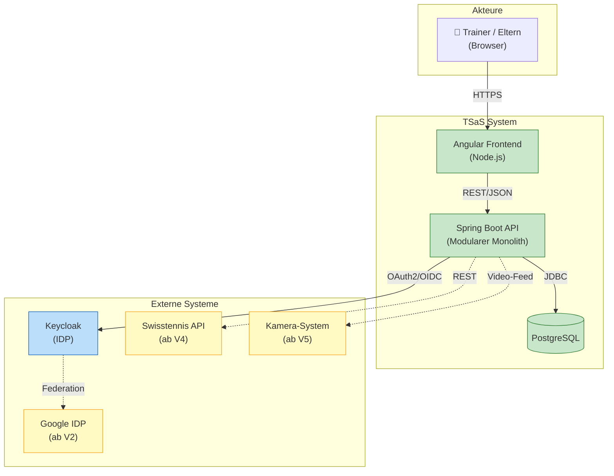
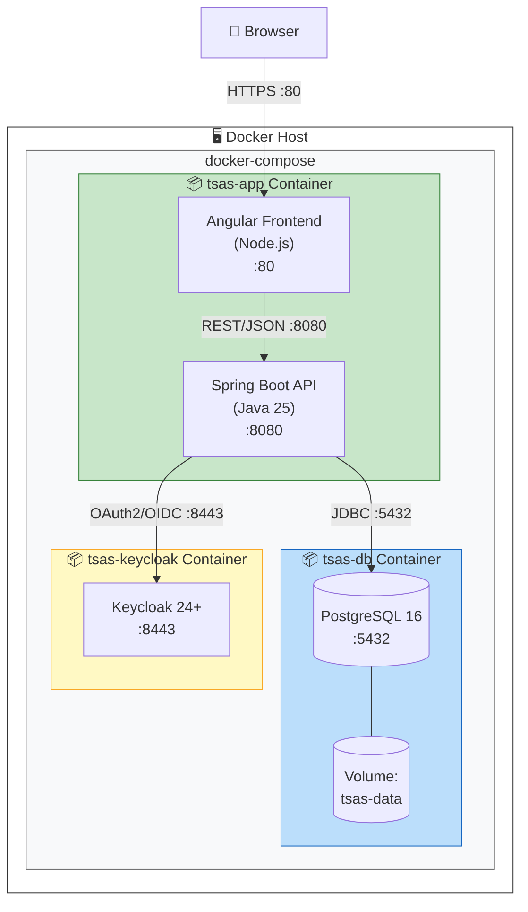

# Software Architecture Document – Tennis Score and Statistic (TSaS)

*nach arc42 Template*

| Feld | Wert |
|------|------|
| **Version** | 1.0 – Erster Entwurf |
| **Datum** | 06. März 2026 |
| **Status** | ENTWURF |
| **Autor** | Christian Bonnhoff |
| **Klassifikation** | Intern |

---

## Inhaltsverzeichnis

1. Einführung und Ziele
2. Randbedingungen
3. Kontextabgrenzung
4. Lösungsstrategie
5. Bausteinsicht
6. Laufzeitsicht
7. Verteilungssicht
8. Querschnittliche Konzepte
9. Architekturentscheidungen
10. Qualitätsanforderungen
11. Datenmodell
12. Risiken und technische Schulden
13. Glossar

---

## 1. Einführung und Ziele

Für die gezielte Vorbereitung auf ein Tennismatch fehlt derzeit eine geeignete Anwendung, welche es Eltern und Trainern ermöglicht, Statistiken und Informationen über die Spielweise und Eigenheiten des eigenen Spielers sowie des Gegners zu erfassen und auszuwerten.

Diese Lücke soll die Anwendung Tennis Score and Statistic (TSaS) schliessen. Ziel ist die Entwicklung einer Web-App (später zusätzlich einer iOS-App), mit der Trainer oder Eltern ein Tennismatch Punkt für Punkt mit vordefinierten und frei definierbaren Angaben dokumentieren können.

### 1.1 Aufgabenstellung

TSaS soll eine webbasierte Applikation bereitstellen, mit der der aktuelle Spielstand eines Tennismatches festgehalten und jeder Punkt mit fixen Attributen dokumentiert werden kann. Zusätzlich sollen einfache statistische Auswertungen ermöglicht werden.

### 1.2 Qualitätsziele

| ID | Qualitätsziel | Szenario (SMART) | Priorität |
|----|---------------|-------------------|-----------|
| QZ-01 | Wartbarkeit / Erweiterbarkeit | Der modulare Monolith muss so strukturiert sein, dass ein neues fachliches Modul (z.B. Statistik-Erweiterung) innerhalb von 5 Personentagen integriert werden kann, ohne bestehende Module zu verändern. | Hoch |
| QZ-02 | Verfügbarkeit | Das System muss eine Verfügbarkeit von mindestens 95% pro Kalendermonat aufweisen (gemessen über HTTP Health-Check des API-Endpunkts). | Hoch |
| QZ-03 | Performance – Datenerfassung | Das Erfassen eines einzelnen Punktes (POST /api/points) muss bei bis zu 100 gleichzeitigen Benutzern in maximal 250ms (95. Perzentil, serverseitig) abgeschlossen sein. | Hoch |
| QZ-04 | Performance – Statistik | Die Berechnung einer Head-to-Head-Statistik zwischen zwei Spielern muss in maximal 60 Sekunden abgeschlossen sein, auch wenn über 500 Matches in der Datenbank vorliegen. | Mittel |
| QZ-05 | Sicherheit | Alle API-Endpunkte (ausser /health) müssen durch ein gültiges OAuth2 Bearer Token geschützt sein. Unautorisierte Requests müssen mit HTTP 401 abgewiesen werden. | Hoch |

### 1.3 Stakeholder

| Rolle | Erwartungshaltung |
|-------|-------------------|
| **Tennistrainer** | Dokumentation von Matches, Zugriff auf Statistiken zur Vorbereitung auf Gegner, Analyse der Spielweise eigener Spieler. |
| **Eltern** | Einfache Bedienung während eines Matches, Übersichtliche Darstellung des Spielverlaufs und der Ergebnisse. |
| **Entwickler / Betreiber** | Wartbare, gut dokumentierte Codebasis. Einfaches Deployment mittels Docker. |

---

## 2. Randbedingungen

### 2.1 Technische Randbedingungen

| ID | Randbedingung |
|----|---------------|
| RB-T01 | Programmiersprache Backend: Java 25 mit Spring Boot 4 |
| RB-T02 | Frontend: Angular mit Node.js als Build-/Dev-Server |
| RB-T03 | Datenbank: PostgreSQL |
| RB-T04 | Authentifizierung/Autorisierung: Keycloak als Identity Provider (OAuth2/OIDC) |
| RB-T05 | Deployment: Docker Container (docker-compose) – Frontend + Backend in einem Container, DB in separatem Container |
| RB-T06 | Architekturstil: Modularer Monolith als Gradle Multi-Module-Projekt. Das Backend wird nach den Prinzipien der Clean Architecture aufgebaut (Schichten: Domain, Application, Infrastructure, Adapter). Abhängigkeiten zeigen stets von aussen nach innen – die Domänenschicht hat keine Abhängigkeiten zu Frameworks oder Infrastruktur. Die fachlichen Module kommunizieren ausschliesslich über definierte Interfaces im Application-Layer (Ports & Adapters) – keine Event-basierte Kommunikation. |

### 2.2 Organisatorische Randbedingungen

- Die App soll für Tennisspieler selbsterklärend sein. Fachbegriffe aus der Tenniswelt dürfen verwendet werden.
- Erste Version (MVP) als reine Web-Applikation. Native iOS-App ist für Version 2 geplant.
- Keine Integration mit externen APIs in Version 1 (Swisstennis-API erst ab Version 4).

---

## 3. Kontextabgrenzung

### 3.1 Fachlicher Kontext

TSaS interagiert mit folgenden externen Akteuren und Systemen:



*Durchgezogene Linien = V1, gestrichelte Linien = zukünftige Versionen*

| Akteur / System | Beschreibung |
|------------------|-------------|
| **Trainer / Eltern** | Erfassen Spielstände Punkt für Punkt, rufen Statistiken ab, verwalten Spielerprofile. |
| **Keycloak (IDP)** | Authentifizierung und Autorisierung der Benutzer via OAuth2/OIDC. In V2 zusätzlich Google als federated IDP. |
| **Swisstennis API (V4+)** | Zukünftige Integration zum Abruf von offiziellen Spieler- und Turnierdaten. |
| **Kamera-System (V5+)** | Automatische Erfassung von Aufsprungpunkten des Balls („Hawk Eye very light"). |

### 3.2 Technischer Kontext

Die Kommunikation zwischen den Systemkomponenten erfolgt über folgende technische Schnittstellen:

| Schnittstelle | Protokoll / Technologie |
|---------------|------------------------|
| Browser ↔ Angular-Frontend | HTTPS, Port 443 (bzw. 4200 in Dev) |
| Angular-Frontend ↔ Spring Boot API | REST/JSON über HTTPS, Port 8080 |
| Spring Boot API ↔ PostgreSQL | JDBC/TCP, Port 5432 |
| Spring Boot API ↔ Keycloak | OAuth2/OIDC, HTTPS, Port 8443 |

---

## 4. Lösungsstrategie

### 4.1 Architekturansatz: Modularer Monolith

Die Anwendung wird als modularer Monolith realisiert. Diese Entscheidung basiert auf folgenden Überlegungen:

- Relativ kleine Applikation zu Beginn – ein Microservice-Ansatz wäre Over-Engineering.
- Vereinfachtes Deployment als einzelne deploybare Einheit.
- Modularität innerhalb des Monolithen ermöglicht ein nachträgliches Aufteilen in einzelne Services, falls dies notwendig wird.
- Geringere Komplexität bei der Kommunikation (keine Netzwerk-Latenzen zwischen Modulen).

### 4.2 Technologieentscheidungen

| Bereich | Technologie | Begründung |
|---------|-------------|------------|
| **Backend** | Java 25, Spring Boot 4, Gradle Multi-Module | Etabliertes Ökosystem, grosse Community, ausgereiftes Dependency-Management. Gradle Multi-Module-Projekt ermöglicht klare Modulgrenzen mit expliziten Compile-Zeit-Abhängigkeiten. Synchrone Modul-Kommunikation über Interfaces im Application-Layer – einfacher und direkter als Event-basierte Ansätze. |
| **Frontend** | Angular mit Node.js, Angular Material, ngx-charts | Typsicherheit durch TypeScript, komponentenbasiert, gut geeignet für komplexe Single-Page-Applikationen. Angular Material liefert touch-optimierte UI-Komponenten (grosse Buttons, Formulare, Dialoge) für die Punkterfassung auf dem Platz. ngx-charts ergänzt Statistik-Visualisierungen. |
| **Datenbank** | PostgreSQL | Bekannt, verbreitet, Open Source, geringes Risiko. Gute Unterstützung für relationale Datenmodelle. |
| **Security** | Keycloak | Standard für OIDC/OAuth2. Ermöglicht Einbettung von federated IDPs wie Google, Facebook. |
| **Deployment** | Docker / Docker Compose | Konsistente Umgebung über Entwicklung, Test und Produktion hinweg. |

### 4.3 Release-Planung

| Version | Umfang |
|---------|--------|
| **Version 1 (MVP)** | Web-App: Punkteerfassung, Spielerverwaltung, Basis-Statistiken (Head-to-Head, Winner%, Serve%), Registrierung/Login via Keycloak |
| **Version 2** | Google als federated IDP, erweiterte statistische Auswertungen, natives iOS-Frontend für iPad (Swift) |
| **Version 3** | Aufsprungpunkte via Touch auf skizziertem Tennisfeld im UI |
| **Version 4** | Integration Swisstennis-API (falls möglich) |
| **Version 5** | Kameraanbindung für automatische Aufsprungpunkt-Erfassung („Hawk Eye very light") |

---

## 5. Bausteinsicht

### 5.1 Whitebox Gesamtsystem

Das Gesamtsystem besteht aus drei Hauptbereichen, die als Docker-Container deployed werden:

**Container 1 – TSaS Application:** Enthält sowohl das Angular-Frontend (ausgeliefert via Node.js) als auch das Spring Boot Backend als zwei eigenständige Services.

**Container 2 – PostgreSQL Database:** Persistenz aller Applikationsdaten.

**Container 3 – Keycloak:** Identity Provider für Authentifizierung und Autorisierung.

### 5.2 Backend-Module (Modularer Monolith)

Das Spring Boot Backend ist intern in fachliche Module aufgeteilt. Jedes Modul kapselt seine Domänenlogik, seine Repositories und seine REST-Endpunkte.

| Modul | Verantwortlichkeit |
|-------|-------------------|
| `player-module` | Verwaltung von Spielerprofilen (Name, Geschlecht, Ranking, Spielhand, Backhand-Typ). CRUD-Operationen und Suchfunktionalität. |
| `match-module` | Erstellen und Verwalten von Begegnungen (Matches) mit Attributen wie Anzahl Gewinnsätze, Match-Tiebreak, Short Set. Verwaltung der Sets und Spiele. |
| `scoring-module` | Erfassen des laufenden Spielstandes Punkt für Punkt. Verwaltung der fixen Attribute (Forehand Winner, Backhand Winner, Ace, Double Fault, etc.) und freier Bemerkungen. |
| `statistics-module` | Berechnung und Bereitstellung von Statistiken: Head-to-Head, Winner%, Unforced Error%, First/Second Serve%, Double Faults, Aces. |
| `auth-module` | Integration mit Keycloak. Token-Validierung, Rollenprüfung, Benutzerverwaltung. |
| `common-module` | Shared Kernel mit gemeinsamen DTOs, Exceptions, Konfigurationen und Utilities. |

---

## 6. Laufzeitsicht

### 6.1 Szenario: Punkt erfassen

Dieses Szenario beschreibt den typischen Ablauf, wenn ein Trainer während eines Matches einen Punkt erfasst:

1. Der Trainer klickt im Angular-Frontend auf die Schaltfläche für den Punkttyp (z.B. „Forehand Winner").
2. Das Frontend sendet einen POST-Request an /api/matches/{id}/points mit dem Bearer Token im Authorization-Header.
3. Das Spring Boot API validiert das Token via Keycloak.
4. Das scoring-module verarbeitet den Punkt: Aktualisierung des Spielstands (Punkte, Games, Sets), Persistierung in der POINT-Tabelle.
5. Das scoring-module aktualisiert die CURRENT_SCORE-Tabelle und die aggregierten MATCH_STATS.
6. Das API gibt den aktualisierten Spielstand als JSON zurück (HTTP 200).
7. Das Frontend aktualisiert die Anzeige des Spielstands.

### 6.2 Szenario: Benutzer-Authentifizierung

Der Login-Flow folgt dem Standard OAuth2 Authorization Code Flow mit PKCE:

1. Benutzer öffnet TSaS im Browser und wird zum Keycloak-Login weitergeleitet.
2. Benutzer authentifiziert sich (Benutzername/Passwort oder Google IDP ab V2).
3. Keycloak stellt Authorization Code aus und leitet zurück an TSaS.
4. Das Frontend tauscht den Code gegen Access- und Refresh-Token.
5. Bei jedem API-Call wird das Access-Token im Authorization-Header mitgesendet.

---

## 7. Verteilungssicht

### 7.1 Infrastruktur

Die Applikation wird mittels Docker Compose deployed. Das folgende Deployment-Diagramm zeigt die Container-Struktur:



| Container | Inhalt | Ports | Bemerkung |
|-----------|--------|-------|-----------|
| `tsas-app` | Angular Frontend (Node.js) + Spring Boot Backend | 80, 8080 | Beide Services laufen als eigenständige Prozesse in einem gemeinsamen Container. |
| `tsas-db` | PostgreSQL 16 | 5432 | Persistentes Volume für Datenbank-Dateien. |
| `tsas-keycloak` | Keycloak 24+ | 8443 | Separater Container, eigene PostgreSQL-Instanz oder Shared-DB möglich. |

### 7.2 Docker Compose Struktur

Schematischer Aufbau der docker-compose.yml:

```yaml
services:
  tsas-app:
    build: .
    ports:
      - "80:80"      # Node.js/Angular
      - "8080:8080"  # Spring Boot API
    depends_on:
      - tsas-db
      - tsas-keycloak
    environment:
      - SPRING_DATASOURCE_URL=jdbc:postgresql://tsas-db:5432/tsas
      - KEYCLOAK_AUTH_SERVER_URL=https://tsas-keycloak:8443

  tsas-db:
    image: postgres:16
    volumes:
      - tsas-data:/var/lib/postgresql/data
    environment:
      - POSTGRES_DB=tsas
      - POSTGRES_USER=tsas
      - POSTGRES_PASSWORD=${DB_PASSWORD}

  tsas-keycloak:
    image: quay.io/keycloak/keycloak:24.0
    ports:
      - "8443:8443"
```

---

## 8. Querschnittliche Konzepte

### 8.1 Sicherheitskonzept

Alle API-Endpunkte (ausser Health-Check) werden durch OAuth2 Bearer Tokens geschützt. Das Frontend nutzt den Authorization Code Flow mit PKCE. Keycloak verwaltet Benutzer, Rollen und Sessions. In Version 1 erfolgt die Registrierung direkt in Keycloak, ab Version 2 zusätzlich über Google als federated Identity Provider.

### 8.2 Persistenz

Die Datenpersistenz erfolgt über Spring Data JPA / Hibernate mit PostgreSQL. Jedes fachliche Modul besitzt eigene Repository-Interfaces. Das Datenbankschema wird via Flyway-Migrationen verwaltet.

**Flyway-Konfiguration:**

- Die Flyway-Dependency (`flyway-core`, `flyway-database-postgresql`) ist im `app`-Modul deklariert – dem natürlichen Aggregator aller fachlichen Module.
- Migrationsskripte liegen unter `backend/app/src/main/resources/db/migration/` und folgen dem Namensschema `V{n}__{beschreibung}.sql`.
- `V1__baseline.sql` enthält das initiale Schema aller Tabellen (`players`, `matches`, `match_scores`), abgeleitet aus den bestehenden JPA-Entitäten.
- Hibernate `ddl-auto` ist auf `validate` (PostgreSQL) bzw. `none` (H2/lokal) gesetzt – Flyway ist die einzige Quelle für Schema-Änderungen.
- Die Migrationsskripte verwenden ausschliesslich ANSI-SQL, das mit PostgreSQL und H2 kompatibel ist (kein datenbankspezifischer SQL-Dialekt), damit auch das lokale H2-Profil Flyway-gesteuert ist.

### 8.3 Fehlerbehandlung

Alle Module nutzen ein zentrales Exception-Handling via @ControllerAdvice. Fachliche Fehler werden als HTTP 4xx, technische Fehler als HTTP 5xx zurückgegeben. Fehler werden strukturiert als JSON-Objekt mit error-code, message und timestamp zurückgegeben.

### 8.4 Logging und Monitoring

Strukturiertes Logging via SLF4J/Logback im JSON-Format. Spring Boot Actuator stellt Health-, Metrics- und Info-Endpunkte bereit. Metriken können über Prometheus/Grafana überwacht werden.

### 8.5 Testkonzept

- Unit Tests: JUnit 5 (Jupiter) für Domänenlogik und Services; Mockito für das Mocking von Ports und externen Abhängigkeiten.
- Integrationstests: Spring Boot Test mit Testcontainers (PostgreSQL).
- API-Tests: REST Assured für Endpunkt-Validierung.
- Frontend-Tests: Jasmine/Karma für Angular-Komponenten.

---

## 9. Architekturentscheidungen

| ID | Entscheidung | Begründung | Status |
|----|-------------|------------|--------|
| ADR-01 | **Modularer Monolith statt Microservices** | Die Applikation ist in V1 klein und wird von einem kleinen Team entwickelt. Die Komplexität von Microservices (Service Discovery, verteilte Transaktionen, Netzwerk-Overhead) ist nicht gerechtfertigt. Die interne Modularisierung als Gradle Multi-Module-Projekt erzwingt klare Modulgrenzen auf Compile-Ebene und erleichtert die spätere Extraktion einzelner Module als eigenständige Microservices. | Akzeptiert |
| ADR-02 | **Frontend und Backend in einem Docker Container** | Vereinfacht das Deployment und die Konfiguration (ein docker-compose Service weniger). Node.js dient als Frontend-Server und liefert die Angular-Applikation aus. Spring Boot läuft als separater Prozess im selben Container. | Akzeptiert |
| ADR-03 | **Keycloak als Identity Provider** | Keycloak ist der De-facto-Standard für OIDC/OAuth2 und bietet out-of-the-box Support für User-Management, Rollen, federated IDPs und Self-Service-Registrierung. | Akzeptiert |
| ADR-04 | **PostgreSQL als Datenbank** | Bewährte relationale Datenbank mit guter Spring-Integration. Das Datenmodell ist klar relational (Player, Match, Set, Point, Stats). Kein Bedarf für NoSQL. | Akzeptiert |
| ADR-05 | **REST API als Schnittstellenformat** | JSON/REST ist Standard für Web-Applikationen, gut tooling-unterstützt und einfach zu dokumentieren (OpenAPI/Swagger). GraphQL wäre eine Alternative, erhöht aber die Komplexität unnötig. | Akzeptiert |
| ADR-06 | **Flyway statt Liquibase für DB-Migrationen** | TSaS betreibt eine einzelne PostgreSQL-Instanz mit einem überschaubaren, stabilen relationalen Datenmodell (6 Kernentitäten). Flyway deckt diesen Anwendungsfall vollständig ab: Migrationen werden als plain SQL-Dateien versioniert, sind direkt lesbar und ohne XML/YAML-Overhead. Die erweiterte Flexibilität von Liquibase (Datenbank-agnostische Changelogs, Rollback-Skripte, Diff-Tooling) ist für dieses Projekt nicht erforderlich, da ein Datenbankwechsel nicht geplant ist und Rollbacks über Datenbankbackups abgedeckt werden. Flyway ist zudem out-of-the-box in Spring Boot integriert (Auto-Configuration) und erfordert keine zusätzliche Konfiguration. **Implementierung:** Flyway-Dependency im `app`-Modul, Skripte unter `db/migration/`, Baseline `V1__baseline.sql` repräsentiert das bei Einführung von Flyway bestehende Schema. | Akzeptiert |
| ADR-08 | **Angular Material + ngx-charts als UI-Framework** | Die primären Nutzer (Coaches, Eltern) verwenden die App während eines Matches auf Tablet oder Smartphone. Angular Material erfüllt die daraus resultierenden Anforderungen out-of-the-box: touch-optimierte Komponenten, responsive Layouts und grosse interaktive Elemente für schnelle Punkterfassung. Als offizielle Google-Library ist Angular Material eng mit Angular verzahnt, gut dokumentiert und kostenlos. Für die Statistik-Darstellung (FA-08) wird ngx-charts ergänzt, das nahtlos mit Angular Material harmoniert und ebenfalls kostenfrei ist. Die evaluierte Alternative PrimeNG bietet mehr Komponenten, ist aber schwerer, erfordert mehr Konfiguration und wäre für V1 Over-Engineering. | Akzeptiert |
| ADR-09 | **`angular-oauth2-oidc` statt `keycloak-angular` als Frontend OIDC-Library** | Für den Authorization Code + PKCE Flow im Angular-Frontend wurde `angular-oauth2-oidc` gegenüber `keycloak-angular` (keycloak-js Wrapper) bevorzugt. Gründe: (1) `angular-oauth2-oidc` ist eine generische, standard-konforme OIDC-Library — kein Keycloak-spezifisches Coupling im Frontend-Code. Bei einem zukünftigen IDP-Wechsel (z.B. Auth0, Okta) muss nur die Konfiguration angepasst werden, nicht der Code. (2) Die Library ist schlanker und hat keine Abhängigkeit auf `keycloak-js`, das eigene Release-Zyklen und Breaking Changes mitbringt. (3) `angular-oauth2-oidc` unterstützt PKCE nativ und ist aktiv gepflegt. **Implementierung:** `OAuthModuleConfig` in `core/auth/auth.config.ts`, HTTP-Interceptor für Bearer-Token-Injection, `CanActivateFn` Guard für alle Routes. | Akzeptiert |
| ADR-07 | **Gradle Multi-Module statt Spring Modulith** | Spring Modulith wurde evaluiert, aber verworfen. Gründe: (1) Spring Modulith nutzt für die modul-übergreifende Kommunikation Application Events (Spring `@EventListener`/`ApplicationEventPublisher`), was standardmässig zu asynchroner Kommunikation führt – eine unnötige Komplexität für einen Use-Case, der synchrone Antworten erfordert. (2) Die Kommunikation zwischen Modulen lässt sich sauberer und direkter über explizite Interfaces im Application-Layer (Ports & Adapters / Clean Architecture) abbilden – ohne Framework-Magie und ohne Remote-Kommunikationssemantik für lokale Aufrufe. (3) Ein Gradle Multi-Module-Projekt erzwingt Modulgrenzen zur Compile-Zeit: unerwünschte Abhängigkeiten zwischen Modulen werden sofort als Build-Fehler sichtbar. (4) Die Gradle-Modul-Struktur erleichtert die spätere Extraktion einzelner Module als eigenständige Microservices, da jedes Modul bereits ein eigenständiges Build-Artefakt mit expliziten Abhängigkeiten darstellt. | Akzeptiert |

---

## 10. Qualitätsanforderungen

### 10.1 Funktionale Anforderungen (SMART)

| ID | Anforderung | SMART-Beschreibung | Version |
|----|-------------|-------------------|---------|
| FA-01 | **User-Registrierung** | Ein nicht authentifizierter Benutzer kann sich über das Keycloak Self-Service-Registrierungsformular mit den Pflichtfeldern E-Mail (gültiges RFC-5322-Format), Benutzername (3–50 Zeichen) und Passwort (mind. 8 Zeichen, mind. 1 Grossbuchstabe und 1 Ziffer) registrieren. Nach erfolgreicher Registrierung wird der Benutzer automatisch authentifiziert und innerhalb von 5 Sekunden auf die TSaS-Startseite weitergeleitet. Doppelte E-Mail-Adressen oder Benutzernamen werden mit einer spezifischen Fehlermeldung im Formular abgewiesen (HTTP 409 intern). | V1 |
| FA-02 | **Authentifizierung** | Ein registrierter Benutzer kann sich via OAuth2 Authorization Code Flow mit PKCE über Keycloak anmelden. Nach erfolgreicher Authentifizierung erhält der Browser ein Access Token (Gültigkeit: 15 Minuten) und ein Refresh Token (Gültigkeit: 30 Tage). Mit gültigem Access Token werden alle geschützten API-Endpunkte mit HTTP 200 beantwortet; ohne gültiges Token antworten alle Endpunkte (ausser `/health`) mit HTTP 401. Der gesamte Login-Flow muss unter normaler Last (≤ 100 Benutzer) innerhalb von 3 Sekunden abgeschlossen sein. | V1 |
| FA-03 | **Spieler erfassen** | Ein authentifizierter Benutzer kann über `POST /api/players` einen neuen Spieler anlegen. Pflichtfelder: Vorname (max. 50 Zeichen), Nachname (max. 50 Zeichen), Geschlecht (`MALE`/`FEMALE`/`OTHER`), Spielhand (`LEFT`/`RIGHT`), Backhand-Typ (`ONE_HANDED`/`TWO_HANDED`). Optionale Felder: Ranking (ganze Zahl > 0), Nationalität (ISO 3166-1 Alpha-2, 2 Zeichen), Geburtsdatum (ISO 8601). Bei gültiger Eingabe antwortet das API mit HTTP 201 und der angelegten Spieler-Ressource inklusive generierter UUID. Fehlende Pflichtfelder oder Formatverletzungen werden mit HTTP 400 und strukturierter Fehlermeldung (Feldname + Grund) abgewiesen. Die Antwort erfolgt innerhalb von 250 ms. | V1 |
| FA-04 | **Spieler suchen** | Ein authentifizierter Benutzer kann über `GET /api/players?firstName={}&lastName={}` nach Spielern suchen. Mindestens einer der beiden Parameter muss angegeben sein (sonst HTTP 400). Das API liefert eine paginierte Liste (max. 50 Einträge pro Seite, Standard-Sortierung: Nachname aufsteigend) aller Treffer innerhalb von 500 ms (95. Perzentil). Bei keinen Treffern wird eine leere Liste mit HTTP 200 zurückgegeben. | V1 |
| FA-05 | **Match erstellen** | Ein authentifizierter Benutzer kann über `POST /api/matches` ein neues Match anlegen. Pflichtfelder: `player1Id` und `player2Id` (müssen als Spieler existieren, sonst HTTP 404), `setsToWin` (2 oder 3), `matchTiebreak` (true/false), `shortSet` (true/false). Bei erfolgreicher Erstellung antwortet das API mit HTTP 201, der neuen Match-Ressource inklusive generierter UUID und Status `IN_PROGRESS`. Die Antwort erfolgt innerhalb von 250 ms. | V1 |
| FA-06 | **Punkte erfassen** | Während eines laufenden Matches (Status `IN_PROGRESS`) kann ein authentifizierter Benutzer über `POST /api/matches/{id}/points` einen Punkt erfassen. Pflichtfelder: `pointType` (`WINNER`/`UNFORCED_ERROR`/`FORCED_ERROR`/`ACE`/`DOUBLE_FAULT`/`NET`/`OUT_LONG`/`OUT_SIDE`), `strokeType` (`FOREHAND`/`BACKHAND`/`SERVE`/`VOLLEY`/`SMASH`) und `direction` (`CROSS_COURT`/`DOWN_THE_LINE`/`MIDDLE`). Optionalfeld: `remark` (Freitext, max. 500 Zeichen). Das API antwortet mit HTTP 201 und dem aktualisierten Spielstand. Ungültige Enum-Werte oder fehlende Pflichtfelder werden mit HTTP 400 abgewiesen. Die Verarbeitung erfolgt innerhalb von 250 ms (95. Perzentil bei 100 gleichzeitigen Benutzern). | V1 |
| FA-07 | **Spielstand anzeigen** | Nach jedem erfassten Punkt enthält die API-Antwort von `POST /api/matches/{id}/points` den vollständigen, korrekt berechneten Spielstand: laufende Punkte im Game (0/15/30/40/Vorteil/Tiebreak-Zählung), gewonnene Games pro Satz und gewonnene Sätze beider Spieler. Das Angular-Frontend aktualisiert die Anzeige auf Basis dieser Antwort innerhalb von 250 ms. Einstand und Vorteile sowie Tiebreak-Regeln müssen gemäss ITF-Regelwerk korrekt abgebildet sein. | V1 |
| FA-08 | **Head-to-Head-Statistik** | Ein authentifizierter Benutzer kann über `GET /api/statistics/head-to-head?player1={id}&player2={id}` eine Statistik abrufen. Die Antwort enthält für beide Spieler: Anzahl Siege und Niederlagen, Winner% (Anteil direkter Gewinnschläge an allen Punkten), Unforced Error%, First Serve% (Anteil erster Aufschläge im Feld), Double Faults (absolut) und Aces (absolut). Die Berechnung muss auch bei 500 oder mehr gespeicherten Matches innerhalb von 60 Sekunden abgeschlossen sein. Nicht existierende Spieler-IDs werden mit HTTP 404 abgewiesen. | V1 |
| FA-09 | **Google-Login** | Ein Benutzer kann sich auf dem Keycloak-Login-Bildschirm über die Schaltfläche «Mit Google anmelden» via OAuth2-Federation mit seinem Google-Konto authentifizieren. Beim ersten Google-Login wird automatisch ein TSaS-Benutzerkonto mit der verifizierten Google-E-Mail-Adresse angelegt (HTTP 201 intern). Nach dem Login hat der Benutzer identische Zugriffsrechte wie ein lokal registrierter Benutzer (HTTP 200 auf alle geschützten Endpunkte). Der gesamte Google-Login-Flow muss innerhalb von 5 Sekunden abgeschlossen sein. | V2 |
| FA-10 | **Aufsprungpunkte erfassen** | Während der Punkterfassung kann ein authentifizierter Benutzer per Touch oder Mausklick auf eine massstabsgetreue, schematische Tennisfeld-Darstellung (Draufsicht, Abmessungen 23,77 m × 10,97 m) den Aufsprungpunkt des Balls markieren. Die normalisierten X/Y-Koordinaten (Gleitkommazahl, relativ zur Feldgrösse) werden als optionales Feld im `POST /api/matches/{id}/points` gespeichert. Die Touch/Klick-Eingabe muss innerhalb von 100 ms durch einen sichtbaren Marker auf der Darstellung bestätigt werden. | V3 |

### 10.2 Nicht-funktionale Anforderungen (SMART)

Siehe Kapitel 1.2 Qualitätsziele für die übergreifenden SMART-Qualitätsziele (QZ-01 bis QZ-05). Ergänzende Anforderungen:

| ID | Qualitätsmerkmal | SMART-Beschreibung |
|----|-----------------|-------------------|
| NFA-01 | **Skalierbarkeit** | Das System muss bei 100 gleichzeitigen Benutzern folgende Response-Time-Ziele einhalten (gemessen via Lasttest mit k6 oder JMeter, 95. Perzentil, serverseitig gemessen): Write-Endpunkte (POST/PUT/DELETE) ≤ 250 ms, Read-Endpunkte (GET) ≤ 500 ms. Der Durchsatz darf bei 100 gleichzeitigen Benutzern im Vergleich zu 10 gleichzeitigen Benutzern um maximal 20 % degradieren. Die Anforderung gilt als erfüllt, wenn ein dokumentierter Lasttest diese Werte nachweislich einhält. |
| NFA-02 | **Datensicherheit** | Benutzerpasswörter dürfen ausschliesslich als bcrypt-Hash (Cost Factor ≥ 12) in der Keycloak-Datenbank gespeichert werden; Klartext-Speicherung oder schwächere Hashing-Algorithmen sind verboten und werden im Security-Review geprüft. Alle externen Verbindungen (Browser ↔ Frontend, Frontend ↔ API, API ↔ Keycloak) müssen TLS 1.2 oder höher verwenden; TLS 1.0 und 1.1 müssen aktiv deaktiviert sein (verifizierbar via `openssl s_client -connect <host>:<port>`). Interne Container-zu-Container-Kommunikation (API ↔ PostgreSQL) erfolgt über das isolierte Docker-Netzwerk und ist von TLS-Pflicht ausgenommen. |
| NFA-03 | **Portabilität** | Die Applikation muss auf jeder Plattform lauffähig sein, die Docker Engine 24.0+ und Docker Compose v2.0+ unterstützt (Linux x86_64, macOS mit Apple Silicon via Rosetta 2, Windows mit WSL2). Der Start der gesamten Umgebung (`docker compose up`) muss ohne manuelle Konfigurationsschritte möglich sein und innerhalb von 5 Minuten (bei erstmaligem Ausführen inklusive Image-Download) eine vollständig betriebsbereite Instanz liefern. Die Anforderung gilt als erfüllt, wenn das Setup auf mindestens zwei der genannten Plattformen erfolgreich verifiziert wurde. |
| NFA-04 | **Wiederherstellbarkeit** | Die PostgreSQL-Datenbank muss täglich automatisch gesichert werden (via `pg_dump`, komprimiert, gespeichert ausserhalb des Datenbank-Containers). Der maximal tolerable Datenverlust (RPO) beträgt 24 Stunden. Eine vollständige Wiederherstellung aus dem letzten erfolgreichen Backup muss innerhalb von 30 Minuten abgeschlossen sein (RTO = 30 min). Die Wiederherstellungsprozedur muss schriftlich dokumentiert und vor dem ersten Produktivbetrieb mindestens einmal erfolgreich getestet und protokolliert worden sein. |

---

## 11. Datenmodell

Das relationale Datenmodell bildet die Kernentitäten der Tennismatch-Dokumentation ab. Die folgende Abbildung zeigt das vollständige Datenbankmodell:

*(Abbildung: Tennis Match Datenbankmodell – wird im finalen .docx als Bild eingebettet)*

### 11.1 Entitätenübersicht

| Entität | Beschreibung |
|---------|-------------|
| `PLAYER` | Spielerprofile mit persönlichen Daten, Spielhand und Ranking. |
| `MATCH` | Begegnungen zwischen zwei Spielern mit Turnier-, Belag- und Formatangaben. |
| `MATCH_SET` | Einzelne Sätze eines Matches mit Games und optionalem Tiebreak. |
| `CURRENT_SCORE` | Aktueller Live-Spielstand eines laufenden Matches (1:1 zu MATCH). |
| `MATCH_STATS` | Aggregierte Statistiken pro Spieler und Match (1:2 zu MATCH). |
| `POINT` | Einzelne Punkte mit Typ, Schlagart, Richtung und Rally-Länge. |

---

## 12. Risiken und technische Schulden

| ID | Risiko | Thema | Beschreibung / Mitigation |
|----|--------|-------|--------------------------|
| R-01 | Hoch | **Single-Container-Deployment** | Frontend und Backend im selben Container erschweren unabhängiges Skalieren. Bei steigender Last muss auf separate Container umgestellt werden. |
| R-02 | Mittel | **Keycloak-Komplexität** | Keycloak ist ein mächtiges Tool mit hohem Konfigurationsaufwand. Fehlkonfigurationen können zu Sicherheitslücken führen. |
| R-03 | Mittel | **Swisstennis-API-Verfügbarkeit** | Die Integration in V4 hängt davon ab, ob Swisstennis eine API bereitstellt und den Zugriff genehmigt. Fallback: manuelle Dateneingabe. |
| R-04 | Niedrig | **Performance bei grosser Datenmenge** | Bei vielen Matches und Punkten könnten Statistik-Berechnungen langsam werden. Mitigation: Indizes, Caching, ggf. materialized Views. |
| R-05 | Mittel | **iOS-Doppelentwicklung** | Die geplante native iOS-App (Swift) in V2 bedeutet doppelte Frontend-Entwicklung. Alternative: Progressive Web App (PWA) evaluieren. |

---

## 13. Glossar

| Begriff | Definition |
|---------|-----------|
| **TSaS** | Tennis Score and Statistic – Name der Applikation |
| **MVP** | Minimum Viable Product – erste lauffähige Version mit Kernfunktionalität |
| **Modularer Monolith** | Architekturmuster, bei dem eine Anwendung als einzelne deploybare Einheit strukturiert ist, intern aber in lose gekoppelte Module aufgeteilt wird |
| **Clean Architecture** | Architekturmuster nach Robert C. Martin, bei dem Abhängigkeiten stets von aussen (Infrastruktur, Adapter) nach innen (Domain) zeigen. Die Domänenschicht ist frei von Framework-Abhängigkeiten. |
| **OIDC** | OpenID Connect – Authentifizierungsschicht auf Basis von OAuth2 |
| **OAuth2** | Autorisierungsframework für delegierte Zugriffsrechte |
| **PKCE** | Proof Key for Code Exchange – Sicherheitserweiterung für OAuth2 Authorization Code Flow |
| **IDP** | Identity Provider – System zur Verwaltung und Verifizierung von Benutzeridentitäten |
| **Keycloak** | Open-Source Identity and Access Management Lösung von Red Hat |
| **Head-to-Head** | Direktvergleich der Statistiken zweier Spieler über alle bisherigen Begegnungen |
| **Winner** | Ein Schlag, der direkt zum Punktgewinn führt, ohne dass der Gegner den Ball berührt |
| **Unforced Error** | Ein Fehler, der ohne Druckeinwirkung des Gegners entsteht |
| **Ace** | Ein Aufschlag, den der Gegner nicht berühren kann |
| **Double Fault** | Zwei aufeinanderfolgende Aufschlagfehler, die zum Punktverlust führen |
| **Tiebreak** | Spezielles Entscheidungsspiel bei Satzgleichstand (meist 6:6) |
| **Match-Tiebreak** | Verkürzter Entscheidungssatz, der durch einen Tiebreak bis 10 Punkte entschieden wird |
| **Short Set** | Verkürzter Satz, der bis 4 Games statt 6 gespielt wird |
