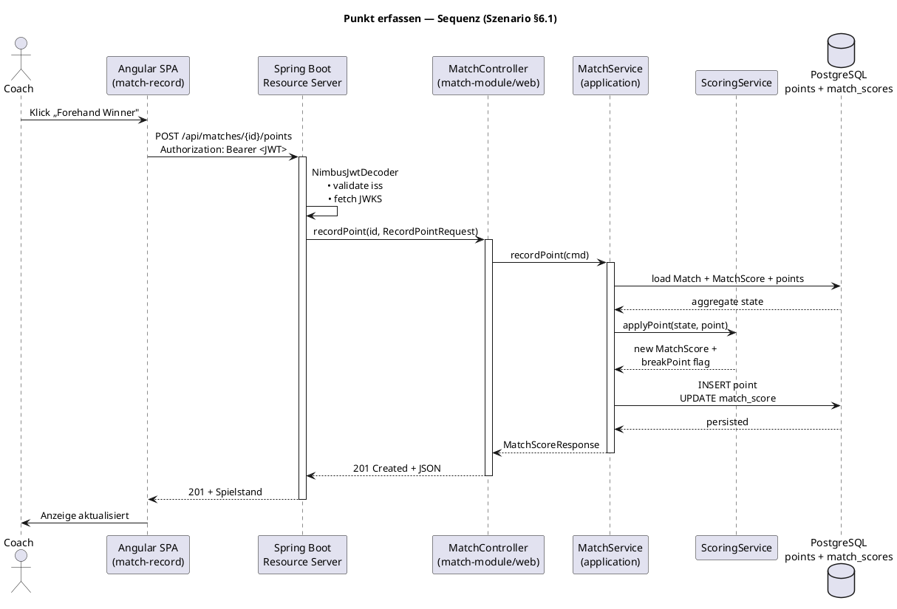

Su# TSaS Bewertungs-Hebel: Reflexion, KI-Doku, OpenAPI & Vision-Erweiterung — Implementation Plan

> **For agentic workers:** REQUIRED SUB-SKILL: Use superpowers:subagent-driven-development (recommended) or superpowers:executing-plans to implement this plan task-by-task. Steps use checkbox (`- [ ]`) syntax for tracking.

**Goal:** Vier der fünf am 2026-06-23 identifizierten Bewertungs-Hebel (gegen `doc/bewertungskriterien/08_bewertungskriterien_projektarbeit.pdf`) umsetzen — Reflexionskapitel, KI-Werkzeuge-Kapitel + Eigenständigkeitserklärung, OpenAPI-Vertrag + Sequenzdiagramme, Vision-Erweiterung um KI-Nutzen pro Kernfunktion und Vektor-DB-Begründung. Erwarteter Punktzuwachs: +17 P (von 76/100 auf ~93/100).

**Architecture:** Vier reine Dokumentations-/Tooling-Sweeps am SAD (`doc/sad/TSaS_SAD_arc42_1.md`) und ein Code-Sweep, der `springdoc-openapi` im `app`-Modul aktiviert. Kein neuer Domänencode. Tasks sind unabhängig — jede liefert für sich einen reviewfähigen Commit; bevorzugte Reihenfolge wegen Kapitel-Nummerierung im SAD: 1 → 2 → 3 → 4 → 5.

**Tech Stack:** Markdown (SAD), springdoc-openapi 2.x (OpenAPI), PlantUML (Sequenzdiagramme), Spring Boot 4.0.6, Java 25, Pandoc + drawio CLI (vorhandene SAD-DOCX-Pipeline).

## Global Constraints

- SAD-Sprache: Deutsch durchgängig (wie bisher).
- Alle SAD-Änderungen müssen mit `python3 doc/sad/build_docx.py` ohne Fehler nach `TSaS_SAD_arc42_1.docx` rendern. Wer keinen drawio + pandoc installiert hat, prüft mindestens die Markdown-Syntax via `python3 -c "import markdown; markdown.markdown(open('doc/sad/TSaS_SAD_arc42_1.md').read())"`.
- Coverage-Gate (85 % Line / 70 % Branch) und `ArchitectureTest` bleiben grün — Task 4 erweitert die Tests, darf sie nicht brechen.
- Commit-Stil: Conventional Commits mit TEN-Ticket im Subject (Beispiele aus `git log`: `docs(sad): ...`, `feat(...): ... (TEN-NN)`); abschliessende `Co-Authored-By: Claude Opus 4.7 <noreply@anthropic.com>`-Trailer wie in bestehenden Commits.
- Branch: ein einziger Feature-Branch (`chbonnhoff/ten-XX-bewertung-hebel`) off `develop`, pro Task ein eigener Commit. PR an `develop`, Review wie üblich.
- Vor jedem `git commit`: `JAVA_HOME=/opt/java/jdk-25.0.1 ./gradlew -p backend check` (nur in Task 4 zwingend; in den reinen Doku-Tasks empfohlen, falls SAD-Pfade über Tests referenziert würden).

## Out of Scope: Hebel 3 — Zweite KI-Rolle

Hebel 3 (Embedding-Suche / Agent / Live-Coaching) ist **bewusst nicht in diesem Plan**. Begründung:

- Der Entwurfsraum ist offen (drei nicht-äquivalente Optionen: RAG über Match-Korpus, taktischer Mehr-Schritt-Agent für „Vorbereitung auf Gegner", oder Live-Coaching während des Matches). Ohne Entscheidung in einem `superpowers:brainstorming`-Zyklus kein belastbarer Plan.
- Umfang ist 2–4 Personentage, kein Doku-Sweep.
- Eigene Risiken: zusätzliche LLM-Kosten, weitere ADRs, weitere Test-Infrastruktur.

**Empfohlenes Vorgehen für Hebel 3 separat:** `superpowers:brainstorming` mit der Frage „Welche zweite KI-Rolle bringt für TSaS-V1.x den grössten Mehrwert bei < 3 PT Aufwand?" → eigene Spec unter `docs/superpowers/specs/2026-XX-XX-ten-XX-second-ai-role-design.md` → eigener Plan.

---

## Task 1: KI-Werkzeuge im Projekt (Hebel 2 → Bewertungskriterium 15: +5 P)

**Files:**
- Modify: `doc/sad/TSaS_SAD_arc42_1.md` — neues Kapitel „13. KI-Werkzeuge im Projekt" vor dem bisherigen Glossar einfügen; Glossar wird zu §14; Inhaltsverzeichnis aktualisieren.
- Create: `doc/sad/TSaS_Eigenstaendigkeitserklaerung.md` — Eigenständigkeitserklärung.

**Interfaces:**
- Produces: Kapitel-Anker `## 13. KI-Werkzeuge im Projekt` und Datei `doc/sad/TSaS_Eigenstaendigkeitserklaerung.md` — werden in Task 2 (§14 Reflexion verweist auf §13.3) und in Task 3 nicht referenziert.

- [ ] **Step 1: Im SAD den bestehenden Glossar-Header umbenennen**

Im `doc/sad/TSaS_SAD_arc42_1.md` die Zeile `## 13. Glossar` ersetzen durch `## 14. Glossar` (Task 2 wird sie später nochmal nach `§15` schieben — hier nur der Zwischenschritt für Task 1).

- [ ] **Step 2: Inhaltsverzeichnis erweitern**

Im `## Inhaltsverzeichnis`-Block (etwa Zeile 17–29) die Liste so anpassen:

```markdown
13. KI-Werkzeuge im Projekt
14. Glossar
```

(Die Einträge 1–12 bleiben unverändert.)

- [ ] **Step 3: Neues Kapitel §13 vor das Glossar einfügen**

Direkt vor der (in Step 1 umbenannten) Zeile `## 14. Glossar` einfügen:

````markdown
## 13. KI-Werkzeuge im Projekt

### 13.1 Eingesetzte Werkzeuge

| Werkzeug | Version / Modell | Einsatzbereich |
|---|---|---|
| Claude Code | Opus 4.7 / 4.8 (1M-Context-Beta) | Hauptassistent für Spezifikation, Planung, Implementierung und Review |
| Superpowers Skill-Suite | `superpowers:brainstorming`, `writing-plans`, `subagent-driven-development`, `verification-before-completion`, `systematic-debugging` | Strukturierter Spec → Plan → Implementierungs-Workflow |
| `pr-review-toolkit:review-pr` / `/code-review ultra` | Multi-Agent-Review (fan-out + adversarial verify) | Codeüberprüfung vor Merge |
| Context7 MCP (`mcp__plugin_context7_context7__query-docs`) | – | Doc-Recherche für Bibliotheken (Spring AI, springdoc, Testcontainers) |
| GitHub MCP (`mcp__github__*`) | – | PR-/Issue-Verwaltung, Branch-Operationen |

### 13.2 Einsatz pro Phase

**Generierung.** Jede grössere Änderung folgt dem Workflow Brainstorming → Spec → Plan → Implementierung mit TDD. Spec- und Plan-Dokumente liegen unter `docs/superpowers/specs/` (15 Designdokumente) bzw. `docs/superpowers/plans/` (16 Plandokumente) und tragen das jeweilige TEN-Ticket im Dateinamen. Belegbeispiele:

- `docs/superpowers/specs/2026-05-17-ai-match-analysis-postmortem-design.md` + Plan `docs/superpowers/plans/2026-05-17-ai-match-analysis-postmortem.md` — Spec/Plan für das `ai-module` (FA-11).
- `docs/superpowers/specs/2026-06-22-ten-60-bean-validation-design.md` + Plan `docs/superpowers/plans/2026-06-22-ten-60-bean-validation.md` — Spec/Plan für Bean Validation auf REST-DTOs (TEN-60).
- `docs/superpowers/specs/2026-06-22-ten-55-owner-binding-rbac-design.md` + Plan `docs/superpowers/plans/2026-06-22-ten-55-owner-binding-rbac.md` — Owner-Binding/RBAC (TEN-55).

**Review.** Vor jedem Merge auf `develop` läuft `/code-review` oder `pr-review-toolkit:review-pr` mit Multi-Agent-Fan-out gegen das Diff. Befunde landen als Inline-PR-Kommentar oder als Edit-Anweisung im Working Tree. Belege:

- `doc/bewertungskriterien/Code-Pruefung_Kriterien_7_und_8.md` ist ein KI-erstellter Selbst-Audit gegen die Bewertungskriterien 7 + 8. Die dort identifizierten Lücken (Scoring-Modul-Konsolidierung, modulübergreifendes Domänenmodell, fehlende Modul-Durchsetzung) wurden anschliessend in **ADR-12**, **ADR-13** und `backend/app/src/test/java/com/cas/tsas/ArchitectureTest.java` adressiert.

**Refactoring.** Spec-getriebene Cleanups mit TDD-Schleife. Belegbeispiele aus `git log` auf `develop`:

- `cc6e502 feat(match): typed enums + @Size on RecordPointRequest + IT (TEN-60)`
- `d96f4da feat(player): @Size limits on DTO string fields + IT (TEN-60)`
- `2a0bcf1 docs(plans): add TEN-60 bean-validation implementation plan`

**Recherche.** Punktuelle Recherche-Aufgaben (Spring AI 2.x Boot-4-Kompatibilität, JaCoCo-Aggregation über Multi-Module, Spring Security Test JWT-Mock, Testcontainers + Podman) wurden über Web-Recherche-Subagenten und `mcp__plugin_context7_context7__query-docs` durchgeführt. Ergebnisse flossen in ADR-10 (Spring AI Milestone-Risiko in R-07) und ADR-11 (CI/Coverage-Gate-Schwellen-Begründung) ein.

### 13.3 Eigenständigkeit

Eine separate Eigenständigkeitserklärung liegt unter `doc/sad/TSaS_Eigenstaendigkeitserklaerung.md`. Sie bestätigt, dass alle KI-Vorschläge vor Übernahme geprüft, angenommen oder zurückgewiesen wurden. Die drei wichtigsten bewusst **nicht** an die KI delegierten Entscheidungen sind in Kapitel 14 (Reflexion und Fazit) mit Begründung und Beleg ausgewiesen.

---
````

- [ ] **Step 4: Eigenständigkeitserklärung anlegen**

Datei `doc/sad/TSaS_Eigenstaendigkeitserklaerung.md` mit folgendem Inhalt erstellen:

```markdown
# Eigenständigkeitserklärung — TSaS

**Modul:** AISE — AI-Assisted Software Engineering · CAS · FFHS
**Projekt:** Tennis Score and Statistic (TSaS)
**Autor:** Christian Bonnhoff

Ich, Christian Bonnhoff, bestätige hiermit, dass ich die vorliegende Projektarbeit selbstständig verfasst habe.

KI-Werkzeuge — insbesondere Claude Code (Modelle Opus 4.7 / 4.8) sowie die zugehörige Superpowers-Skill- und Subagent-Infrastruktur (siehe SAD Kapitel 13) — wurden systematisch für Spezifikation, Planung, Implementierung, Review und Recherche eingesetzt. Jeder KI-Vorschlag wurde vor Übernahme manuell geprüft. Bewusst nicht delegierte Entscheidungen (Security-Konfiguration, Architekturentscheidungen, Domänenregeln) sind in SAD Kapitel 14 (Reflexion und Fazit) mit Begründung und Beleg ausgewiesen.

Alle Code-, ADR- und Diagrammquellen liegen im Repository und sind im SAD referenziert. Externe Bibliotheken sind in `backend/*/build.gradle.kts` und `frontend/package.json` deklariert. Es wurden keine fremden, unzitierten Inhalte verwendet.

Ort, Datum:  _______________________

Unterschrift:  _______________________

— Christian Bonnhoff
```

- [ ] **Step 5: Build verifizieren**

Run: `cd /Users/cbo/Projects/cas/tsas && python3 doc/sad/build_docx.py`

Expected: Skript läuft ohne Exception bis zur Ausgabe `doc/sad/TSaS_SAD_arc42_1.docx`. Falls drawio CLI fehlt: Skript-Stop bei `export_pngs` ist tolerabel — wichtig ist, dass `transform_md` (mit `assert n == 1, "manual Inhaltsverzeichnis block not found"`) bestanden wird.

Sanity-Check: `grep -c "^## 13. KI-Werkzeuge" doc/sad/TSaS_SAD_arc42_1.md` → `1`; `grep -c "^## 14. Glossar" doc/sad/TSaS_SAD_arc42_1.md` → `1`.

- [ ] **Step 6: Commit**

```bash
cd /Users/cbo/Projects/cas/tsas
git add doc/sad/TSaS_SAD_arc42_1.md doc/sad/TSaS_Eigenstaendigkeitserklaerung.md
git commit -m "$(cat <<'EOF'
docs(sad): add KI-Werkzeuge chapter + Eigenständigkeitserklärung (TEN-XX)

Erfüllt Bewertungskriterium 15: Werkzeuge benannt, Einsatz pro Phase
(Generierung/Review/Refactoring/Recherche) belegt durch Spec-/Plan-/
Commit-Referenzen; separate Eigenständigkeitserklärung.

Co-Authored-By: Claude Opus 4.7 <noreply@anthropic.com>
EOF
)"
```

---

## Task 2: Reflexion und Fazit — drei Veto-Entscheidungen (Hebel 1 → Bewertungskriterium 18: +6 P)

**Files:**
- Modify: `doc/sad/TSaS_SAD_arc42_1.md` — neues Kapitel „14. Reflexion und Fazit" vor dem (durch Task 1 verschobenen) Glossar einfügen; Glossar wird zu §15; Inhaltsverzeichnis aktualisieren.

**Interfaces:**
- Consumes: aus Task 1: Kapitelnummer §13 für KI-Werkzeuge, §13.3 für Verweis auf Eigenständigkeitserklärung.
- Produces: Kapitel-Anker `## 14. Reflexion und Fazit` (wird in Task 3 ggf. zitiert).

- [ ] **Step 1: Glossar-Header von §14 auf §15 verschieben**

Im `doc/sad/TSaS_SAD_arc42_1.md` `## 14. Glossar` durch `## 15. Glossar` ersetzen.

- [ ] **Step 2: Inhaltsverzeichnis aktualisieren**

Im `## Inhaltsverzeichnis`-Block die Zeile `14. Glossar` ersetzen durch:

```markdown
14. Reflexion und Fazit
15. Glossar
```

- [ ] **Step 3: Neues Kapitel §14 vor das Glossar einfügen**

Direkt vor der (in Step 1 umbenannten) Zeile `## 15. Glossar` einfügen:

````markdown
## 14. Reflexion und Fazit

Drei Bereiche wurden im Projektverlauf bewusst **nicht an die KI delegiert** — Vorschläge wurden zurückgewiesen, manuell überschrieben oder ohne KI-Unterstützung getroffen. Begründungen und Belege:

### 14.1 Veto 1 — Security-Konfiguration

**Entscheidung:** Die Security-Konfiguration (`backend/auth-module/.../SecurityConfig.java`, der Keycloak-Realm-Export `docker/keycloak/realm-export.json`, JWT-Validator-Setup, CORS, Pfad-basierte Permits) wurde **ohne KI-Generierung** verfasst und in jedem Review-Schritt zeilenweise gegen die OAuth2-/OIDC-Spec geprüft.

**Begründung:** Eine fehlerhafte Token-Validation (`aud`-/`iss`-Prüfung, JWK-Set-URL, Permit-Patterns) führt unmittelbar zu Auth-Bypass-Lücken. Generative Tools neigen dazu, `permitAll()` als „lauffähigen" Default vorzuschlagen oder eine `aud`-Prüfung in `JwtValidators.createDefaultWithIssuer(...)` zu unterlassen — beide Muster sind in `SecurityConfig.java` bewusst manuell entschieden.

**Beleg:** `doc/sad/TSaS_STRIDE_Threat_Analysis.md` §2.1 listet die noch offene `aud`-Lücke (Befund S1) als Hoch-Risiko. Sie wurde im manuellen STRIDE-Audit identifiziert; ein KI-Review hätte sie wahrscheinlich nicht als Lücke erkannt, weil `JwtValidators.createDefaultWithIssuer` formal „korrekt" ist. Die Backlog-Entscheidung (Mitigation in eigenem Ticket) bleibt bei einem Menschen.

### 14.2 Veto 2 — Architekturentscheidungen (ADRs)

**Entscheidung:** Die 13 ADRs in §9 wurden inhaltlich **manuell** entschieden; die KI half lediglich beim Ausformulieren der Trade-off-Texte.

**Begründung:** KI-generierte ADR-Vorschläge tendieren zu konservativen „Best-Practice"-Empfehlungen (z. B. „nimm Spring Modulith, weil es aktuell ist") und übersehen Kontextfaktoren wie Team-Grösse, Erfahrung und Roadmap. Drei konkrete Gegen-Entscheidungen:

- **ADR-07** verwirft Spring Modulith bewusst zugunsten von Gradle-Multi-Module-Compile-Zeit-Grenzen — entgegen dem aktuellen Hype.
- **ADR-12** konsolidiert das ursprünglich vorgesehene `scoring-module` wieder ins `match-module`, nachdem die Implementierung zeigte, dass die Modulgrenze keinen fachlichen Mehrwert bringt.
- **ADR-13** erlaubt geteilte Domänen-Wertobjekte modulübergreifend statt einer Anti-Corruption-Schicht — die KI hätte hier vermutlich Spiegel-DTO-Mapper an jeder Grenze vorgeschlagen.

**Beleg:** SAD §9 (ADR-Tabelle); die Begründungstexte enthalten konkrete Kontextfaktoren („V1 klein", „kleines Team", „spätere Extraktion möglich"), die nicht aus dem Code ableitbar sind. ADR-12 und ADR-13 sind explizit Korrekturen früherer Bausteinskizzen — Spuren der manuellen Nachjustierung.

### 14.3 Veto 3 — Tennis-Domänenregeln im Scoring

**Entscheidung:** `backend/match-module/.../application/service/ScoringService.java` (Punkte, Spiele, Sätze, Tiebreak, Match-Tiebreak, Short Set, Einstand-/Vorteil-Logik, Break-Point-Erkennung) wurde gegen das **ITF-Regelwerk manuell verifiziert** statt aus KI-Generierung übernommen.

**Begründung:** LLMs haben unzuverlässige Domänenkenntnis bei Sport-Regelwerken — insbesondere bei Edge Cases wie Match-Tiebreak (bis 10 Punkte, Aufschlägerwechsel nach erstem Punkt, danach je 2), Short Set (bis 4 Games statt 6), Tiebreak-Wechsel-Sequenz. Falsche Scoring-Regeln würde der Coach am Platz sofort bemerken — das ist die kritischste Domäne der App.

**Beleg:** 60 Tests im `match-module` (Snapshot SAD §8.7), davon der Grossteil explizite Edge-Case-Tests für Tiebreak / Match-Tiebreak / Short Set; `ScoringService.java`-JavaDoc verweist auf das ITF-Regelwerk als Quelle. Die hohe Branch-Coverage (74,2 %) im `match-module` ist ein direktes Ergebnis dieser Manuell-Verifikation: jede Edge-Case-Verzweigung hat einen Test, nicht weil die KI darum gebeten hat, sondern weil das ITF-Regelwerk sie vorgibt.

### 14.4 Übertrag auf die künftige Arbeitsweise

- **KI als Drafting- und Review-Werkzeug, nicht als Entscheider.** Spec, Plan, Code werden generiert — aber Entscheidungen (Stil-Wahl, Trade-offs, Domänenregeln, Security) bleiben beim Menschen.
- **Adversariales Review als Standard.** Ein zweiter, unabhängiger KI-Agent (`/code-review ultra` oder `pr-review-toolkit:review-pr`) prüft jeden grösseren Diff — kein einzelnes Modell entscheidet allein.
- **Belegpflicht für KI-Vorschläge.** Wenn ein Vorschlag übernommen wird, muss er in einer Spec, einem ADR oder einem Commit-Diff nachvollziehbar sein. Ohne Beleg keine Übernahme.
- **Domänenregeln immer testen.** Tennis-Scoring, Statistik-Aggregation und Security-Pfade haben dedizierte Test-Suites; das 70-%-Branch-Coverage-Gate hält diese Disziplin durch.

---
````

- [ ] **Step 4: Build verifizieren**

Run: `cd /Users/cbo/Projects/cas/tsas && python3 doc/sad/build_docx.py`

Expected: Skript läuft ohne Exception. Sanity-Check: `grep -c "^## 14. Reflexion" doc/sad/TSaS_SAD_arc42_1.md` → `1`; `grep -c "^## 15. Glossar" doc/sad/TSaS_SAD_arc42_1.md` → `1`.

- [ ] **Step 5: Commit**

```bash
cd /Users/cbo/Projects/cas/tsas
git add doc/sad/TSaS_SAD_arc42_1.md
git commit -m "$(cat <<'EOF'
docs(sad): add Reflexion chapter with three veto decisions (TEN-XX)

Erfüllt Bewertungskriterium 18 Stufe vollständig (7 P): drei
„nie an die KI delegiert"-Veto-Entscheidungen (Security-Config, ADRs,
Tennis-Domänenregeln) konkret, begründet und belegt; Übertrag auf
künftige Arbeitsweise dokumentiert.

Co-Authored-By: Claude Opus 4.7 <noreply@anthropic.com>
EOF
)"
```

---

## Task 3: KI-Nutzen pro Kernfunktion + Vektor-DB-Begründung (Hebel 5 → Kriterien 3 + 6: +3 P)

**Files:**
- Modify: `doc/sad/TSaS_SAD_arc42_1.md` — neue Sektion §1.4 nach §1.3 Stakeholder; bestehender ADR-10 (in §9) um Absatz „Bewusst nicht eingesetzt: RAG / Vektor-Datenbank" am Ende erweitern.

**Interfaces:** keine.

- [ ] **Step 1: Neue Sektion §1.4 hinter §1.3 einfügen**

Im `doc/sad/TSaS_SAD_arc42_1.md`, direkt nach dem Block ab `### 1.3 Stakeholder` (Tabelle endet mit der Zeile `| **Entwickler / Betreiber** | ... Docker. |`) und vor dem nächsten `---` einfügen:

````markdown

### 1.4 KI-Nutzen pro Kernfunktion

Die Tabelle bildet ab, welche Kernfunktion einen KI-Anteil hat. Mehrheitlich sind Scoring- und Statistik-Funktionen rein deterministisch — KI wird gezielt nur dort eingesetzt, wo natürlichsprachliche Synthese einen Mehrwert liefert, der aus Roh-Statistiken nicht mechanisch ableitbar ist.

| FA | Funktion | KI-Anteil |
|---|---|---|
| FA-01, FA-02 | Registrierung / Authentifizierung | – (Keycloak-Standard, OAuth2/OIDC) |
| FA-03, FA-04, FA-12, FA-13 | Spieler-CRUD und -Suche | – (klassische CRUD-Operationen) |
| FA-05, FA-14, FA-15, FA-16 | Match-Lebenszyklus (Erstellen, Beenden, Walkover, Korrektur, Aufschläger) | – (deterministisch) |
| FA-06, FA-07 | Punkt erfassen / Spielstand anzeigen | – (ITF-Regelwerk in `ScoringService`, deterministisch) |
| FA-08 | Head-to-Head-Statistik | – (Aggregation aus `points`, deterministisch) |
| FA-17 | Match-Statistik (einzelnes Match) | – (Aggregation aus `points`, deterministisch) |
| **FA-11** | **KI-Match-Analyse (Postmortem)** | **Spring AI → OpenAI (Default `gpt-4o-mini`); strukturierter JSON-Output via `BeanOutputConverter`; deterministischer Fallback via `FakeLlmClientAdapter`. Liefert taktische Synthese (Schlüsselmomente, Stärken / Schwächen je Spieler, 3–5 priorisierte Empfehlungen) — nicht mechanisch aus Roh-Statistiken ableitbar.** |
| FA-09 (V2) | Google-Login | – (IdP-Federation) |
| FA-10 (V3) | Aufsprungpunkte erfassen | – (Touch-Erfassung) |

In V2 sind zwei weitere KI-Rollen vorgesehen: KI-Live-Coaching während des Matches und KI-Vorbereitung auf einen Gegner (Head-to-Head-basiert).

````

- [ ] **Step 2: ADR-10 um RAG-/Vektor-DB-Begründung erweitern**

Im `doc/sad/TSaS_SAD_arc42_1.md` ADR-10 (in der ADR-Tabelle in §9) — der Eintrag endet mit `...Spring-Milestone-Repo nötig (Spring AI 2.0.0-M6). | Akzeptiert |`. Den ADR-10-Begründungstext um folgenden Absatz am Ende (direkt vor `| Akzeptiert |`) erweitern:

```
**Bewusst nicht eingesetzt: RAG / Vektor-Datenbank.** Eine Embedding-basierte Retrieval-Schicht wurde geprüft und für V1.x verworfen. Begründung: (a) Der Analyse-Input ist **strukturierte Numerik** (`MatchStatistics` plus Spieler-Metadaten), kein Text-Korpus zum Retrieval. (b) Pro Match liegen wenige Dutzend Felder vor, die problemlos in einen einzelnen Prompt-Context passen — kein Token-Budget-Druck. (c) Eine Vektor-DB wäre Over-Engineering ohne ableitbaren Qualitätsgewinn und würde zusätzliche Infrastruktur (z. B. pgvector-Extension, Embedding-Pipeline) einführen. Für V2 (KI-Vorbereitung auf einen Gegner mit Head-to-Head-Kontext über N Matches) wird diese Entscheidung neu bewertet.
```

- [ ] **Step 3: Build verifizieren**

Run: `cd /Users/cbo/Projects/cas/tsas && python3 doc/sad/build_docx.py`

Expected: Skript läuft fehlerfrei. Sanity: `grep -c "^### 1.4 KI-Nutzen pro Kernfunktion" doc/sad/TSaS_SAD_arc42_1.md` → `1`; `grep -c "Bewusst nicht eingesetzt: RAG" doc/sad/TSaS_SAD_arc42_1.md` → `1`.

- [ ] **Step 4: Commit**

```bash
cd /Users/cbo/Projects/cas/tsas
git add doc/sad/TSaS_SAD_arc42_1.md
git commit -m "$(cat <<'EOF'
docs(sad): KI-Nutzen pro Kernfunktion + RAG-Entscheidung in ADR-10 (TEN-XX)

Erfüllt Anker aus Bewertungskriterium 3 (je ein Satz zum KI-Nutzen
pro Kernfunktion via Tabelle in §1.4) und schliesst die Vektor-DB-
Lücke aus Kriterium 6 (Begründung gegen RAG in ADR-10 ergänzt).

Co-Authored-By: Claude Opus 4.7 <noreply@anthropic.com>
EOF
)"
```

---

## Task 4: OpenAPI-Vertrag via springdoc-openapi (Hebel 4a → Kriterium 5: +1 P, Kriterium 8 idiomatisch +0)

**Files:**
- Modify: `backend/app/build.gradle.kts` — Dependency `org.springdoc:springdoc-openapi-starter-webmvc-ui` hinzufügen.
- Modify: `backend/app/src/main/resources/application.yml` — `springdoc`-Block ergänzen.
- Modify: `backend/auth-module/src/main/java/com/cas/tsas/auth/infrastructure/security/SecurityConfig.java` — Permits für `/v3/api-docs/**` und `/swagger-ui/**` (sonst 401 in `!test`-Profilen).
- Create: `backend/app/src/test/java/com/cas/tsas/OpenApiContractIT.java` — Integration-Test, der OpenAPI-Dokument und Swagger-UI verifiziert.
- Modify: `backend/app/src/main/java/com/cas/tsas/app/config/OpenApiConfig.java` — `@Configuration` mit `OpenAPI`-Bean (Info, Security-Scheme).
- Modify: `doc/sad/TSaS_SAD_arc42_1.md` — in §3.2 (Technischer Kontext) den OpenAPI-Endpunkt referenzieren; in §8.3 (Fehlerbehandlung) ergänzen, dass Schema via OpenAPI ausgeliefert wird.

**Interfaces:**
- Consumes: bestehende `SecurityConfig.securityFilterChain(HttpSecurity)` — wird um zwei `requestMatchers(...).permitAll()` erweitert.
- Produces: HTTP-Endpunkt `GET /v3/api-docs` (JSON) und `GET /swagger-ui/index.html` (HTML). Im Produktiv-Profil weiter ÖFFENTLICH lesbar (kein Auth-Schutz), weil die API-Doku Teil des Vertrags ist.

- [ ] **Step 1: Failing IT zuerst**

Datei `backend/app/src/test/java/com/cas/tsas/OpenApiContractIT.java` erstellen:

```java
package com.cas.tsas;

import org.junit.jupiter.api.Test;
import org.springframework.beans.factory.annotation.Autowired;
import org.springframework.boot.test.context.SpringBootTest;
import org.springframework.test.context.ActiveProfiles;
import org.springframework.test.web.servlet.MockMvc;
import org.springframework.boot.test.autoconfigure.web.servlet.AutoConfigureMockMvc;

import static org.hamcrest.Matchers.startsWith;
import static org.springframework.test.web.servlet.request.MockMvcRequestBuilders.get;
import static org.springframework.test.web.servlet.result.MockMvcResultMatchers.*;

@SpringBootTest
@AutoConfigureMockMvc
@ActiveProfiles("test")
class OpenApiContractIT {

    @Autowired
    MockMvc mockMvc;

    @Test
    void openApiDocumentIsServed() throws Exception {
        mockMvc.perform(get("/v3/api-docs"))
                .andExpect(status().isOk())
                .andExpect(content().contentTypeCompatibleWith("application/json"))
                .andExpect(jsonPath("$.openapi").value(startsWith("3.")))
                .andExpect(jsonPath("$.info.title").value("TSaS API"))
                .andExpect(jsonPath("$.paths['/api/players']").exists())
                .andExpect(jsonPath("$.paths['/api/matches/{matchId}/points']").exists())
                .andExpect(jsonPath("$.paths['/api/matches/{matchId}/analysis']").exists())
                .andExpect(jsonPath("$.components.securitySchemes.bearer-jwt.type").value("http"))
                .andExpect(jsonPath("$.components.securitySchemes.bearer-jwt.scheme").value("bearer"));
    }

    @Test
    void swaggerUiIsServed() throws Exception {
        mockMvc.perform(get("/swagger-ui/index.html"))
                .andExpect(status().isOk())
                .andExpect(content().contentTypeCompatibleWith("text/html"));
    }
}
```

> **Hinweis zum Path-Template:** Die Pfade `/api/matches/{matchId}/points` und `/api/matches/{matchId}/analysis` müssen exakt dem entsprechen, was die Controller via `@PathVariable("matchId")` deklarieren. Falls die Controller aktuell `{id}` verwenden, ist hier `{id}` einzusetzen — vor dem Schreiben des Tests einmal `grep -rn "@PathVariable" backend/*/src/main/java | grep -i match` prüfen und das Template angleichen.

- [ ] **Step 2: Test laufen lassen, Fehlschlag verifizieren**

Run: `cd /Users/cbo/Projects/cas/tsas && JAVA_HOME=/opt/java/jdk-25.0.1 DOCKER_HOST=unix:///var/run/docker.sock TESTCONTAINERS_RYUK_DISABLED=true ./gradlew :app:test --tests "com.cas.tsas.OpenApiContractIT"`

Expected: FAIL — beide Tests scheitern mit `404 Not Found`, weil weder springdoc noch die OpenAPI-Routen aktiv sind.

- [ ] **Step 3: springdoc-Dependency hinzufügen**

In `backend/app/build.gradle.kts` im `dependencies { ... }`-Block (ab Zeile 16) folgende Zeile direkt nach `implementation("org.springframework.boot:spring-boot-starter-web")` einfügen:

```kotlin
    implementation("org.springdoc:springdoc-openapi-starter-webmvc-ui:2.8.13")
```

> **Versions-Risiko:** Spring Boot 4.0.x ist neu; springdoc 2.8.x ist gegen Boot 3.5 entwickelt. Falls die Dependency mit Boot 4 inkompatibel ist (Jakarta-Modul-Splits), eine neuere `2.9.x` oder `3.x` über `mcp__plugin_context7_context7__query-docs?library=springdoc-openapi` prüfen. Fallback (wenn keine Version Boot 4 kompatibel): springdoc fallenlassen, stattdessen ein hand-geschriebenes `backend/app/src/main/resources/openapi.yaml` einchecken und über einen `WebMvcConfigurer` als statische Ressource ausliefern — dann den Test entsprechend gegen `/openapi.yaml` umstellen.

- [ ] **Step 4: OpenAPI-Config-Klasse anlegen**

Datei `backend/app/src/main/java/com/cas/tsas/app/config/OpenApiConfig.java` erstellen:

```java
package com.cas.tsas.app.config;

import io.swagger.v3.oas.models.Components;
import io.swagger.v3.oas.models.OpenAPI;
import io.swagger.v3.oas.models.info.Info;
import io.swagger.v3.oas.models.info.License;
import io.swagger.v3.oas.models.security.SecurityRequirement;
import io.swagger.v3.oas.models.security.SecurityScheme;
import org.springframework.context.annotation.Bean;
import org.springframework.context.annotation.Configuration;

@Configuration
class OpenApiConfig {

    @Bean
    OpenAPI tsasOpenApi() {
        return new OpenAPI()
                .info(new Info()
                        .title("TSaS API")
                        .version("v1")
                        .description("Tennis Score and Statistic — REST API für Spieler-, Match-, Punkt- und Statistik-Verwaltung sowie KI-Match-Analyse.")
                        .license(new License().name("Internal")))
                .components(new Components()
                        .addSecuritySchemes("bearer-jwt", new SecurityScheme()
                                .type(SecurityScheme.Type.HTTP)
                                .scheme("bearer")
                                .bearerFormat("JWT")
                                .description("OAuth2 Access Token (Keycloak realm tsas)")))
                .addSecurityItem(new SecurityRequirement().addList("bearer-jwt"));
    }
}
```

- [ ] **Step 5: SecurityConfig um permits erweitern**

In `backend/auth-module/.../SecurityConfig.java` die `authorizeHttpRequests`-Lambda (ab Zeile 33) so erweitern:

Alter Block (ab Zeile 33):

```java
                .authorizeHttpRequests(auth -> auth
                        .requestMatchers("/actuator/health", "/actuator/info").permitAll()
                        .anyRequest().authenticated()
                )
```

Neuer Block:

```java
                .authorizeHttpRequests(auth -> auth
                        .requestMatchers("/actuator/health", "/actuator/info").permitAll()
                        .requestMatchers("/v3/api-docs/**", "/swagger-ui/**", "/swagger-ui.html").permitAll()
                        .anyRequest().authenticated()
                )
```

- [ ] **Step 6: springdoc-Block in application.yml ergänzen**

In `backend/app/src/main/resources/application.yml` am Ende der Datei (oder als neuer Top-Level-Block) anfügen:

```yaml
springdoc:
  api-docs:
    path: /v3/api-docs
  swagger-ui:
    path: /swagger-ui.html
    operations-sorter: method
    tags-sorter: alpha
  packages-to-scan: com.cas.tsas
  paths-to-match: /api/**
```

In `backend/app/src/main/resources/application-test.yml` denselben Block anfügen (damit der IT-Test gegen `test`-Profil den Endpunkt findet). Die `SecurityConfig` ist via `@Profile("!test")` ohnehin im Test-Profil inaktiv (`permitAll`-Test-Config übernimmt), die `springdoc`-Routen müssen aber trotzdem aktiv sein.

- [ ] **Step 7: Test laufen lassen, Erfolg verifizieren**

Run: `cd /Users/cbo/Projects/cas/tsas && JAVA_HOME=/opt/java/jdk-25.0.1 DOCKER_HOST=unix:///var/run/docker.sock TESTCONTAINERS_RYUK_DISABLED=true ./gradlew :app:test --tests "com.cas.tsas.OpenApiContractIT"`

Expected: PASS — beide Tests grün. Falls Path-Template-Mismatch (siehe Hinweis in Step 1): den Pfad im Test an das tatsächliche Controller-Mapping angleichen.

- [ ] **Step 8: Volle Test-Suite + Coverage-Gate**

Run: `cd /Users/cbo/Projects/cas/tsas && JAVA_HOME=/opt/java/jdk-25.0.1 DOCKER_HOST=unix:///var/run/docker.sock TESTCONTAINERS_RYUK_DISABLED=true ./gradlew -p backend check`

Expected: BUILD SUCCESSFUL. Insbesondere `ArchitectureTest` grün (die neue Config liegt im erlaubten `app.config`-Paket), und das Coverage-Gate (`jacocoRootCoverageVerification`) hält die 85 / 70 %.

- [ ] **Step 9: SAD-Notiz in §3.2 und §8.3**

In `doc/sad/TSaS_SAD_arc42_1.md` §3.2 (Technischer Kontext) — am Ende der Tabelle direkt vor `---` einen Hinweis anhängen:

```markdown

> **OpenAPI-Vertrag:** Das Backend exponiert seinen REST-Vertrag maschinenlesbar unter `GET /v3/api-docs` (OpenAPI 3.x JSON) und für menschliche Konsumenten unter `GET /swagger-ui.html`. Die Pfade sind `permitAll()` (öffentlicher Vertrag), die Operationen selbst weiterhin durch Bearer-JWT geschützt (Security-Scheme `bearer-jwt`).
```

In §8.3 (Fehlerbehandlung), nach dem Absatz „Das Antwortformat folgt **RFC 7807** …", als neuen Satz ergänzen:

```markdown
Die ProblemDetail-Schemas (400, 404, 409, 422, 502) werden mit der OpenAPI-Spec via springdoc automatisch publiziert und sind unter `/v3/api-docs` einsehbar.
```

- [ ] **Step 10: Commit**

```bash
cd /Users/cbo/Projects/cas/tsas
git add backend/app/build.gradle.kts \
        backend/app/src/main/resources/application.yml \
        backend/app/src/main/resources/application-test.yml \
        backend/app/src/main/java/com/cas/tsas/app/config/OpenApiConfig.java \
        backend/app/src/test/java/com/cas/tsas/OpenApiContractIT.java \
        backend/auth-module/src/main/java/com/cas/tsas/auth/infrastructure/security/SecurityConfig.java \
        doc/sad/TSaS_SAD_arc42_1.md
git commit -m "$(cat <<'EOF'
feat(app): publish OpenAPI 3 contract via springdoc + IT (TEN-XX)

Adds springdoc-openapi-starter-webmvc-ui, OpenApiConfig with Info and
bearer-jwt security scheme, permits for /v3/api-docs and /swagger-ui
in SecurityConfig (production profile), springdoc properties in both
application.yml profiles, and OpenApiContractIT verifying the served
document. SAD §3.2 + §8.3 reference the new endpoints.

Erfüllt Bewertungskriterium 5 (Interaktion-Perspektive: OpenAPI-Vertrag).

Co-Authored-By: Claude Opus 4.7 <noreply@anthropic.com>
EOF
)"
```

---

## Task 5: Sequenzdiagramme zu §6.1 und §6.2 (Hebel 4b → Kriterium 5: +2 P)

**Files:**
- Create: `doc/sad/diagrams/TSaS_Seq_RecordPoint.puml`
- Create: `doc/sad/diagrams/TSaS_Seq_RecordPoint.svg` (gerendert)
- Create: `doc/sad/diagrams/TSaS_Seq_RecordPoint.png` (für DOCX-Pipeline)
- Create: `doc/sad/diagrams/TSaS_Seq_GenerateAnalysis.puml`
- Create: `doc/sad/diagrams/TSaS_Seq_GenerateAnalysis.svg`
- Create: `doc/sad/diagrams/TSaS_Seq_GenerateAnalysis.png`
- Modify: `doc/sad/diagrams/README.md` — neue Diagramme listen.
- Modify: `doc/sad/build_docx.py` — PlantUML-Block in der Diagramm-Pipeline ergänzen.
- Modify: `doc/sad/TSaS_SAD_arc42_1.md` — Diagramme in §6.1 / §6.2 einbinden.

**Interfaces:**
- Produces: zwei Sequenz-SVG/PNG-Paare als Diagramm-Assets; SAD-Referenzen auf `(diagrams/TSaS_Seq_RecordPoint.svg)` und `(diagrams/TSaS_Seq_GenerateAnalysis.svg)`.

- [ ] **Step 1: PlantUML lokal sicherstellen**

Run: `which plantuml || brew install plantuml`

Expected: `plantuml` ist im `PATH`. (Java ist über `JAVA_HOME=/opt/java/jdk-25.0.1` ohnehin vorhanden — PlantUML braucht eine JRE.)

- [ ] **Step 2: PlantUML-Quelle „Punkt erfassen" anlegen**

Datei `doc/sad/diagrams/TSaS_Seq_RecordPoint.puml`:



- [ ] **Step 3: PlantUML-Quelle „KI-Match-Analyse" anlegen**

Datei `doc/sad/diagrams/TSaS_Seq_GenerateAnalysis.puml`:

```plantuml
@startuml TSaS_Seq_GenerateAnalysis
title KI-Match-Analyse generieren — Sequenz (Szenario §6.2)

skinparam sequenceMessageAlign center
skinparam shadowing false
skinparam defaultFontName Helvetica

actor Coach
participant "Angular SPA\n(match-analysis)" as FE
participant "Spring Boot\nResource Server" as API
participant "MatchAnalysisController\n(ai-module/web)" as Ctrl
participant "MatchAnalysisService\n(application)" as Svc
participant "MatchStatisticsService" as Stats
participant "LlmClientPort\n(OpenAiLlmAdapter / FakeLlmClientAdapter)" as Llm
database "match_analysis" as DB
cloud "OpenAI\nChat Completions" as OpenAI

Coach -> FE : Klick „Taktische Analyse generieren"
FE -> API : POST /api/matches/{id}/analysis\nAuthorization: Bearer <JWT>
activate API
API -> Ctrl : generateAnalysis(id)
activate Ctrl
Ctrl -> Svc : generate(matchId)
activate Svc
Svc -> Svc : assert MatchStatus = COMPLETED\nelse 409
Svc -> Stats : compute(matchId)
Stats --> Svc : MatchStatistics
Svc -> Svc : assert totalPoints ≥ 10\nelse 422
Svc -> Llm : generateAnalysis(stats, playerMeta)
activate Llm
alt API-Key konfiguriert
  Llm -> OpenAI : ChatClient.entity(MatchAnalysis.class)
  OpenAI --> Llm : structured JSON
else kein API-Key
  Llm -> Llm : deterministic stub
end
Llm --> Svc : MatchAnalysis (COMPLETED) /\n  oder Exception
deactivate Llm
alt erfolgreich
  Svc -> DB : UPSERT match_analysis (status COMPLETED)
else LLM-Fehler
  Svc -> DB : UPSERT match_analysis (status FAILED, errorMessage)
  Svc -> Ctrl : throw AnalysisGenerationException
  Ctrl --> API : 502 ProblemDetail
end
DB --> Svc : persisted
Svc --> Ctrl : MatchAnalysisResponse
deactivate Svc
Ctrl --> API : 200 OK + JSON
deactivate Ctrl
API --> FE : 200 + Analyse
deactivate API
FE -> Coach : 5 Textfelder + Empfehlungen
@enduml
```

- [ ] **Step 4: SVG + PNG rendern**

Run:
```bash
cd /Users/cbo/Projects/cas/tsas
plantuml -tsvg doc/sad/diagrams/TSaS_Seq_RecordPoint.puml \
               doc/sad/diagrams/TSaS_Seq_GenerateAnalysis.puml
plantuml -tpng -SdpiScale=2.5 doc/sad/diagrams/TSaS_Seq_RecordPoint.puml \
                              doc/sad/diagrams/TSaS_Seq_GenerateAnalysis.puml
```

Expected: vier neue Dateien in `doc/sad/diagrams/`: `TSaS_Seq_RecordPoint.svg`, `TSaS_Seq_RecordPoint.png`, `TSaS_Seq_GenerateAnalysis.svg`, `TSaS_Seq_GenerateAnalysis.png`. Sichtprüfung der SVG-Datei im Browser oder mit `qlmanage -p doc/sad/diagrams/TSaS_Seq_RecordPoint.svg`.

- [ ] **Step 5: `build_docx.py` um PlantUML-Diagramme erweitern**

In `doc/sad/build_docx.py`, im `DIAGRAM_WIDTHS`-Dict (ab Zeile 27), nach `"TSaS_Datenmodell": ("Datenmodell", "16cm"),` zwei Einträge ergänzen:

```python
    "TSaS_Seq_RecordPoint":          ("Seq_RecordPoint", "14cm"),
    "TSaS_Seq_GenerateAnalysis":     ("Seq_GenerateAnalysis", "15cm"),
```

In `export_pngs(tmp)` (ab Zeile 60) eine Verzweigung einbauen: drawio-Diagramme über drawio CLI exportieren, PlantUML-Diagramme stattdessen aus der bereits eingecheckten `*.png` kopieren. Die Funktion `export_pngs` erhält einen kleinen Filter:

Alter Block:

```python
def export_pngs(tmp):
    for src, (dst, _) in DIAGRAM_WIDTHS.items():
        subprocess.run([DRAWIO, "--export", "--format", "png", "--scale", "2.5",
                        "--border", "8", "--output", os.path.join(tmp, dst + ".png"),
                        os.path.join(DIAGRAMS, src + ".drawio")],
                       check=True, stdout=subprocess.DEVNULL, stderr=subprocess.DEVNULL)
```

Neuer Block:

```python
PLANTUML_SOURCES = {"TSaS_Seq_RecordPoint", "TSaS_Seq_GenerateAnalysis"}

def export_pngs(tmp):
    import shutil
    for src, (dst, _) in DIAGRAM_WIDTHS.items():
        out_png = os.path.join(tmp, dst + ".png")
        if src in PLANTUML_SOURCES:
            shutil.copyfile(os.path.join(DIAGRAMS, src + ".png"), out_png)
            continue
        subprocess.run([DRAWIO, "--export", "--format", "png", "--scale", "2.5",
                        "--border", "8", "--output", out_png,
                        os.path.join(DIAGRAMS, src + ".drawio")],
                       check=True, stdout=subprocess.DEVNULL, stderr=subprocess.DEVNULL)
```

- [ ] **Step 6: SAD §6.1 und §6.2 mit Diagramm-Einbettungen erweitern**

In `doc/sad/TSaS_SAD_arc42_1.md` §6.1 (Szenario: Punkt erfassen), direkt unter der Überschrift `### 6.1 Szenario: Punkt erfassen` und vor dem nummerierten Ablauftext einfügen:

```markdown


*Quelle: [`diagrams/TSaS_Seq_RecordPoint.puml`](diagrams/TSaS_Seq_RecordPoint.puml).*

```

Analog in §6.2 (Szenario: KI-gestützte Match-Analyse), direkt unter der Überschrift `### 6.2 Szenario: KI-gestützte Match-Analyse (Postmortem)`:

```markdown


*Quelle: [`diagrams/TSaS_Seq_GenerateAnalysis.puml`](diagrams/TSaS_Seq_GenerateAnalysis.puml).*

```

- [ ] **Step 7: `doc/sad/diagrams/README.md` aktualisieren**

In `doc/sad/diagrams/README.md` zwei Einträge am Ende der bestehenden Diagrammliste ergänzen (passendes Markdown-Format wie für die anderen Diagramme — Diagrammname + kurze Beschreibung + Quelldateien `.puml`/`.svg`/`.png`).

- [ ] **Step 8: Build verifizieren**

Run: `cd /Users/cbo/Projects/cas/tsas && python3 doc/sad/build_docx.py`

Expected: Skript läuft fehlerfrei und produziert `doc/sad/TSaS_SAD_arc42_1.docx`. Sichtprüfung: DOCX öffnen, prüfen dass die beiden neuen Sequenzdiagramme in §6.1 und §6.2 lesbar enthalten sind.

Sanity-Checks:
- `ls doc/sad/diagrams/TSaS_Seq_*.{puml,svg,png}` → 6 Dateien
- `grep -c "diagrams/TSaS_Seq_" doc/sad/TSaS_SAD_arc42_1.md` → `4` (je 2 Referenzen: Bild + Quelle)

- [ ] **Step 9: Commit**

```bash
cd /Users/cbo/Projects/cas/tsas
git add doc/sad/diagrams/TSaS_Seq_RecordPoint.puml \
        doc/sad/diagrams/TSaS_Seq_RecordPoint.svg \
        doc/sad/diagrams/TSaS_Seq_RecordPoint.png \
        doc/sad/diagrams/TSaS_Seq_GenerateAnalysis.puml \
        doc/sad/diagrams/TSaS_Seq_GenerateAnalysis.svg \
        doc/sad/diagrams/TSaS_Seq_GenerateAnalysis.png \
        doc/sad/diagrams/README.md \
        doc/sad/build_docx.py \
        doc/sad/TSaS_SAD_arc42_1.md
git commit -m "$(cat <<'EOF'
docs(sad): PlantUML sequence diagrams for §6.1 and §6.2 (TEN-XX)

Zwei Sequenzdiagramme (Punkt erfassen, KI-Match-Analyse generieren)
schliessen die Verhalten-Perspektive aus Bewertungskriterium 5.
build_docx.py erweitert um PlantUML-Quellen — PNG-Asset wird statisch
in den DOCX-Build kopiert (kein zusätzliches Build-Tool nötig).

Erfüllt Bewertungskriterium 5 Anker „Verhalten mit Diagramm und Text".

Co-Authored-By: Claude Opus 4.7 <noreply@anthropic.com>
EOF
)"
```

---

## Abschluss: PR erstellen

Nachdem alle fünf Tasks committet sind:

```bash
cd /Users/cbo/Projects/cas/tsas
git push -u origin chbonnhoff/ten-XX-bewertung-hebel
gh pr create --title "TEN-XX: Bewertungs-Hebel (Reflexion, KI-Doku, OpenAPI, Sequenzdiagramme)" --body "$(cat <<'EOF'
## Summary

Setzt vier von fünf Bewertungs-Hebeln aus der TSaS-Selbstbewertung um:

- Hebel 1 (Reflexion, +6 P) — neues SAD-Kapitel §14 mit drei Veto-Entscheidungen
- Hebel 2 (KI-Werkzeuge, +5 P) — neues SAD-Kapitel §13 + Eigenständigkeitserklärung
- Hebel 4 (OpenAPI + Sequenzdiagramme, +3 P) — springdoc-openapi + 2 PlantUML-Diagramme
- Hebel 5 (Vision + Vektor-DB-Begründung, +3 P) — §1.4 Tabelle + ADR-10 ergänzt

**Ausgenommen:** Hebel 3 (zweite KI-Rolle) — bekommt eigenen Brainstorm/Spec/Plan-Zyklus.

Erwarteter Punktzuwachs: 76 → 93 / 100.

## Test plan
- [ ] `python3 doc/sad/build_docx.py` rendert SAD ohne Fehler; DOCX-Sichtprüfung
- [ ] `JAVA_HOME=/opt/java/jdk-25.0.1 ./gradlew -p backend check` grün (Coverage-Gate, ArchitectureTest, OpenApiContractIT)
- [ ] `curl http://localhost:8080/v3/api-docs` (lokaler Backend-Run) liefert OpenAPI-JSON
- [ ] Sequenzdiagramme in §6.1 / §6.2 visuell lesbar im DOCX

🤖 Generated with [Claude Code](https://claude.com/claude-code)
EOF
)"
```

---

## Self-Review

**Spec coverage:**
- Hebel 1 (Reflexion / 3 Veto-Entscheidungen) → Task 2 ✓
- Hebel 2 (KI-Werkzeuge + Eigenständigkeit) → Task 1 ✓
- Hebel 3 (zweite KI-Rolle) → out of scope, mit Begründung ✓
- Hebel 4a (OpenAPI) → Task 4 ✓
- Hebel 4b (Sequenzdiagramme) → Task 5 ✓
- Hebel 5 (KI-Nutzen pro FA + Vektor-DB) → Task 3 ✓

**Type consistency:**
- §13 wird in Task 1 eingeführt und in Task 2 zitiert (§13.3) — Nummerierung konsistent.
- Glossar wandert §13 → §14 (Task 1) → §15 (Task 2) — jeder Schritt explizit.
- Path-Templates im OpenAPI-IT (Task 4 Step 1) sind in einem Hinweis als „vor Schreiben prüfen" markiert.
- `PLANTUML_SOURCES`-Set in `build_docx.py` referenziert exakt die zwei neuen Diagrammnamen.

**Placeholder scan:** Keine TBDs, „TODO", „implement later" oder generische Phrasen — jeder Block enthält den realen Markdown-/Java-/PlantUML-/YAML-Inhalt.

**Mögliche Reibungspunkte:**
1. springdoc-openapi 2.8.x gegen Boot 4 — wird in Task 4 Step 3 explizit mit Versions-Risiko und Fallback markiert.
2. PlantUML nicht installiert — Task 5 Step 1 fängt das mit `which plantuml || brew install plantuml` ab.
3. Tatsächliches `@PathVariable`-Naming der Match-Endpunkte muss vor dem Schreiben des IT geprüft werden — Hinweis in Task 4 Step 1.

---

## Execution

**Plan complete and saved to `docs/superpowers/plans/2026-06-23-bewertung-hebel-doku-openapi.md`. Zwei Execution-Optionen:**

1. **Subagent-Driven (empfohlen)** — pro Task ein frischer Subagent, Review zwischen den Tasks
2. **Inline Execution** — Tasks in dieser Session mit Checkpoints

**Welche Variante?**
